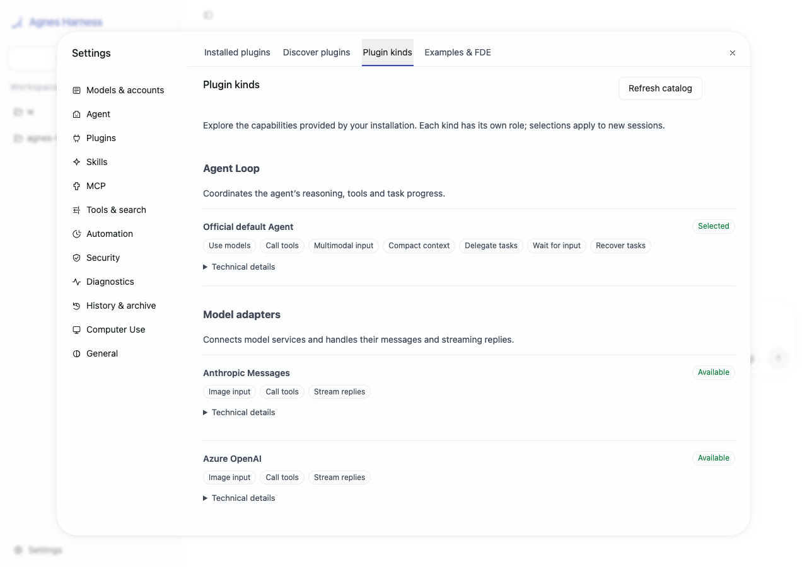
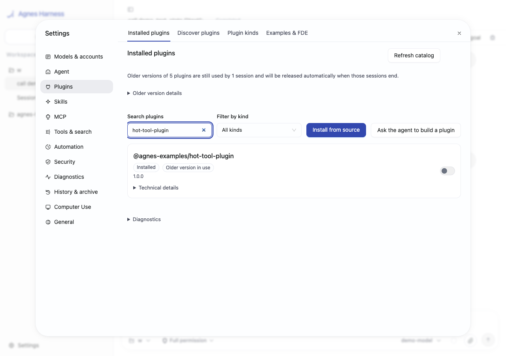
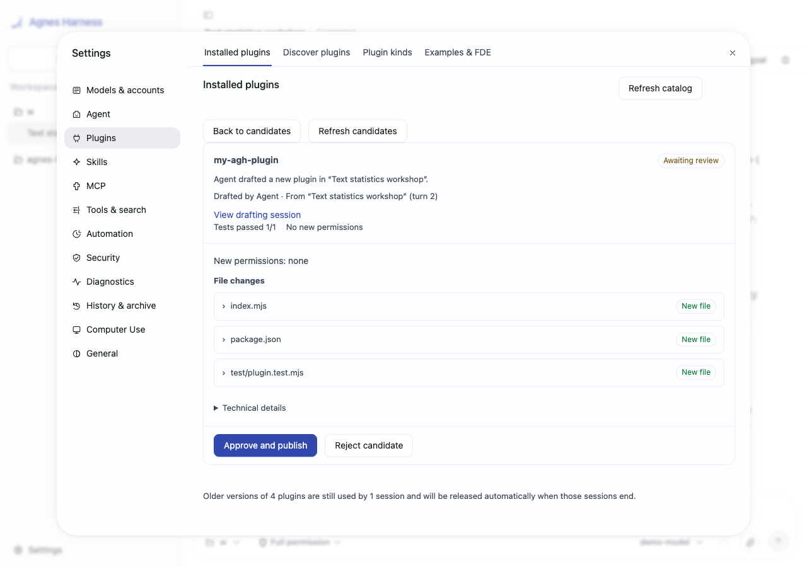

# Agnes Harness

English | [简体中文](README.zh-CN.md)

**A trustworthy business-agent platform.** Build business agents as plugins, upgrade them while existing work keeps its version, and grow reusable skills through human review.

AGH is an open-source developer preview for developers and field deployment teams. CLI, Web and SDK share one local App Server, with durable sessions, approvals and inspectable execution records.

[Quickstart](docs/guide/quickstart.md) · [Why AGH](docs/guide/why-agh.md) · [Documentation](docs/README.md) · [Build a plugin](docs/extend/quickstart.md)

## 1. Your business agent is a plugin

Package a business Loop, tools, model adapters, persona and Skills into an installable bundle. Each session gets its selected capabilities; a support agent's tools do not automatically appear in an unrelated default session. Add a workbench panel through the public frontend APIs.



[Run the business-agent demo](examples/demos/business-agent/README.md) · [Browse FDE bundles](examples/fde/README.md)

## 2. Upgrade without replacing work in progress

New sessions use the reviewed new plugin code; saved sessions retain their code and UI version across restart. Inspect model requests, tool results and recovery gaps through the trace and execution-evidence views. Uncertain external effects require reconciliation before another dispatch.



[Run the hot-upgrade demo](examples/demos/hot-upgrade/README.md) · [Read the recovery rules](docs/guide/sessions.md)

## 3. Let the agent grow reusable skills

Ask the agent to draft a Skill or plugin, test it, then review its files and permissions before publication. Provenance keeps the drafting session and human review. Learned file memory can retain workspace preferences, with agent access off by default.



[Run the growing-skills demo](examples/demos/growing-skills/README.md) · [Candidate review](docs/extend/agent-built-plugins.md) · [Memory](docs/guide/memory.md)

The screenshots show the current interface using synthetic browser fixtures. The runnable demos use fresh isolated homes and a deterministic local model by default; they do not send external business messages. Old code remains retained while durable session pins reference it, including idle history.

## Start from source

Prepare Node.js **24.10+**, pinned pnpm **10.34.5**, and your platform's native toolchain ([installation](docs/guide/install.md)). Clone this repository and run from its root:

```sh
pnpm install --frozen-lockfile
pnpm --filter @agnes/cli build:local
node agnes.mjs serve
```

Open the local URL printed by the terminal. The [first-run guide](docs/guide/getting-started.md) walks through account setup, model selection and your first session; every step can be skipped. Model tests and real-model conversations may incur charges. Try the [local Demo](docs/extend/quickstart.md) without a key, or run the [three demos](docs/guide/demos.md).

For your first request:

> Read this project and describe its main directories. Do not modify files or run installation commands.

Keep `serve` running. Another terminal with the same `AGH_HOME` and `AGNES_PROFILE` can run `node agnes.mjs` for the TUI, or `node agnes.mjs sessions --json` to find the shared history. See [Quickstart](docs/guide/quickstart.md) for the complete sequence.

## Architecture and extension paths

Clients connect to one App Server per canonical home. Workers host composed plugin generations; Core owns durable facts, authorization and recovery. The official default Loop is the separate `@agnes/loop-default` plugin. Storage and sandbox backends remain restart-required. Plugin code is pinned; MCP definitions and Skills are live resources filtered by the session composition.

[Architecture](docs/develop/architecture.md) · [Plugin contracts](docs/develop/architecture-plugins.md) · [App Server stdio](docs/reference/app-server.md) · [Source map](docs/develop/source-map.md)

## Boundaries to understand

- **External effects:** recovery does not promise exactly-once emails, remote writes or device actions. A missing receipt can leave an outcome unknown.
- **Trusted code:** ordinary backend plugins execute in process. Capability review, provenance, approvals and command/MCP sandboxing do not isolate arbitrary plugin JavaScript.
- **Preview release:** source builds are available; no public npm release, consumer installer or automatic-update commitment is made. APIs and configuration can change during preview.
- **Platforms:** macOS and Linux have maintained native/process/browser gates. Windows remains untested end to end, with no proven L1 command sandbox. Computer Use is unavailable on Linux.
- **Experimental paths:** provider/Loop APIs, child engines, programmatic cells (especially stateless CPython), and MHS-inspired device integration need deployment-specific validation. The device example is a simulator, not a certified hardware adapter.

[Supported scope](docs/reference/limitations.md) · [Security](docs/guide/security.md) · [Verification](docs/maintainers/verification.md) · [Network deployment](docs/guide/deployment.md)

## Community and licensing

Use, study and extend AGH under its licenses. Issues welcome bug reports and use cases; code and documentation PRs currently require an invitation ([contribution policy](CONTRIBUTING.md)). Report vulnerabilities through [SECURITY.md](SECURITY.md).

Project-authored code uses [Apache-2.0](LICENSE). Third-party components and adapted examples retain their notices; see [NOTICE](NOTICE) and [licensing](docs/maintainers/provenance.md).

<!-- Preserve historical README links. -->
<a id="architecture"></a>
<a id="a-runtime-built-to-extend"></a>
<a id="agnes-harness"></a>
<a id="built-for-trust-made-for-the-real-world"></a>
<a id="what-agh-is-and-what-it-is-not"></a>
<a id="architecture-brain-cerebellum-memory-and-body"></a>
<a id="what-agh-does-for-a-deployment-team"></a>
<a id="1-every-customers-systems-are-different"></a>
<a id="2-work-starts-on-the-web-and-continues-in-the-terminal"></a>
<a id="3-what-did-the-ai-change-and-who-approved-it"></a>
<a id="4-each-role-needs-its-own-screen"></a>
<a id="5-the-next-deployment-should-start-from-the-last-one"></a>
<a id="6-the-site-also-has-devices"></a>
<a id="public-benchmark"></a>
<a id="who-it-is-for"></a>
<a id="start-from-an-example"></a>
<a id="run-from-source"></a>
<a id="current-status"></a>
<a id="faq"></a>
<a id="follow-agh-and-bring-your-use-case"></a>
<a id="license"></a>
