# Agnes Harness

**面向前线交付工程（FDE）的插件化智能体框架。**

### 以可信为根基，为真实世界而生。

**把 AI 接入真实业务，让每一次交付沉淀为可复用的能力。**

Agnes Harness（AGH）将模型、工具、任务状态和业务界面连接在一起。你可以用 CLI 和 Web 开始工作，用插件接入业务系统，用 Skills 沉淀任务方法，再把这些能力组合成自己的 Agent 应用。

[English](README.md) | 简体中文

[快速开始](docs/guide/quickstart.zh-CN.md) · [架构](#architecture) · [体验示例](docs/guide/demo.zh-CN.md) · [开发插件](docs/develop/plugins.zh-CN.md) · [完整文档](docs/README.zh-CN.md) · [MHS（即将开放）](docs/guide/mhs.zh-CN.md)

开发者预览（pre-alpha） · [源码构建](#从源码开始) · [Apache-2.0](LICENSE)

## 为什么选择 AGH

从一个业务工具，到一个岗位工作台，再到持续迭代的现场交付，AGH 为它们提供共同的运行基础。

| 你要做的事 | AGH 为你提供 | 深入了解 |
| --- | --- | --- |
| **把业务能力交给 Agent** | 通过后端插件注册工具，通过 MCP 连接已有工具服务；把输入、调用与结果接入任务过程 | [后端插件](docs/develop/backend.zh-CN.md) · [MCP](docs/guide/mcp.zh-CN.md) |
| **做出适合业务的界面** | 在 Web 工作台中加入前端面板，并通过受限服务调用连接后端 | [前端面板](docs/develop/frontend.zh-CN.md) · [前后端联动](docs/develop/fullstack.zh-CN.md) |
| **让经验成为下一次任务的起点** | 用 Skills 保存任务方法，用插件包管理可复用的业务实现 | [Skills](docs/guide/skills.zh-CN.md) · [插件生命周期](docs/guide/packages.zh-CN.md) |
| **在熟悉的入口中继续工作** | CLI、Web 与 SDK 共享后台会话，查看历史、继续任务、处理中断 | [会话与恢复](docs/guide/sessions.zh-CN.md) |
| **把授权与结果放进执行过程** | 包信任、工具审批、执行约束与会话记录，让集成有明确的控制点 | [安全与信任](docs/guide/security.zh-CN.md) |

我们面向 Forward Deployed Engineering（FDE）：深入业务现场，把系统集成、使用体验和持续迭代做成可交付的软件。**把现场差异写进插件，把任务执行交给 Harness，把经过验证的能力带到下一个项目。** [了解 FDE 与应用场景 →](docs/guide/why-agh.zh-CN.md)

<a id="architecture"></a>
<a id="为扩展而组织的运行基础"></a>

## 架构：大脑、小脑、记忆与身体

**LLM 是大脑，Jev 是小脑，Harness 是记忆，MHS 是身体。**

这组角色表达 AGH 的产品愿景：组合推理、结构化决策、持久任务上下文与物理能力。图中实线表示已有软件能力，虚线表示规划中的接入。



| 角色 | 在 AGH 中的含义 | 当前范围 |
| --- | --- | --- |
| **LLM / 大脑** | 理解请求、推理任务并生成候选动作 | 通过 AI Provider 接入模型 |
| **Jev / 小脑** | 通过路由、评分等结构化决策辅助执行协调 | 规划接入；main 当前运行内置 Core loop |
| **Harness / 记忆** | 保存会话历史、任务状态、执行记录，并用 Skills 沉淀可复用方法 | 已有任务上下文与恢复机制；Harness 同时承担执行与治理 |
| **MHS / 身体** | 连接设备能力，让任务读取物理状态、请求设备动作 | 规划通过基于 MCP 的适配器接入设备；AGH 接入文档与示例即将开放 |

FDE 是交付方式，MHS 是设备接入方向。两者使用同一套底座，FDE 的现场交付也可以包含设备场景。

| 共享模块 | 当前怎样支撑 FDE | 后续 MHS 接入可以复用什么 |
| --- | --- | --- |
| **App Server** | 为 CLI、Web、SDK 提供共享会话、任务提交、事件输出与审批路由 | 任务入口、人工确认与状态展示 |
| **Agent Loop** | 模型与工具执行、任务状态、事件记录、中断处理与恢复 | 高层设备任务编排与结果记录 |
| **Sandbox / 执行约束** | 工具授权，以及适用的命令、文件、网络和进程约束 | 软件执行边界；运动控制、互锁和急停仍由设备控制器承担 |
| **Plugins / 插件体系** | 后端工具与服务、Web 面板、Skills、hooks、MCP，由 Cordis 和包治理组织 | 基于 MCP 的设备适配器与设备操作界面的扩展入口；具体适配仍需开发与验证 |

具体业务连接器与工作台通过这些扩展入口按现场需求构建。当前仓库没有已验证的通用 MHS 适配器或端到端设备示例。普通后端插件作为受信进程内代码运行；沙箱约束作用于相应的受支持执行路径。

实际请求链路与源码归属见[架构说明](docs/develop/architecture.zh-CN.md)，深入实现可从[源码地图](docs/develop/source-map.zh-CN.md)开始；执行边界见[安全与信任](docs/guide/security.zh-CN.md)。

## 从三个示例，开始构建你的应用

仓库提供三个可运行示例，分别展示业务能力、专属界面与前后端联动。每个教程都包含源码入口、操作步骤和预期结果。

| 示例 | 先看到什么 | 然后可以构建什么 |
| --- | --- | --- |
| [一个工具](docs/develop/backend.zh-CN.md) | 调用 `demo_text_stats`，得到字符数与词数 | 为 Agent 接入订单查询、数据检索等业务函数 |
| [一个面板](docs/develop/frontend.zh-CN.md) | 在工作台侧栏加载自己的面板，更新版本 | 为岗位展示任务信息和业务状态 |
| [一套联动](docs/develop/fullstack.zh-CN.md) | 面板读取后端服务结果，观察升级与回滚 | 把业务服务与操作界面组合成插件 |

**先选一个示例，再换成你的业务逻辑。** [打开演示指南 →](docs/guide/demo.zh-CN.md)

## 从源码开始

当前为 **开发者预览（pre-alpha）**，通过源码构建体验。准备 Node.js 24.10+、pnpm 10.34.5，以及平台所需的原生构建工具，获取源码与完整步骤见[安装指南](docs/guide/install.zh-CN.md)。API、配置与插件接口仍在演进，可能出现破坏兼容性的变更。

首次运行前阅读[安全与信任](docs/guide/security.zh-CN.md)，确认工作目录和授权范围。在源码仓库根目录运行：

```sh
pnpm install --frozen-lockfile
pnpm --filter @agnes/cli build:local
node packages/cli/dist/local/agnes.mjs serve
```

打开终端打印的本机地址，配置模型，创建任务并确认工作目录。试着发出第一个请求：

> 请只读取当前项目，说明它解决什么问题、主要目录如何组织；不要修改文件。

保持 Web 服务运行，另开一个终端并进入同一源码目录。CLI 使用同一后台与配置；如果设置过 `AGH_HOME` / `AGNES_PROFILE`，在新终端使用相同值：

```sh
node packages/cli/dist/local/agnes.mjs -p "简要说明当前项目的用途"
```

跟随[首次运行](docs/guide/quickstart.zh-CN.md)查看结果、找到会话，并继续任务。没有模型账号，也可以运行[本地模拟模型演示](docs/guide/demo.zh-CN.md#不配置模型账号先跑通本地链路)，先体验插件与任务执行流程。

完整文档提供[英文](docs/README.md)与[简体中文](docs/README.zh-CN.md)版本，每页都可以切换到同一主题的另一种语言。

## MHS：向物理世界延伸

AGH 的设备接入方向以 MCP（Model Context Protocol）为基础，而不是厂商专属 SDK，让集成方式能在巡检、仪器协作和现场运维中复用。大脑、小脑、记忆与身体如何对应 MHS，见上文[架构](#architecture)。

**MHS 接入文档与示例即将开放。** [了解设备接入方向 →](docs/guide/mhs.zh-CN.md)

## 关注 AGH，把你的场景带进来

如果你也在探索 AI 的现场交付，欢迎 **Star 收藏项目**，用 **Watch 关注更新**，或把 AGH 分享给正在做 Agent 应用和业务集成的开发者。

- **试用与反馈**：跑通一个示例，分享使用体验；可通过 Issues 提交普通问题与场景建议。
- **构建与复用**：按适用许可证，在自己的项目中开发插件、接入工具、打造工作台。
- **开发协作**：当前代码与文档 PR 仅限受邀内部开发者，暂不接收外部 PR。详见[反馈与协作规则](docs/develop/contributing.zh-CN.md)。

安全问题请按[安全报告政策](SECURITY.md)私密提交。

## 状态与许可

AGH 当前为开发者预览。[支持范围与已知限制](docs/reference/limitations.zh-CN.md)帮助你选择试用环境；[验证与复现](docs/maintainers/verification.zh-CN.md)提供检查命令与验收范围。

项目自有代码采用 [Apache License 2.0](LICENSE)。第三方组件、改编文件及部分示例保留各自的许可声明，详见 [NOTICE](NOTICE) 与[许可说明](docs/maintainers/provenance.zh-CN.md)。
