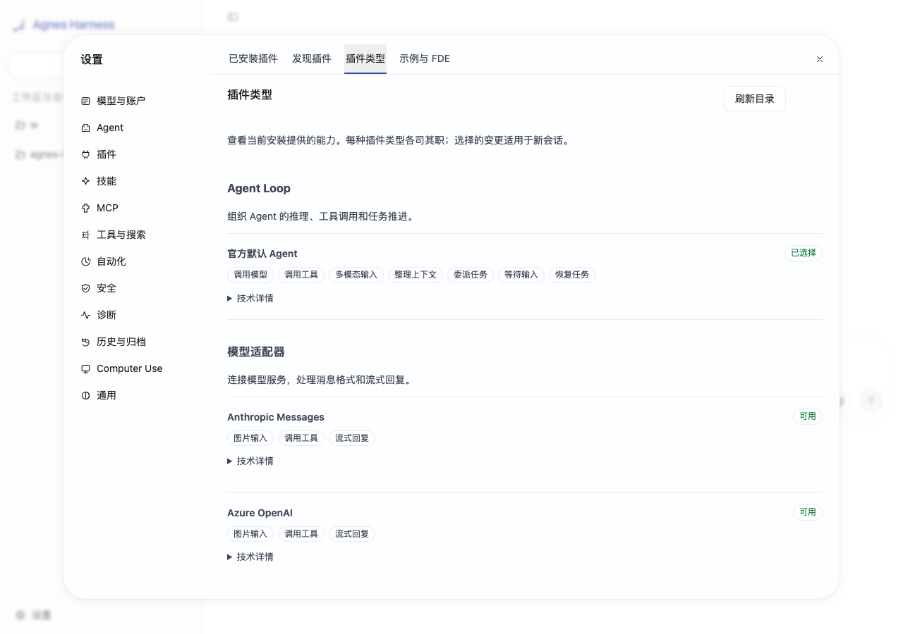
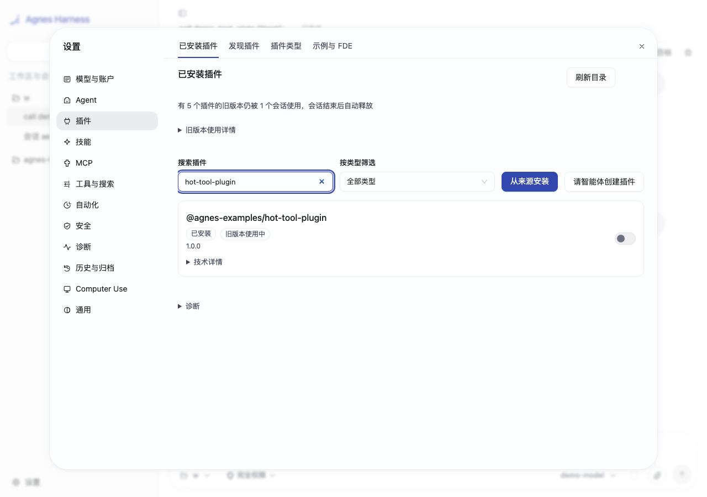
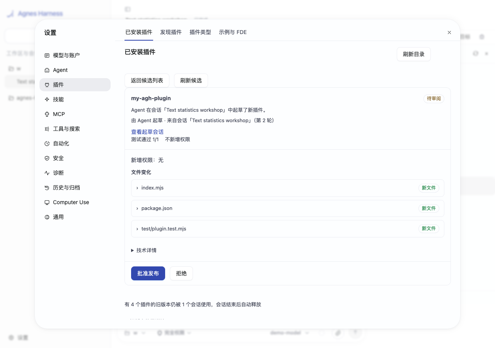

# Agnes Harness

[English](README.md) | 简体中文

**可托付的业务 Agent 平台。** 将业务 Agent 打包成插件，升级时让已有任务继续使用原版本，再通过人工审阅积累可复用的技能。

AGH 是面向开发者与现场交付团队的开源开发者预览版。CLI、Web 和 SDK 共享一个本地 App Server，提供持久会话、审批与可检查的执行记录。

[快速开始](docs/guide/quickstart.zh-CN.md) · [为什么选择 AGH](docs/guide/why-agh.zh-CN.md) · [完整文档](docs/README.zh-CN.md) · [开发插件](docs/extend/quickstart.zh-CN.md)

## 1. 业务 Agent 就是插件

把业务 Agent Loop、工具、模型适配器、角色与技能组合成可安装的组合包。每个会话只获得所选能力，客服 Agent 的业务工具不会自动出现在无关的默认会话中。通过公开前端 API，还可以加入岗位工作台面板。

业务事件也能驱动 Agent：显式启用 [GitHub 与通用 Webhook 触发器](docs/guide/webhooks.zh-CN.md)，在工作区正常策略下启动普通会话。



[运行业务 Agent 演示](examples/demos/business-agent/README.zh-CN.md) · [查看 FDE 组合包](examples/fde/README.md)

## 2. 升级时，进行中的工作保留原版本

新会话使用审阅后的新插件代码，已有会话在重启后仍保留原代码与界面版本。通过轨迹和执行证据查看模型请求、工具结果与恢复缺口。外部操作结果不确定时，必须先核对，再决定是否重新派发。



[运行热升级演示](examples/demos/hot-upgrade/README.zh-CN.md) · [阅读恢复规则](docs/guide/sessions.zh-CN.md)

## 3. 让 Agent 积累可复用技能

请 Agent 起草技能或插件、运行测试，再由人审阅文件与权限后发布。来源记录保留起草会话与人工审阅信息。文件记忆可以保存工作区偏好，Agent 的记忆访问默认关闭。



[运行技能成长演示](examples/demos/growing-skills/README.zh-CN.md) · [候选审阅](docs/extend/agent-built-plugins.zh-CN.md) · [记忆](docs/guide/memory.zh-CN.md)

截图使用当前界面与合成浏览器测试数据。可运行演示默认使用全新隔离 home 和确定性本地模型，不发送外部业务消息。只要持久会话仍引用旧代码，旧版本就会保留，包括闲置历史会话。

## 从源码开始

准备 Node.js **24.10+**、固定 pnpm **10.34.5** 与平台原生工具链（[安装指南](docs/guide/install.zh-CN.md)）。克隆仓库，在根目录运行：

```sh
pnpm install --frozen-lockfile
pnpm --filter @agnes/cli build:local
node agnes.mjs serve
```

打开终端打印的本机地址。[首次运行指南](docs/guide/getting-started.zh-CN.md)带你配置账号、选择模型并创建会话，每一步都可跳过。模型测试和真实模型对话可能产生费用。没有密钥也可以体验[本地 Demo](docs/extend/quickstart.zh-CN.md)，或运行[三个产品演示](docs/guide/demos.zh-CN.md)。

第一个请求可以是：

> 请只读取当前项目，说明主要目录的用途；不要修改文件或运行安装命令。

保持 `serve` 运行。在使用相同 `AGH_HOME` 与 `AGNES_PROFILE` 的另一个终端运行 `node agnes.mjs` 打开 TUI，或运行 `node agnes.mjs sessions --json` 查找共享历史。完整步骤见[快速开始](docs/guide/quickstart.zh-CN.md)。

## 架构与扩展入口

每个规范化 home 对应一个 App Server。Worker 承载组合后的插件版本，Core 负责持久事实、授权与恢复。官方默认 Agent Loop 是独立的 `@agnes/loop-default` 插件。存储、沙箱等后端仍需重启。插件代码固定到会话，MCP 定义与技能则是按会话组合过滤的动态资源。

[架构](docs/develop/architecture.zh-CN.md) · [插件合同](docs/develop/architecture-plugins.zh-CN.md) · [App Server stdio](docs/reference/app-server.zh-CN.md) · [源码地图](docs/develop/source-map.zh-CN.md)

## 使用边界

- **外部副作用：** 恢复不承诺邮件、远程写入或设备动作的恰好一次执行。缺少回执时，结果可能仍不确定。
- **受信代码：** 普通后端插件在进程内运行。能力审阅、来源校验、审批和命令/MCP 沙箱不隔离任意插件 JavaScript。
- **预览发行：** 当前可从源码构建，没有公开 npm 发行、消费者安装程序或自动升级承诺。预览期间 API 与配置可能变化。
- **平台：** macOS 和 Linux 已有持续维护的原生、进程与浏览器检查。Windows 尚未经完整端到端验收，也没有已验证的 L1 命令沙箱。Linux 暂不支持 Computer Use。
- **实验能力：** Provider/Agent Loop API、子引擎、程序化 cell（尤其无状态 CPython）与 MHS 启发的设备接入需要按部署验证。设备示例是模拟器，不是认证硬件适配器。

[支持范围](docs/reference/limitations.zh-CN.md) · [安全](docs/guide/security.zh-CN.md) · [验证](docs/maintainers/verification.zh-CN.md) · [网络部署](docs/guide/deployment.zh-CN.md)

## 社区与许可

按适用许可证使用、研究与扩展 AGH。欢迎通过 Issues 提交问题与场景；代码和文档 PR 当前仅接受受邀开发者（[协作规则](CONTRIBUTING.md)）。安全问题按 [SECURITY.md](SECURITY.md) 私密报告。

项目自有代码采用 [Apache-2.0](LICENSE)。第三方组件与改编示例保留各自声明，见 [NOTICE](NOTICE) 与[许可说明](docs/maintainers/provenance.zh-CN.md)。

<!-- Preserve historical README links. -->
<a id="architecture"></a>
<a id="为扩展而组织的运行基础"></a>
<a id="agnes-harness"></a>
<a id="以可信为根基为真实世界而生"></a>
<a id="agh-是什么不是什么"></a>
<a id="架构大脑小脑记忆与身体"></a>
<a id="在现场交付中agh-能帮上什么"></a>
<a id="1-每个客户的业务系统都不一样"></a>
<a id="2-任务在-web-上开始在终端里继续"></a>
<a id="3-ai-改了什么谁批准的"></a>
<a id="4-不同岗位需要不同的界面"></a>
<a id="5-下一个项目应该从上一个项目的终点出发"></a>
<a id="6-现场还有设备"></a>
<a id="公开评测"></a>
<a id="适合谁"></a>
<a id="从示例开始"></a>
<a id="从源码开始"></a>
<a id="当前状态"></a>
<a id="常见问题"></a>
<a id="关注-agh把你的场景带进来"></a>
<a id="开源许可"></a>
