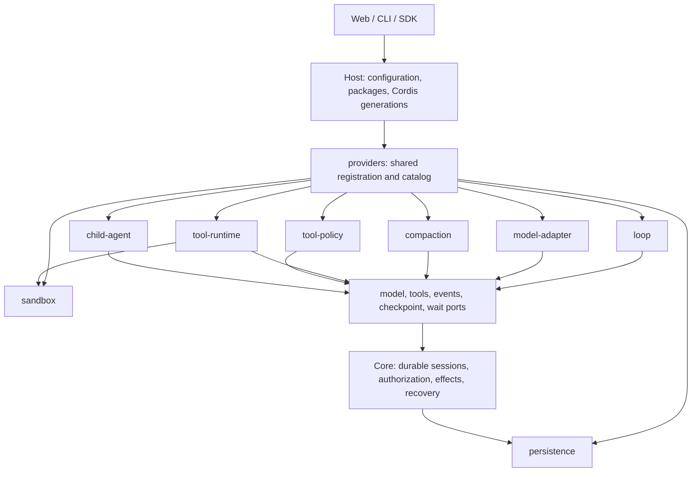

# Plugin and provider architecture

English | [简体中文](architecture-plugins.zh-CN.md)

[Architecture](architecture.md) · [Source map](source-map.md) · [Author guide](../extend/README.md)

The kernel keeps session facts, ledger writes, effects, authorization and recovery. Replaceable algorithms use operation ports. Host loads packages into Cordis, owns their registrations and instances, and supplies the selected providers to Core. Ordinary backend plugins execute as trusted in-process code; this composition mechanism does not isolate arbitrary plugin code.



## One provider pattern

Every kind describes validation, capabilities, identity and restart requirements with `defineProviderKind<T>()` from `@agnes/extension-api`. Host's `ProviderRegistry<T>` owns registration, duplicate refusal, selection, immutable catalogs and disposal. Registration may be owned by a plugin fiber; unloading it unregisters the provider and runs its existing resource cleanup. Loop identity is `id@version`; the other current kinds refuse duplicate ids.

An author can register an existing kind through one service:

```ts
export const plugin = {
  inject: ['providers'],
  apply(ctx) {
    ctx.providers.register('tool-policy', '@example/read-only', {
      id: 'read-only', version: '1.0.0',
      decide(input) {
        return input.policy.isReadOnly && !input.policy.isDestructive
          ? { effect: 'allow', reason: 'Read-only call' }
          : { effect: 'deny', reason: 'This preset permits reads only' }
      },
    })
  },
}
```

Named services (`loops`, `modelAdapters`, `compactionEngines`, `toolRuntimes`, `toolPolicies`, `sandboxProviders`, `childAgents`) retain their existing typed APIs and catalog shapes. The common entry point delegates to those services, including their instance cleanup and source-package checks. Contributors adding a kind use `installProviderRegistry(ctx, defineProviderKind({...}))` from `@agnes/host`, then fit its operations behind a typed facade. The persistence registry remains process-owned: packages export `persistenceProvider` before the store opens, and that same registry joins the combined catalog after Cordis starts.

## Selection and compatibility

The canonical block is `<kind>: { provider: id, version?: version }`. Use these blocks in one enabled profile package's `config`, the existing JSON extension point. For example:

```yaml
packages:
  - id: '@example/workflow'
    source: './workflow'
    config:
      loop: { provider: 'example.research', version: '1.0.0' }
      tool-policy: { provider: 'read-only' }
      compaction: { provider: 'default' }
      child-agent: { provider: 'in-process' }
```

Existing top-level `loop: { id, version }`, `compaction: { engine }`, `persistence: { provider }`, `sandbox: { provider }`, model `provider.adapters`, and preset `tools.runtime` / `approval.policy` remain supported. Explicit top-level selections take precedence over package config. Multiple package selections for the same kind are refused. New root-profile keys are not introduced by this migration; canonical blocks use package config until the profile authoring layer exposes them directly.

`child-agent: { provider, version? }` selects the default for `childAgents.start(undefined, task, options)`. An explicit provider id still selects that provider. Omitting configuration keeps `in-process`; a missing configured provider fails instead of falling back. Existing in-process subagent tools and `LoopContext.children` retain their explicit in-process path. Providers register through `ctx.providers.register('child-agent', sourcePackage, provider)` or the compatible `ctx.childAgents.register(provider)` facade; both feed the same catalogs and own the same cleanup.

A versionless loop selection requires exactly one installed version. An explicit version must match; missing or ambiguous providers fail with an installation or configuration hint. Core still pins the resolved loop id and version in the session, and legacy sessions map to `agnes.default@1.0.0`. Resume does not silently switch to an installed alternative.

`host.providers.catalog()` (also `ctx.providers.catalog()`) returns every installed kind with `id`, `version`, `sourcePackage`, a capability list, `restartRequired`, `active` and `selectedFor`. This read-only view contains no factories or credentials. Active means selected by the reported profile/default or fitted provider scope, not the number of running sessions. Uninstalled providers are absent; future kinds join when their service is installed. Admin and config-dump integrations can consume this port without another registry or HTTP endpoint.

| Kind | Default | Replacement / lifecycle |
| --- | --- | --- |
| `loop` | `agnes.default@1.0.0`, Core | Select for new sessions; persisted id/version governs resume. Registrations reload with Cordis. |
| `model-adapter` | API-specific adapters from `@agnes/ai` | Model-profile updates rebuild validated routes; unload disposes owned instances. |
| `compaction` | `default`, Base | Registration is reloadable; the assembled runner selection requires a Host restart. |
| `tool-runtime` | `default`, Core | Preset selection; session instances own scheduling and cancellation. |
| `tool-policy` | `default`, Base approval policy | Selected per preset; principal authorization remains in Core. |
| `persistence` | `sqlite`, Host | Process startup selection; restart required. Providers do not migrate another store's files. |
| `sandbox` | `local`, Host | Startup selection, bound on first workspace; restart required to change it. |
| `child-agent` | `in-process`, Base | Defined with `defineProviderKind`; `childAgents` remains the typed facade. Optional `acp` stays unloaded by default. Fiber unload aborts the provider lifetime and disposes its handles; capability checks and session allowlists still apply. |

## The plugin ladder

Each rung works without learning the next: **0 Use** — select installed plugins and presets; **1 Skill** — write `SKILL.md`; **2 Connect** — configure MCP; **3 Tool** — write a JS/TS tool; **4 Panel** — add a client panel; **5 Brain** — replace a model adapter, compaction engine or policy; **6 Loop** — supply a complete driver; **7 Bundle** — compose the pieces as configuration. Beginners enter through tools and Skills; researchers swap algorithms; FDE teams distribute bundles; core contributors maintain the ports and shared provider lifecycle.
