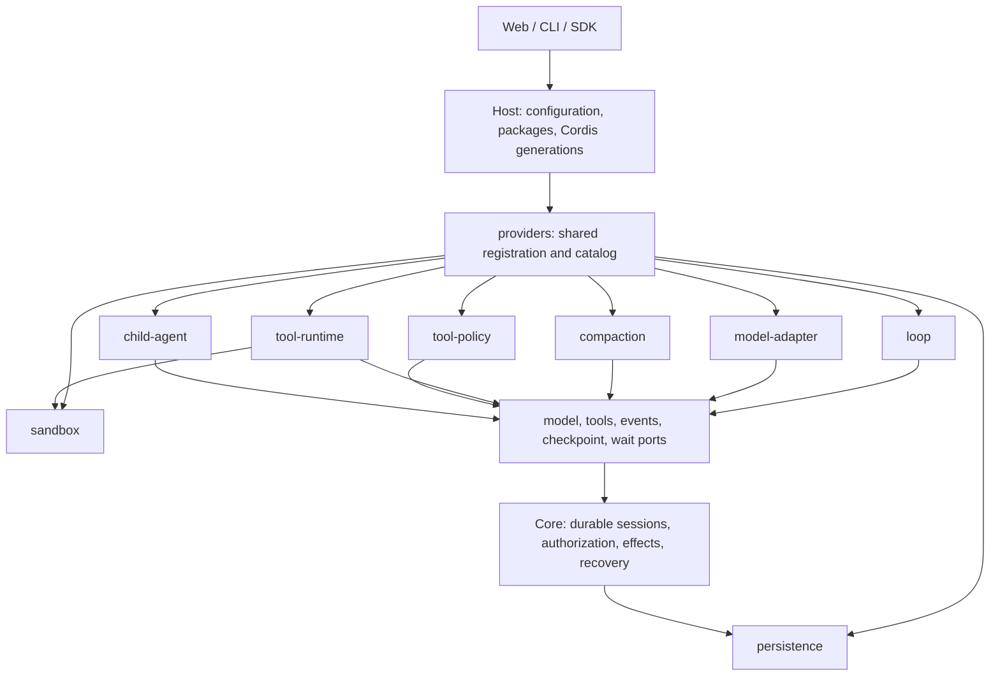

# Plugin and provider architecture

English | [简体中文](architecture-plugins.zh-CN.md)

[Architecture](architecture.md) · [Source map](source-map.md) · [Author guide](../extend/README.md) · [v0.1 contracts](contracts-v0.1.md)

The kernel keeps session facts, ledger writes, effects, authorization and recovery. Replaceable algorithms use operation ports. Host loads packages into Cordis, owns their registrations and instances, and supplies the selected providers to Core. Ordinary backend plugins execute as trusted in-process code; this composition mechanism does not isolate arbitrary plugin code.



## One provider pattern

Every kind describes validation, capabilities, semver identity and lifecycle scope with `defineProviderKind<T>()` from `@agnes/extension-api`. Host's `ProviderRegistry<T>` owns registration, duplicate refusal, selection, immutable catalogs and disposal. Registration may be owned by a plugin fiber; unregister returns an idempotent `Promise<void>`. Model, compaction, policy and tool-runtime owners stop admission, abort and drain creates/calls, dispose instances, then run registration cleanup. Cleanup failures are aggregated. Loop identity is `id@version`; the other current kinds refuse duplicate ids.

An author can register an existing kind through one service:

```ts
export const plugin = {
  inject: ['providers'],
  apply(ctx) {
    ctx.providers.register('tool-policy', '@example/read-only', {
      id: 'read-only', version: '1.0.0',
      decide(input) {
        return input.policy.isReadOnly && !input.policy.isDestructive
          ? { effect: 'allow', reason: 'Read-only call' }
          : { effect: 'deny', reason: 'This preset permits reads only' }
      },
    })
  },
}
```

Named services (`loops`, `modelAdapters`, `compactionEngines`, `toolRuntimes`, `toolPolicies`, `sandboxProviders`, `childAgents`) retain their existing typed APIs and catalog shapes. The common entry point delegates to those services, including their instance cleanup and source-package checks. Contributors adding a kind use `installProviderRegistry(ctx, defineProviderKind({...}))` from `@agnes/host`, then fit its operations behind a typed facade. The persistence registry remains process-owned: packages export `persistenceProvider` before the store opens, and that same registry joins the combined catalog after Cordis starts.

## Selection and compatibility

The canonical block is `<kind>: { provider: id, version?: version }`. Use these blocks in one enabled profile package's `config`, the existing JSON extension point. For example:

```yaml
packages:
  - id: '@example/workflow'
    source: './workflow'
    config:
      loop: { provider: 'example.research', version: '1.0.0' }
      tool-policy: { provider: 'read-only' }
      compaction: { provider: 'default' }
      child-agent: { provider: 'in-process' }
```

Existing top-level `loop: { id, version }`, `compaction: { engine }`, `persistence: { provider }`, `sandbox: { provider }`, model `provider.adapters`, and preset `tools.runtime` / `approval.policy` remain supported. Explicit top-level selections take precedence over package config. Multiple package selections for the same kind are refused. Canonical provider blocks use package config; only the documented top-level profile fields are accepted.

`child-agent: { provider, version? }` selects the default for `childAgents.start(undefined, task, options)`. An explicit provider id still selects that provider. Omitting configuration keeps `in-process`; a missing configured provider fails instead of falling back. Existing in-process subagent tools retain their explicit in-process path. When fitted, `LoopContext.children` uses the parent-bound `ChildAgentSessionService` facade and configured provider selection. Providers register through `ctx.providers.register('child-agent', sourcePackage, provider)` or the compatible `ctx.childAgents.register(provider)` facade; both feed the same catalogs and own the same cleanup.

A versionless loop selection requires exactly one installed version. An explicit version must match; missing or ambiguous providers fail with an installation or configuration hint. Core still pins the resolved loop id and version in the session, and legacy sessions map to `agnes.default@1.0.0`. Resume does not silently switch to an installed alternative.

`host.providers.catalog()` (also `ctx.providers.catalog()`) returns every installed kind with `id`, `version`, `sourcePackage`, a capability list, `scope`, derived `restartRequired`, `active` and `selectedFor`. This read-only view contains no factories or credentials. Active means selected by the reported profile/default or fitted provider scope, not the number of running sessions. Uninstalled providers are absent; future kinds join when their service is installed. Admin and config-dump integrations can consume this port without another registry or HTTP endpoint.

| Kind | Default | Replacement / lifecycle |
| --- | --- | --- |
| `loop` | `agnes.default@1.0.0`, `@agnes/loop-default` | Select for new sessions; persisted id/version governs resume. Registrations reload with Cordis. |
| `model-adapter` | API-specific adapters from `@agnes/ai` | Model-profile updates rebuild validated routes; unload disposes owned instances. |
| `compaction` | `default`, Base | Generation scope: a new Host generation assembles its runner; existing sessions retain their code. |
| `tool-runtime` | `default`, Core | Preset selection; session instances own scheduling and cancellation. |
| `tool-policy` | `default`, Base approval policy | Selected per preset; principal authorization remains in Core. |
| `persistence` | `sqlite`, Host | Process startup selection; restart required. Providers do not migrate another store's files. |
| `sandbox` | `local`, Host | Startup selection, bound on first workspace; restart required to change it. |
| `child-agent` | `in-process`, Base | Defined with `defineProviderKind`; `childAgents` remains the typed facade. Optional `acp` stays unloaded by default. Fiber unload aborts the provider lifetime and disposes its handles; capability checks and session allowlists still apply. |

## Pinned code, live resources

Sessions persist their plugin code generation: packages, loops, providers and tool implementations stay pinned across hibernation and restart. MCP server definitions and Skills are live resources, filtered by the session’s composition. Added, updated or removed resources take effect on the session’s next turn; disabling an MCP server removes it from new turns of every session. Unchanged MCP servers share one connection across code generations within a worker and opener/policy scope, keyed by the effective transport configuration and resolved credential boundary, with reference-counted leases; the connection closes when its last generation/session reference is released. Cold resume resolves the pinned code snapshot and current resources, and waits for the first MCP catalog sync with a bounded timeout.

Model routes, catalogues and credential-store configuration are live too: `Host.applyModelProfile` broadcasts to all retained code containers, while each container keeps its adapter registry. Cold containers start with the current configuration. Non-model backend changes remain refused.

Disabling a package that supplies a session composition’s selected Loop drains that composition. It keeps its original code container and publishes only live resources until the Loop is enabled again; new sessions cannot bind the disabled bundle. Its retained code is reported as draining, and explicit migration is refused while that Loop is unavailable. Resumed work retains its existing Loop pin.

### Publication and recovery

Composition publication uses independent convergence, rather than a global atomic transaction. `applyRuntimeTarget` and `extensionRows.apply` return a convergence report with `publication`; `refreshSkillRow` and `applyModelProfile` return a `HostPublicationReport` on composition Hosts (ordinary Hosts retain their void result). Each report identifies the operation, every `compositionHash`, its `applied`/`failed` result and error, and `recovery: 'retry-same-input'`. All existing containers are attempted, including those after a failure. Successfully applied containers keep their new state; failed containers may retain prior state or partially converge, and new containers receive the latest desired input. Repeat the same complete input to converge failed containers. `compositionPublicationStatus()` exposes the last report. Callers must inspect `ok`; `assertHostPublication` raises `HostPublicationError` carrying the report for compatibility callers, including worker resource/config commands. Failure does not mean an atomic rollback occurred.

### Historical session retention

Code snapshots stay retained while any durable session pin refers to them, including idle history. Closing or hibernating a session does not expire its pin. There is no implicit time-based upgrade. A privileged session coordinator may call `Host.migrateSessionGeneration(sessionKey)` after closing the session and excluding concurrent admission. This migrates only that session to the current generation of its existing composition; it preserves the ledger, loop id/version and composition binding. Both snapshots must be available and compatible, and the target must resolve the exact pinned loop. An open session, missing snapshot or incompatible deployment is refused before changing the pin. Migration is idempotent and returns `{ previousGenerationId, generationId, changed }`.

Once the last pin moves or the session is deleted (`releaseSessionGeneration`), collection disposes the old container and removes its snapshot. Archives owned by another live worker remain conservatively protected until that owner collects or exits. Migration changes plugin implementation behavior explicitly; it does not promise migration of plugin-defined state/checkpoint schemas. Use `agh sessions migrate <key> [--profile <name>] [--json]` for a closed historical session. The daemon checks authenticated session ownership and `packages.activate`, and fences concurrent admission until the worker replies or exits. Open or opening sessions are refused without interrupting their turn. No automatic migration or model-facing tool is installed.

The Node SDK exposes `client.packages.migrateSession({ profile, clientId, commandId, sessionId })` through `_agnes/v1/sessions.migrate`. Each request resolves the compatible current generation; after a transport failure inspect/retry explicitly, since a pin write may have committed. Publication status is `client.packages.publicationStatus({ profile })` / `_agnes/v1/plugins.publicationStatus`, or `agh plugins publication-status [--profile <name>] [--json]`. It returns `{ publication: report | null }`: null means this worker has no recorded composition publication yet, including after restart. Reports retain per-container applied/failed results and retry-same-input recovery; plugin exception text is replaced with a safe failure message.

The exact-origin admin BFF serves read-only `GET /admin/plugins/api/publication-status` (profile bound by the launcher; no query parameters) and the equivalent scoped POST. Both require `packages.read` and remain available in read-only recovery mode. `POST /admin/plugins/api/sessions/migrate` takes the migration DTO above, requires activation authority, and is refused in read-only mode. The Web API helpers are `PluginAdminApi.publicationStatus()` and `migrateSession(sessionId)`; the launcher keeps its Node credential private. Migration refusals return a safe 409 code such as `E_GENERATION_SESSION_OPEN`, while incompatible or missing pins remain unchanged.

Restart scope distinguishes backend changes from code publication: storage, sandbox, platform and fitted adapters require a process/worker restart and compatible deployment for resume. A new generation reconstructs generation-owned registries/runners for new sessions; existing sessions retain their code. Bundled implementation replacement remains restart-required where Host publication refuses it. The provider catalogue describes kind/instance lifecycle requirements; generation status describes the actual deployment publication restriction.

## The plugin ladder

Each rung works without learning the next: **0 Use** — select installed plugins and presets; **1 Skill** — write `SKILL.md`; **2 Connect** — configure MCP; **3 Tool** — write a JS/TS tool; **4 Panel** — add a client panel; **5 Brain** — replace a model adapter, compaction engine or policy; **6 Loop** — supply a complete driver; **7 Bundle** — compose the pieces as configuration. Beginners enter through tools and Skills; researchers swap algorithms; FDE teams distribute bundles; core contributors maintain the ports and shared provider lifecycle.


## Provider author contracts

Built-in string kinds use `KindMap`: `register(kind, sourcePackage, provider)` and `resolve(kind, selection)` infer the matching provider type. Custom kinds use the exact invariant token returned by `defineProviderKind<T>()` and installed by their service. A token with the same name but a different identity is refused. The verified plugin owner determines `sourcePackage`; a conflicting claim fails admission.

Service providers use that same registry. `defineServiceKind()` adds cardinality, an instance scope, and the maximum port grant (`ledger`, `input`, `projections`). Host installs one descriptor, which can only shrink the grant, and admits the current callback through `ExtensionAPI.providers`. The loader supplies the package id and the manifest supplies the owner. Each admitted call opens its own instance. A handle used after that callback, generation, or dispose fails closed. Process-wide sharing stays inside the feature that already reference-counts the resource.

Provider failures use `ProviderError`, separate from the closed extension-call error set: `E_PROVIDER_DUPLICATE`, `E_PROVIDER_UNKNOWN`, `E_PROVIDER_INVALID`, `E_PROVIDER_INCOMPATIBLE` and `E_PROVIDER_UNAVAILABLE`. Each carries `kind`, optional `provider`, `operation`, `retryable`, optional `hint` and original `cause`. Duplicate registration no longer reports an API-range error.

Every filesystem-loaded ordinary plugin entry in `agnes.plugins` must declare `apiRange`, for example `"^1.4.0"`. Host checks static metadata before importing code, independently of `hostProvidedExternals`. Existing manifests must add this field. Provider `version` is semver (the built-in persistence version is now `1.0.0`); package version, provider version, contract range and checkpoint codec version have separate meanings. Extension API remains `1.4.0` during this experimental hardening. `ModelAdapter.wireApi` names its wire format; deprecated `api` remains accepted, and conflicting aliases are refused. Catalogs expose both names during migration.

Scopes are session (`loop`, `tool-runtime`, `child-agent`), generation (`model-adapter`, `compaction`, `tool-policy`) and process (`persistence`, `sandbox`). Custom kinds may declare workspace scope. Workspace/process scopes derive `restartRequired`; generation publication also checks the registered package's scopes. Backend seam rows retain their startup constraints where no provider contract describes them.

`@agnes/plugin-runtime` exports `defineProvider`, `defineLoop`, `defineModelAdapter`, `defineToolRuntime`, `defineToolPolicy`, `defineCompactionEngine`, `defineSandboxProvider`, `definePersistenceProvider` and `defineChildAgentProvider`. The helpers preserve inferred declarations and validate identity/operations early; Host still validates registrations. Model, compaction and tool-runtime factories can return promises and receive a creation signal. Compaction instances and policies may dispose owned resources; registrations may clean up shared resources. Await unregister before releasing a plugin's dependencies. Cancellation requests cooperative termination: a provider must settle started work after abort, or unload remains pending rather than claiming a completed drain.

`@agnes/extension-api/testkit` publishes `runProviderConformance` and a named runner for each of the eight kinds, also re-exported by `@agnes/plugin-runtime/testkit`. Supply the registration port captured inside an isolated Host plugin and an `open` probe using the real Host service or session path. Each probe starts a controlled operation and reports when it reaches the provider, so the suite can check cancellation and unload without timing guesses. Loop and persistence probes must verify cold resume; other probes can opt in. The suites check rejection, immutable metadata, cancellation, idempotent draining unload and missing-provider refusal. They deliberately fail if a provider ignores cancellation or a facade returns before work drains.

## Session capability resolution

`resolveSessionCapabilities()` is the pure Host decision boundary. It returns a deeply frozen `SessionCapabilitySet`; factories, configuration bodies, credentials and paths never enter the public result. Registries retain ownership and lifecycle duties. Their read facades, invocation policy, MCP/Skill views, Loop/model admission, child admission and client-module checks consume the resolver instead of repeating membership predicates.

| Order | Input and effect |
| --- | --- |
| 1 | Builtin defaults and the resolved profile, including inherited profile bundles, establish the base and package ceiling. |
| 2 | Preset bundles, then preset composition, replace selected fields. |
| 3 | Admin bundles, then admin composition/default Loop, establish defaults for new sessions. |
| 4 | Explicit session bundles, then session parameters, override those defaults. |
| 5 | A durable binding uses its compiled composition and owning code generation instead of recompiling today's defaults. Legacy bindings retain their unfiltered tool/resource catalogs and bypass bundle ownership scope. |
| 6 | The owning generation's installed catalog and current MCP/Skills/model resources determine available items. Refresh changes resources without rebinding code. |
| 7 | Package/bundle ownership, plugin enablement, model input support, tool selection, read-only/allow/deny policy, MCP ownership, UI/surface selection and child allowlists are intersected. Any failed check excludes the item. |

Each item carries `enabled` and `reasons[{source:{layer,name},rule}]`; excluded items retain refusal reasons. Scalar selections carry their source, and `codePin` carries safe generation/package identities. Empty tools/MCP/Skills lists retain defaults; an explicit empty policy allowlist, surface list or shell module/slot list denies all. MCP local and stable public tool names use the same server selection; shared MCP resource bridges check their `server` argument.

`Session.capabilities()` reads the optional `capabilities` field of the existing authenticated `_agnes/v1/session.tools` result (`undefined` for older servers); `agh tools --json` exposes that same result. `PluginAdminApi.composition(preset?)` reads `CompositionCapabilitySnapshot` through the existing composition GET/POST route, also used by `agh config dump`. Its top-level set is static desired inspection: catalog-dependent lists remain empty when no catalog is supplied. `sessions[].capabilities` records actual live session facts. `sessions[].toolGroups` remains a display compatibility adapter until clients switch; it is not an authorization input.
