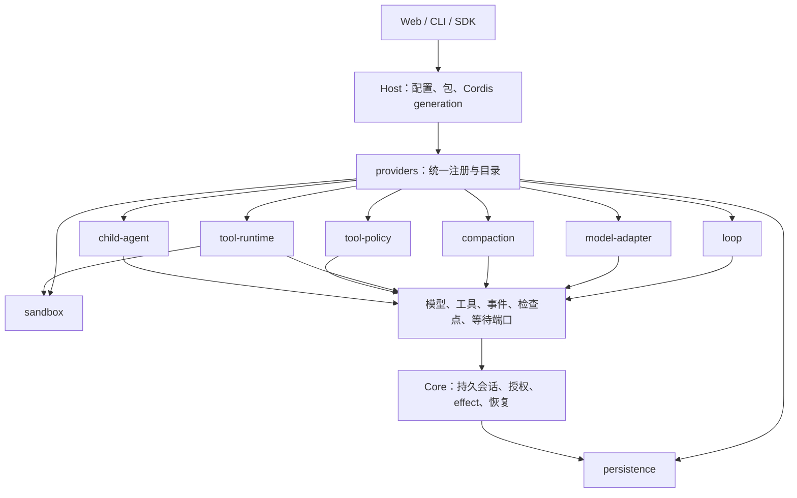

# 插件与 provider 架构

[English](architecture-plugins.md) | 简体中文

[架构](architecture.zh-CN.md) · [源码导航](source-map.zh-CN.md) · [作者指南](../extend/README.zh-CN.md)

内核保存会话事实，负责账本写入、effect、授权与恢复；可替换的算法通过操作端口运行。Host 将包加载到 Cordis，管理注册项与实例，再把选中的 provider 交给 Core。普通后端插件作为受信任的进程内代码执行；组合机制不会隔离任意插件代码。



## 一套 provider 模式

每种类型通过 `@agnes/extension-api` 的 `defineProviderKind<T>()` 描述校验、能力、身份与重启要求。Host 的 `ProviderRegistry<T>` 统一管理注册、重复拒绝、选择、只读目录和释放。注册项可归插件 fiber 所有；卸载时注销并执行原有资源清理。loop 按 `id@version` 注册，其他现有类型拒绝重复 id。

作者可以通过同一个服务注册已有类型：

```ts
export const plugin = {
  inject: ['providers'],
  apply(ctx) {
    ctx.providers.register('tool-policy', '@example/read-only', {
      id: 'read-only', version: '1.0.0',
      decide(input) {
        return input.policy.isReadOnly && !input.policy.isDestructive
          ? { effect: 'allow', reason: 'Read-only call' }
          : { effect: 'deny', reason: 'This preset permits reads only' }
      },
    })
  },
}
```

`loops`、`modelAdapters`、`compactionEngines`、`toolRuntimes`、`toolPolicies`、`sandboxProviders`、`childAgents` 保留原有类型化 API 和目录结构；统一入口委托这些服务执行，包括实例清理与来源包核对。贡献者添加类型时使用 `@agnes/host` 的 `installProviderRegistry(ctx, defineProviderKind({...}))`，再为操作提供类型化外观。persistence 保留进程级启动生命周期：包在打开存储前导出 `persistenceProvider`，同一注册表在 Cordis 启动后加入统一目录。

## 选择与兼容

统一配置块是 `<kind>: { provider: id, version?: version }`，放在一个已启用 profile 包的 `config` 中，复用现有 JSON 扩展点：

```yaml
packages:
  - id: '@example/workflow'
    source: './workflow'
    config:
      loop: { provider: 'example.research', version: '1.0.0' }
      tool-policy: { provider: 'read-only' }
      compaction: { provider: 'default' }
      child-agent: { provider: 'in-process' }
```

原有顶层 `loop: { id, version }`、`compaction: { engine }`、`persistence: { provider }`、`sandbox: { provider }`、模型 `provider.adapters`，以及 preset 的 `tools.runtime` / `approval.policy` 继续有效。显式顶层选择优先于包配置；同一类型由多个包选择时拒绝启动。本次迁移不添加新的根 profile 字段，统一配置先使用 package config，后续由 profile 作者层直接开放。

`child-agent: { provider, version? }` 选择 `childAgents.start(undefined, task, options)` 使用的默认 provider；显式传入 id 仍选择指定 provider。未配置时保留 `in-process`，配置的 provider 缺失时拒绝而不回退。既有进程内 subagent 工具与 `LoopContext.children` 保留显式进程内路径。作者可使用 `ctx.providers.register('child-agent', sourcePackage, provider)` 或兼容的 `ctx.childAgents.register(provider)`，两者共享目录与资源清理。

loop 省略版本时必须恰好安装一个版本。显式版本必须匹配；缺失或歧义都会返回安装或配置修复提示。Core 仍在会话中固定实际解析出的 loop id/version；旧会话映射到 `agnes.default@1.0.0`，恢复不会悄悄换成另一个已安装版本。

`host.providers.catalog()` 和 `ctx.providers.catalog()` 返回所有已安装类型的 `id`、`version`、`sourcePackage`、能力列表、`restartRequired`、`active` 和 `selectedFor`，不包含工厂或凭据。active 表示被当前 profile、默认值或已绑定 provider 范围选中，不代表正在运行的会话数。卸载项不在目录中；后续类型在其服务安装后加入。管理端和 config dump 可直接消费此只读端口，无需再建注册表或 HTTP 接口。

| 类型 | 默认实现 | 替换与生命周期 |
| --- | --- | --- |
| `loop` | Core 的 `agnes.default@1.0.0` | 新会话可选择；恢复遵循持久化 id/version；注册项随 Cordis 重载。 |
| `model-adapter` | `@agnes/ai` 提供的各 API 适配器 | 模型 profile 更新重建已校验路由；卸载释放所属实例。 |
| `compaction` | Base 的 `default` | 注册可重载；已装配 runner 的选择需重启 Host。 |
| `tool-runtime` | Core 的 `default` | preset 选择；会话实例负责调度与取消。 |
| `tool-policy` | Base approval policy 的 `default` | preset 选择；主体授权仍由 Core 决定。 |
| `persistence` | Host 的 `sqlite` | 启动选择，变更需重启；不会迁移其他 provider 的文件。 |
| `sandbox` | Host 的 `local` | 启动选择、首个 workspace 绑定，变更需重启。 |
| `child-agent` | Base 的 `in-process` | 用 `defineProviderKind` 定义，`childAgents` 保留类型化外观。可选 `acp` 默认不加载。fiber 卸载会中止 provider 生命周期并释放所属 handle；能力检查与会话 allowlist 继续有效。 |

## 插件阶梯

每一级都可以独立学习：**0 使用**——选择插件和 preset；**1 Skill**——编写 `SKILL.md`；**2 连接**——配置 MCP；**3 Tool**——编写 JS/TS 工具；**4 Panel**——添加客户端面板；**5 Brain**——替换模型适配器、压缩引擎或策略；**6 Loop**——提供完整 driver；**7 Bundle**——用配置组合以上能力。新手从工具与 Skill 起步，研究者替换算法，FDE 团队交付 bundle，内核贡献者维护端口与统一生命周期。
