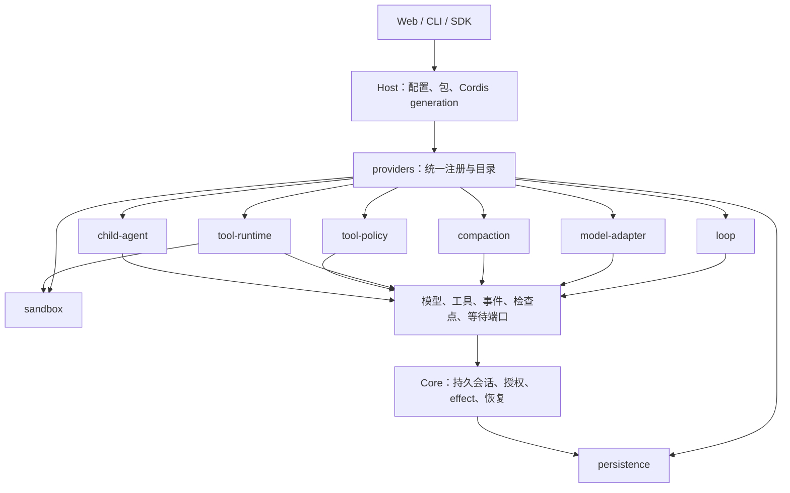

# 插件与 provider 架构

[English](architecture-plugins.md) | 简体中文

[架构](architecture.zh-CN.md) · [源码导航](source-map.zh-CN.md) · [作者指南](../extend/README.zh-CN.md) · [v0.1 合同](contracts-v0.1.zh-CN.md)

内核保存会话事实，负责账本写入、effect、授权与恢复；可替换的算法通过操作端口运行。Host 将包加载到 Cordis，管理注册项与实例，再把选中的 provider 交给 Core。普通后端插件作为受信任的进程内代码执行；组合机制不会隔离任意插件代码。



## 一套 provider 模式

每种类型通过 `@agnes/extension-api` 的 `defineProviderKind<T>()` 描述校验、能力、身份与重启要求。Host 的 `ProviderRegistry<T>` 统一管理注册、重复拒绝、选择、只读目录和释放。注册项可归插件 fiber 所有；卸载时注销并执行原有资源清理。loop 按 `id@version` 注册，其他现有类型拒绝重复 id。

作者可以通过同一个服务注册已有类型：

```ts
export const plugin = {
  inject: ['providers'],
  apply(ctx) {
    ctx.providers.register('tool-policy', '@example/read-only', {
      id: 'read-only', version: '1.0.0',
      decide(input) {
        return input.policy.isReadOnly && !input.policy.isDestructive
          ? { effect: 'allow', reason: 'Read-only call' }
          : { effect: 'deny', reason: 'This preset permits reads only' }
      },
    })
  },
}
```

`loops`、`modelAdapters`、`compactionEngines`、`toolRuntimes`、`toolPolicies`、`sandboxProviders`、`childAgents` 保留原有类型化 API 和目录结构；统一入口委托这些服务执行，包括实例清理与来源包核对。贡献者添加类型时使用 `@agnes/host` 的 `installProviderRegistry(ctx, defineProviderKind({...}))`，再为操作提供类型化外观。persistence 保留进程级启动生命周期：包在打开存储前导出 `persistenceProvider`，同一注册表在 Cordis 启动后加入统一目录。

## 选择与兼容

统一配置块是 `<kind>: { provider: id, version?: version }`，放在一个已启用 profile 包的 `config` 中，复用现有 JSON 扩展点：

```yaml
packages:
  - id: '@example/workflow'
    source: './workflow'
    config:
      loop: { provider: 'example.research', version: '1.0.0' }
      tool-policy: { provider: 'read-only' }
      compaction: { provider: 'default' }
      child-agent: { provider: 'in-process' }
```

原有顶层 `loop: { id, version }`、`compaction: { engine }`、`persistence: { provider }`、`sandbox: { provider }`、模型 `provider.adapters`，以及 preset 的 `tools.runtime` / `approval.policy` 继续有效。显式顶层选择优先于包配置；同一类型由多个包选择时拒绝启动。统一 provider 配置使用 package config，根 profile 只接受已经列入合同的字段。

`child-agent: { provider, version? }` 选择 `childAgents.start(undefined, task, options)` 使用的默认 provider；显式传入 id 仍选择指定 provider。未配置时保留 `in-process`，配置的 provider 缺失时拒绝而不回退。既有进程内 subagent 工具保留显式进程内路径。可选 `LoopContext.children` 使用绑定父会话的 `ChildAgentSessionService` facade，并按配置选择 provider。作者可使用 `ctx.providers.register('child-agent', sourcePackage, provider)` 或兼容的 `ctx.childAgents.register(provider)`，两者共享目录与资源清理。

loop 省略版本时必须恰好安装一个版本。显式版本必须匹配；缺失或歧义都会返回安装或配置修复提示。Core 仍在会话中固定实际解析出的 loop id/version；旧会话映射到 `agnes.default@1.0.0`，恢复不会悄悄换成另一个已安装版本。

`host.providers.catalog()` 和 `ctx.providers.catalog()` 返回所有已安装类型的 `id`、`version`、`sourcePackage`、能力列表、`scope`、由作用域推导的 `restartRequired`、`active` 和 `selectedFor`，不包含工厂或凭据。active 表示被当前 profile、默认值或已绑定 provider 范围选中，不代表正在运行的会话数。卸载项不在目录中；后续类型在其服务安装后加入。管理端和 config dump 可直接消费此只读端口，无需再建注册表或 HTTP 接口。

| 类型 | 默认实现 | 替换与生命周期 |
| --- | --- | --- |
| `loop` | `@agnes/loop-default` 的 `agnes.default@1.0.0` | 新会话可选择；恢复遵循持久化 id/version；注册项随 Cordis 重载。 |
| `model-adapter` | `@agnes/ai` 提供的各 API 适配器 | 模型 profile 更新重建已校验路由；卸载释放所属实例。 |
| `compaction` | Base 的 `default` | 新版本按插件版本代数装配 runner；已有会话保留原代码。 |
| `tool-runtime` | Core 的 `default` | preset 选择；会话实例负责调度与取消。 |
| `tool-policy` | Base approval policy 的 `default` | preset 选择；主体授权仍由 Core 决定。 |
| `persistence` | Host 的 `sqlite` | 启动选择，变更需重启；不会迁移其他 provider 的文件。 |
| `sandbox` | Host 的 `local` | 启动选择、首个 workspace 绑定，变更需重启。 |
| `child-agent` | Base 的 `in-process` | 用 `defineProviderKind` 定义，`childAgents` 保留类型化外观。可选 `acp` 默认不加载。fiber 卸载会中止 provider 生命周期并释放所属 handle；能力检查与会话 allowlist 继续有效。 |

## 插件阶梯

每一级都可以独立学习：**0 使用**——选择插件和 preset；**1 Skill**——编写 `SKILL.md`；**2 连接**——配置 MCP；**3 Tool**——编写 JS/TS 工具；**4 Panel**——添加客户端面板；**5 Brain**——替换模型适配器、压缩引擎或策略；**6 Loop**——提供完整 driver；**7 Bundle**——用配置组合以上能力。新手从工具与 Skill 起步，研究者替换算法，FDE 团队交付 bundle，内核贡献者维护端口与统一生命周期。

<a id="pinned-code-live-resources"></a>


## 固定代码，动态资源

会话持久化插件代码 generation：包、loop、provider 和工具实现跨休眠与重启保持固定。MCP 服务器定义与 Skills 是动态资源，仍按会话的 composition 过滤。资源新增、更新或删除在同一会话的下一轮生效；禁用 MCP 服务器后，所有会话的新一轮都不再看到它。同一 worker 与 opener/策略作用域内，按实际传输配置及已解析凭据边界，未修改的 MCP 服务器跨代码 generation 共享一条连接，每个使用方持有引用计数租约，最后一个 generation/会话引用释放时关闭连接。冷恢复解析固定的代码快照与当前资源，并在有超时上限的等待中完成首次 MCP 工具目录同步。


模型路由、目录及凭据存储配置同样是实时配置：`Host.applyModelProfile` 广播到所有保留的代码容器，各容器的 adapter 注册表保持固定。冷恢复容器使用当前配置；非模型后端变更仍被拒绝。

禁用提供会话 composition 所选 Loop 的包时，该 composition 进入排空状态：保留原代码容器，仅发布动态资源，直到该 Loop 再次启用；新会话不能绑定已禁用的 bundle。保留的代码显示为 draining，Loop 不可用期间拒绝显式迁移。恢复中的任务沿用已有 Loop pin。

### 发布与恢复

composition 发布采用逐容器收敛。`applyRuntimeTarget` 与 `extensionRows.apply` 的收敛结果带有 `publication`；composition Host 的 `refreshSkillRow`、`applyModelProfile` 返回 `HostPublicationReport`，普通 Host 保留 void 返回。报告包含操作、每个 `compositionHash` 的 `applied`/`failed` 结果及错误，以及 `recovery: 'retry-same-input'`。所有容器都会尝试发布，失败不会阻止后续容器。成功容器保留新状态，失败容器可能保留旧状态或部分收敛，新容器采用最新期望输入。重试同一完整输入使失败容器继续收敛。`compositionPublicationStatus()` 读取最后报告。调用方必须检查 `ok`；worker 的资源和配置命令通过 `assertHostPublication` 抛出携带完整报告的 `HostPublicationError`。失败不表示曾执行全局原子回滚。

### 历史会话留存

代码快照按持久会话 pin 留存，包含闲置历史。关闭、休眠不会使 pin 过期，也不会按时间自动升级。特权会话协调器关闭会话并排除并发准入后，可调用 `Host.migrateSessionGeneration(sessionKey)`，将该会话迁移到原 composition 的当前 generation；账本、loop id/version 与 composition binding 保留。两个快照必须存在且兼容，目标须解析相同 loop。打开中的会话、缺失快照或不兼容部署在修改 pin 前被拒绝。迁移幂等，返回 `{ previousGenerationId, generationId, changed }`。

最后一个 pin 迁出，或删除会话后调用 `releaseSessionGeneration`，会触发旧容器释放与快照清理。其他存活 worker 所属归档保守保留，直到所属 worker 清理或退出。迁移显式改变插件实现，不承诺迁移插件自行定义的状态/checkpoint schema。关闭历史会话后，可运行 `agh sessions migrate <key> [--profile <name>] [--json]`。daemon 核验认证会话归属与 `packages.activate`，并在 worker 回应或退出前阻止该 key 的并发准入。打开中或恢复中的会话被拒绝，不中断当前轮。没有自动迁移或模型工具。

Node SDK 提供 `client.packages.migrateSession({ profile, clientId, commandId, sessionId })`，对应 `_agnes/v1/sessions.migrate`。每次请求解析兼容的当前 generation；传输失败后应显式检查或重试，持久 pin 可能已经写入。发布状态通过 `client.packages.publicationStatus({ profile })` / `_agnes/v1/plugins.publicationStatus`，或 `agh plugins publication-status [--profile <name>] [--json]` 查询，返回 `{ publication: report | null }`。null 表示当前 worker 尚无 composition 发布记录，重启后也可能如此。报告保留逐容器 applied/failed 和 retry-same-input 恢复方式，插件异常正文替换为安全失败提示。

同源 admin BFF 提供只读 `GET /admin/plugins/api/publication-status`（launcher 固定 profile，不接受查询参数）与等价的带作用域 POST；要求 `packages.read`，只读恢复模式下仍可访问。`POST /admin/plugins/api/sessions/migrate` 接受上述迁移 DTO，要求 activation 权限，只读模式拒绝写入。Web 端提供 `PluginAdminApi.publicationStatus()` 与 `migrateSession(sessionId)`，launcher 不向浏览器公开 Node 凭据。迁移拒绝以安全的 409 code 返回，例如 `E_GENERATION_SESSION_OPEN`；缺失或不兼容 pin 保持不变。

重启作用域区分后端变更与代码发布：storage、sandbox、platform 及部署 adapter 变更需要 worker/进程重启，恢复仍要求兼容部署。新 generation 为新会话重建其注册表/runner，旧会话保留代码。Host 拒绝在线替换的内置实现仍需重启。provider 目录描述 kind/实例生命周期要求，generation 状态描述当前部署实际支持的发布范围。

## Provider 合同与迁移

内置 kind 字符串通过公开 `KindMap` 绑定注册与解析的类型；自定义 kind 使用 `defineProviderKind<T>()` 创建并由服务安装的同一个 token，同名但不同身份的 token 会被拒绝。provider version 必须是 semver，内置 persistence 从 `1` 改为 `1.0.0`；package version、契约 apiRange、checkpoint codecVersion 与代码摘要各自独立。Extension API 仍为 `1.4.0`。

服务提供者共用这套注册表。`defineServiceKind()` 增加基数、实例作用域和最大端口授权（`ledger`、`input`、`projections`）。Host 安装一份只能缩小授权的描述，并通过 `ExtensionAPI.providers` 准入当前 callback。包身份来自加载器，owner 来自清单。每次获准的调用各自打开实例。callback、generation 或 dispose 之后继续使用句柄会失败关闭。进程级共享仍留在已经做引用计数的功能里。

文件系统加载的每个普通 `agnes.plugins` 条目必须声明 `apiRange`（如 `"^1.4.0"`），Host 在执行模块代码前核验，不再依赖可选的 `hostProvidedExternals`。`ModelAdapter.wireApi` 表示线路格式，旧 `api` 为弃用兼容别名，二者冲突会被拒绝；目录同时提供两个字段。

`ProviderError` 独立于闭合的 extension 调用错误集，稳定 code 为 `E_PROVIDER_DUPLICATE`、`E_PROVIDER_UNKNOWN`、`E_PROVIDER_INVALID`、`E_PROVIDER_INCOMPATIBLE`、`E_PROVIDER_UNAVAILABLE`，携带 kind/provider/operation/retryable/hint/cause。unregister 返回幂等、可等待的 Promise。model、compaction、tool-runtime、policy 的 owner 禁止新准入，取消并等待创建与调用完成，再 dispose 实例、cleanup 注册资源；清理失败聚合返回，不吞错。

生命周期作用域：loop/tool-runtime/child-agent 为 session，model-adapter/compaction/tool-policy 为 generation，persistence/sandbox 为 process，自定义 kind 可声明 workspace。workspace/process 推导为 restartRequired；generation 发布使用注册目录的作用域，同时保留无法由 provider 描述的后台 seam 启动约束。

plugin-runtime 提供所有 kind 的 defineX helper，extension-api/testkit 提供八种 kind 的 conformance runner，并由 plugin-runtime/testkit 重导出。使用隔离的真实 Host 注册端口和公开服务/会话 probe，检查准入拒绝、不可变目录、取消、卸载排空；loop/persistence 必须另验冷恢复。probe 的 ready 表示调用已进入 provider，无需依赖定时猜测。完整签名与使用边界见英文页和 [测试指南](../extend/testing.zh-CN.md)。

## 会话能力解析

`resolveSessionCapabilities()` 是 Host 的纯能力决策边界，返回深度冻结的 `SessionCapabilitySet`。公开结果不含工厂、配置正文、凭据或路径。注册表继续拥有注册与生命周期；读取 facade、调用策略、MCP/Skill 视图、Loop/模型准入、child 准入和客户端模块检查消费 resolver，不再重复判断成员资格。

| 顺序 | 输入与作用 |
| --- | --- |
| 1 | 内置默认值和已解析 profile（含继承的 profile bundles）建立基础与 package 上限。 |
| 2 | 依次应用 preset bundles、preset composition，替换选中字段。 |
| 3 | 依次应用 admin bundles、admin composition/默认 Loop，为新会话建立默认值。 |
| 4 | 显式 session bundles、session 参数依次覆盖默认值。 |
| 5 | 持久绑定使用已编译 composition 与所属代码 generation，不重新应用今天的默认值；legacy 绑定保留未经过 composition 过滤的工具/资源目录，并绕过 bundle ownership scope。 |
| 6 | 所属 generation 的安装目录与当前 MCP/Skills/模型资源确定可用项；资源刷新不重新绑定代码。 |
| 7 | 对 package/bundle 归属、插件启用、模型输入支持、tools 选择、只读/allow/deny 策略、MCP 归属、UI/surface 选择和 child allowlist 取交集；任一检查失败则排除该项。 |

每项携带 `enabled` 和 `reasons[{source:{layer,name},rule}]`，被排除的项保留拒绝原因。单值选择携带来源，`codePin` 保留安全的 generation/package 身份。空 tools/MCP/Skills 列表沿用默认值；显式空 policy allowlist、surface 或 shell module/slot 列表禁止全部。MCP 的本地名与稳定公开工具名使用同一 server 选择；共享 MCP resource bridge 检查 `server` 参数。

`Session.capabilities()` 读取现有鉴权 `_agnes/v1/session.tools` 结果中的可选 `capabilities`（旧服务返回 `undefined`），`agh tools --json` 输出同一结果。`PluginAdminApi.composition(preset?)` 经现有 composition GET/POST 路径读取 `CompositionCapabilitySnapshot`，`agh config dump` 也使用该结果。顶层能力集是静态 desired 检查：未传入目录时，依赖目录的列表保持空；`sessions[].capabilities` 记录实际运行会话事实。客户端切换前保留 `sessions[].toolGroups` 展示兼容 adapter，它不参与授权。
