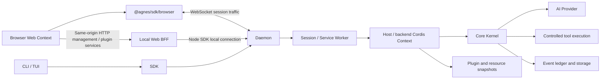

# Architecture: from a request to recoverable execution

English | [简体中文](architecture.zh-CN.md)

[Documentation](../README.md) · [Source map](source-map.md)

AGH runs tasks in a shared backend so CLI, Web, and SDK work with the same session state. Business tools and interfaces use distinct extension entry points and can be developed separately, then composed into an application. This guide follows a request through that architecture.

Clients present state, the daemon manages sessions and the control plane, Host assembles the runtime, and Core advances the model/tool loop. Models propose actions; model text does not decide tool authorization, execution, or persistent state.

## The two Web communication paths

The session path is `@agnes/sdk/browser` → WebSocket → daemon. `app.ts` reads the address from the page's `agnes-config` `data-ws` attribute and creates a client with `transport.kind: 'ws'`, protocol `agnes-v1`, and `auth.kind: 'local'`. Session creation/loading, prompts, events, and approvals use this connection without HTTP BFF forwarding. `local` does not waive server-side loopback, Origin, or permission checks.

Management and constrained plugin services use a same-origin HTTP BFF. Resource management uses `/admin/resources/api/...`; client plugin queries/effects use `/api/client-modules/service` and `/api/client-modules/effect`. The local Web process then calls the daemon through the Node SDK's local connection. Direct browser session connectivity does not give browser plugins Node management capabilities. `ClientContext` service relay remains constrained by the current session, row identity, and allow-list.

Code: [browser session client](../../packages/web/src/app.ts), [browser SDK exports and management restrictions](../../packages/sdk/src/index.browser.ts), [resource-management BFF](../../packages/resource-control-cli/src/admin-bff.ts), [plugin-service BFF](../../packages/cli/launch/package-admin.ts), [Web server](../../packages/web-server/src/server.ts).

## State ownership

| Layer | Main responsibilities |
| --- | --- |
| CLI/Web | User input, approval interaction, sessions, and result presentation |
| SDK | Protocol, transport, session handles, cursors, and request journal |
| daemon / worker | Shared instance and session directory, control plane, and approval routing; workers host execution environments |
| Host | Profiles, credentials, platform adapters, plugin assembly, and Kernel creation |
| Core | Execution state machine, event facts, and required capability seams |
| AI/Base/Code | Provider protocols, standard capabilities, and programmable workflows |

A prompt reaches the daemon through the SDK and is routed to a session worker. Host supplies model, tool, approval, sandbox, storage, and other seams for that session. Core generates the next step, records state, and consumes model or tool results. Clients read events or derived projections. Backend state determines cancellation, failure, parking, and recovery.

## Seams and extensions

A seam supplies a required part of execution, such as approval, ledger, or sandbox behavior. Missing seams must be refused according to the contract rather than silently skipped. Extensions contribute optional features such as tools, observation hooks, or client slots. Both can be assembled through Cordis, but they have different permission surfaces.

Trusted backend Cordis rows may contribute tools, hooks, and constrained services. A browser module is a separate runtime surface bound to a row; see [plugin boundaries](plugins.md). Frontend and backend Contexts do not share memory. Ordinary `ctx.provide()` is not a cross-process proxy. Browsers call row services through declared relays without obtaining Host management objects.

## Runtime targets and hot updates

PackageManager produces verified snapshots and governance state. A runtime target combines ordinary rows, resource rows, and platform-synthesized client rows. `web:` rows do not execute in Host's ordinary tree. Host reconciles mutable rows, dependencies, and actual state in constrained transactions, applying eligible changes incrementally. Static boundaries, failed compensation, or tainted state may require a rebuild.

This supports incremental updates for eligible changes. Transactions do not cover external business effects. The frontend also reconciles its own roster and cleans up fibers, so inspect both backend actual state and page loading.

## MCP and Skills

The MCP control plane stores definitions, trust, and enablement. Session workers mount a Host `ext:` row per eligible server from resource snapshots. Startup and turn-boundary reloads use the same apply path; the dedicated resource-management service worker uses the manager. The session path currently skips OAuth bindings; see [MCP runtime behavior](../guide/mcp.md#runtime-behavior-and-versions) for the call chain and limits.

Skills combine disk/package resource governance with runtime Cordis contributions. The shared worker handles Skill scan/deletion commands, and Host's Skills row can refresh incrementally after resource changes. The session workspace determines visible disk Skills. This lifecycle differs from per-server MCP rows; do not assume each Skill source has its own Host row.

## App Server and clients

AGH's App Server provides shared task execution: the daemon manages sessions and the control plane, workers execute tasks, and the SDK provides communication entry points. Choose an integration path from the repository's [API contracts](../reference/api.md) when building a client.

## Scope of reusable applications

FDE and domain-specific deployments can connect knowledge retrieval, databases, business systems, and specialized interfaces to a shared execution and approval flow. Enterprise deployment, audit, and isolation requirements need validation in the actual environment. MHS and device adapters are future integration directions and are not part of the implemented software diagram above; their guides and examples are [coming soon](../guide/mhs.md).

Source: [Host](../../packages/host/src/assemble.ts), [Worker](../../packages/worker-runtime/src/main.ts), [Core](../../packages/core/src), [Daemon](../../packages/daemon/src/supervisor/supervisor.ts), [runtime-target publication](../../packages/host/src/runtime-target-publisher.ts), [Web Context](../../packages/web/src/client-modules/boot.ts).
