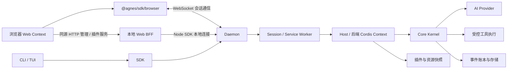

# 架构：从请求到可恢复执行

[文档导航](../README.md) · [源码地图](source-map.md)

AGH 把任务运行放在共享后台，让 CLI、Web 与 SDK 围绕同一份会话状态工作。业务工具和界面通过各自的扩展入口接入，开发者可以分别构建，再组合成应用。本页沿一次请求说明这套结构如何工作。

AGH 的客户端展示状态，daemon 管理会话与控制面，Host 组装运行环境，Core 推进模型与工具的执行循环。模型负责生成候选行为；工具授权、执行与持久状态不由模型文本决定。

## Web 的两条通信路径

会话主路径是浏览器中的 `@agnes/sdk/browser` → WebSocket → daemon。`app.ts` 从页面 `agnes-config` 的 `data-ws` 读取地址，以 `transport.kind: 'ws'`、协议 `agnes-v1` 和 `auth.kind: 'local'` 创建客户端；会话创建/加载、prompt、事件和审批交互走这条连接。它不经过 HTTP BFF 转发；`local` 不表示可以免除服务端的回环/Origin 与权限校验。

管理及受限插件服务则走同源 HTTP BFF。资源管理使用 `/admin/resources/api/...`，客户端插件 query/effect 使用 `/api/client-modules/service`、`/api/client-modules/effect`；本地 Web 进程再用 Node SDK 的本地连接调用 daemon。浏览器有直接会话连接，不等于浏览器插件获得了 Node 管理能力；`ClientContext` 的 service relay 仍受当前会话、行身份和 allow-list 约束。

对应代码：[浏览器会话客户端](../../packages/web/src/app.ts)、[浏览器 SDK 出口与管理方法限制](../../packages/sdk/src/index.browser.ts)、[资源管理 BFF](../../packages/resource-control-cli/src/admin-bff.ts)、[插件服务 BFF](../../packages/cli/launch/package-admin.ts)、[Web 服务](../../packages/web-server/src/server.ts)。

## 状态归属

| 层 | 主要职责 |
| --- | --- |
| CLI/Web | 用户输入、审批交互、会话与结果展示 |
| SDK | 协议、传输、会话句柄、游标与请求日志 |
| daemon / worker | 共享实例与会话目录、控制面与审批路由；worker 承载执行环境 |
| Host | Profile、凭据、平台适配、插件装配与 Kernel 创建 |
| Core | 执行状态机、事件事实与必要能力接缝 |
| AI/Base/Code | 提供方协议、标准能力与可编程工作流 |

一次 prompt 经 SDK 到 daemon，路由到 session worker。Host 为该会话提供模型、工具、审批、沙箱、存储等接缝；Core 生成下一步、记录状态，再消费模型或工具结果。客户端读取事件或派生投影。取消、失败、停驻、恢复都由后台状态决定。

## 接缝与扩展

Seam 是必要执行位置的实现，例如审批、账本、沙箱；缺失必须按合同拒绝，不能静默跳过。Extension 是可选贡献，例如工具、观察 hook、客户端槽位。它们虽可通过 Cordis 装配，但权限面并不相同。

受信后端 Cordis 行可贡献工具、hook 和受约束的服务等能力；浏览器模块是绑定该行的另一运行面，详见[插件边界](plugins.md)。前后端的 Context 不共享内存；普通 `ctx.provide()` 不是跨进程代理。浏览器通过已声明的 relay 调用行服务，不直接获取 Host 管理对象。

## Runtime target 与热更新

PackageManager 产生已核验快照和治理状态；runtime target 组合普通行、资源行与平台合成的客户端行。`web:` 行不在 Host 普通树执行。Host 在受限事务中协调可变行、依赖和实际状态，合格变更增量应用；静态边界、失败补偿或污染处理可能要求重建。

这套机制支持符合条件的增量更新。其事务范围不覆盖外部业务效果；前端还有自己的名册对账与 fiber 清理，需要分别检查后端实际状态和页面加载结果。

## MCP 与 Skills

MCP 控制面保存定义、信任与启用状态。session worker 从资源快照为每个合格服务器挂载 Host `ext:` 行，启动与轮次边界重载使用同一条 apply 路径；专用资源管理 service worker 使用 manager。当前会话路径跳过 OAuth 绑定，具体调用链与限制见[MCP 运行方式](../guide/mcp.md#运行方式与版本)。

Skills 包含磁盘/包资源治理与运行时 Cordis 贡献。当前共享 worker 承接 Skill 扫描/删除命令，Host 的 Skills 行可在资源变化后增量刷新；会话工作区仍决定可见磁盘 Skill。它与 MCP 的逐服务器行是不同的生命周期，不应推定所有 Skill 来源都各有独立 Host 行。

## App Server 与客户端

AGH 的 App Server 为客户端提供共享的任务运行基础：daemon 管理会话与控制面，worker 承载执行，SDK 提供通信入口。开发自己的客户端时，从本仓的[API 合同](../reference/api.md)选择接入方式。

## 可复用场景的范围

FDE/行业交付可将知识检索、数据库、业务系统和专用界面接到同一执行与审批流程。企业部署、审计和隔离要求需针对实际环境验证。MHS 与设备适配属于后续接入方向，未包含在上方已实现的软件架构图中；接入文档与示例[即将开放](../guide/mhs.md)。

源码依据：[Host](../../packages/host/src/assemble.ts)、[Worker](../../packages/worker-runtime/src/main.ts)、[Core](../../packages/core/src)、[Daemon](../../packages/daemon/src/supervisor/supervisor.ts)、[运行目标发布](../../packages/host/src/runtime-target-publisher.ts)、[Web Context](../../packages/web/src/client-modules/boot.ts)。
