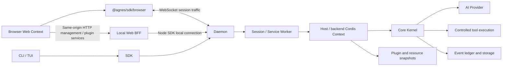

# Architecture: from a request to recoverable execution

English | [简体中文](architecture.zh-CN.md)

[Documentation](../README.md) · [Source map](source-map.md)

AGH runs tasks in a shared backend so CLI, Web, and SDK work with the same session state. Business tools and interfaces use distinct extension entry points and can be developed separately, then composed into an application. This guide follows a request through that architecture.

Clients present state, the daemon manages sessions and the control plane, Host assembles the runtime, and Core advances the model/tool loop. Models propose actions; model text does not decide tool authorization, execution, or persistent state.

## Brain, cerebellum, memory and body

**LLM is the brain, Jev is the cerebellum, Harness is the memory, and MHS is the body.** This is a role metaphor for the product vision, and the overview shows the target architecture; the request diagram below follows the existing software implementation.

| Concept | Responsibility and implementation boundary |
| --- | --- |
| **LLM / brain** | The [AI provider layer](../../packages/ai/src) supplies model inference. Core consumes proposed actions through the controlled execution flow. |
| **Jev / cerebellum** | A planned structured-decision integration for routing, scoring, and execution coordination. Main uses the built-in [Core loop](../../packages/core/src/step/session.ts); it has no Jev adapter or Jev-driven loop. [TypeSafe's Jev guide](https://docs.typesafe.ai/introduction/coding-agents) explains its structured-decision role. AGH's integration contract still needs implementation and validation. |
| **Harness / memory** | [Core event records](../../packages/core/src/log), task state, shared sessions, and recovery preserve task context. [Skills](../guide/skills.md) capture reusable methods. Harness also owns execution and governance; these memory mechanisms preserve facts and methods under their existing contracts. |
| **MHS / body** | A planned device capability interface, built on MCP (Model Context Protocol) rather than a vendor-specific SDK or a ROS bridge: AGH would organize state reads, action requests, and receipts through MCP-based adapters. The physical body consists of devices and their controllers; AGH's [MHS integration](../guide/mhs.md) is exploratory. |

Jev decisions and LLM proposals would still pass through backend authorization and execution controls. Session records and Skills contribute context; authority comes from the configured policy and approval flow.

## Runtime request path

```mermaid
flowchart LR
  CLI[CLI / TUI] --> SDK[SDK]
  Web[Browser Web Context] --> BrowserSDK["@agnes/sdk/browser"]
  BrowserSDK <-->|WebSocket session traffic| D[Daemon]
  Web -->|Same-origin HTTP management / plugin services| BFF[Local Web BFF]
  BFF -->|Node SDK local connection| D
  SDK --> D
  D --> W[Session / Service Worker]
  W --> H[Host / backend Cordis Context]
  H --> K[Core Kernel]
  K --> AI[AI Provider]
  K --> T[Controlled tool execution]
  K --> L[Event ledger and storage]
  H --> R[Plugin and resource snapshots]
```

## The two Web communication paths

The session path is `@agnes/sdk/browser` → WebSocket → daemon. `app.ts` reads the address from the page's `agnes-config` `data-ws` attribute and creates a client with `transport.kind: 'ws'`, protocol `agnes-v1`, and `auth.kind: 'local'`. Session creation/loading, prompts, events, and approvals use this connection without HTTP BFF forwarding. `local` does not waive server-side loopback, Origin, or permission checks.

Management and constrained plugin services use a same-origin HTTP BFF. Resource management uses `/admin/resources/api/...`; client plugin queries/effects use `/api/client-modules/service` and `/api/client-modules/effect`. The local Web process then calls the daemon through the Node SDK's local connection. Direct browser session connectivity does not give browser plugins Node management capabilities. `ClientContext` service relay remains constrained by the current session, row identity, and allow-list.

Code: [browser session client](../../packages/web/src/app.ts), [browser SDK exports and management restrictions](../../packages/sdk/src/index.browser.ts), [resource-management BFF](../../packages/resource-control-cli/src/admin-bff.ts), [plugin-service BFF](../../packages/cli/launch/package-admin.ts), [Web server](../../packages/web-server/src/server.ts).

## State ownership

The daemon also owns a private runtime-client HTTP listener on a random `127.0.0.1` port, including
when only Unix sockets or Windows pipes are configured. CLI startup first verifies the local IPC
connection and daemon owner generation, then reads the endpoint and derives a separate bearer from
the existing private local credential. HTTP checks the bearer in constant time and rechecks the
owner before reading a body. Restart invalidates the capability; shutdown closes the listener.
Host composition admits only explicitly installed read adapters with an injected authorization
policy. Missing services or policy return `operation_not_supported`; write operations remain unwired.

| Layer | Main responsibilities |
| --- | --- |
| CLI/Web | User input, approval interaction, sessions, and result presentation |
| SDK | Protocol, transport, session handles, cursors, and request journal |
| daemon / worker | Shared instance and session directory, control plane, and approval routing; workers host execution environments |
| Host | Profiles, credentials, platform adapters, plugin assembly, and Kernel creation |
| Core | Execution state machine, event facts, and required capability seams |
| AI/Base/Code | Provider protocols, standard capabilities, and programmable workflows |

A prompt reaches the daemon through the SDK and is routed to a session worker. Host supplies model, tool, approval, sandbox, storage, and other seams for that session. Core generates the next step, records state, and consumes model or tool results. Clients read events or derived projections. Backend state determines cancellation, failure, parking, and recovery.

## Seams and extensions

A seam supplies a required part of execution, such as approval, ledger, or sandbox behavior. Missing seams must be refused according to the contract rather than silently skipped. Extensions contribute optional features such as tools, observation hooks, or client slots. Both can be assembled through Cordis, but they have different permission surfaces.

Trusted backend Cordis rows may contribute tools, hooks, and constrained services. A browser module is a separate runtime surface bound to a row; see [plugin boundaries](plugins.md). Frontend and backend Contexts do not share memory. Ordinary `ctx.provide()` is not a cross-process proxy. Browsers call row services through declared relays without obtaining Host management objects.

Host startup also opens one fixed Cordis service root, available to trusted Host code through the readonly `runtimeServices` accessor. Its initial defaults are `agh.package-source` queries and `agh.package-resolver` computation over an isolated, initially empty package cache. They have no admitted local roots, network sources, or maintenance operations. Unregistered contracts return `service_not_registered`. This root runs beside the existing Kernel, SQLite session storage, audit sink, and secrets composition. Initialization failure uses startup rollback; Host shutdown releases the resolver before the source and removes the cache. See [Host service selection](../../packages/host/src/runtime/host-services.ts) and [startup tests](../../packages/host/test/host.test.ts).

Trusted Host code also has a private `runtimeServices.usageLedger` composition slot. Its optional
`runtimeUsageLedgerOwners` supply the selected C33 provider and authenticated context, committed State
source verification, and the original Session/Core mapping with an exclusive ledger write capability.
Absent owners return named refusals and create no journal. The session owner must exclude the claimed
run from legacy inference settlement; ordinary sessions retain their existing ledger path.

The consumer journals delivery before C33 record/query and writes verified credits through the original
effect-idempotent ledger seam. Gateway zero and original estimates keep their source labels; unknown
or missing credits remain pending and refuse delivery. Existing bounded-units reservations require a
C32 settlement owner. A pending delivery blocks another attempt in that run; ledger failures refuse.
Cold owners can enumerate `pending()` and call `consume()` with the original attempt. This slot has
fixture coverage, including process death; production installer, State store and Core mapping owners
are still required. See [Host usage composition](../../packages/host/src/assemble/usage-ledger.ts).

## Runtime targets and hot updates

PackageManager produces verified snapshots and governance state. A runtime target combines ordinary rows, resource rows, and platform-synthesized client rows. `web:` rows do not execute in Host's ordinary tree. Host reconciles mutable rows, dependencies, and actual state in constrained transactions, applying eligible changes incrementally. Static boundaries, failed compensation, or tainted state may require a rebuild.

This supports incremental updates for eligible changes. Transactions do not cover external business effects. The frontend also reconciles its own roster and cleans up fibers, so inspect both backend actual state and page loading.

## MCP and Skills

The MCP control plane stores definitions, trust, and enablement. Session workers mount a Host `ext:` row per eligible server from resource snapshots. Startup and turn-boundary reloads use the same apply path; the dedicated resource-management service worker uses the manager. The session path currently skips OAuth bindings; see [MCP runtime behavior](../guide/mcp.md#runtime-behavior-and-versions) for the call chain and limits.

Skills combine disk/package resource governance with runtime Cordis contributions. The shared worker handles Skill scan/deletion commands, and Host's Skills row can refresh incrementally after resource changes. The session workspace determines visible disk Skills. This lifecycle differs from per-server MCP rows; do not assume each Skill source has its own Host row.

## App Server and clients

AGH's App Server provides shared task execution: the daemon manages sessions and the control plane, workers execute tasks, and the SDK provides communication entry points. Choose an integration path from the repository's [API contracts](../reference/api.md) when building a client.

The runtime HTTP listener consumes Host-owned read adapters. Host owns the projection lifecycle, refreshes after committed-event notifications, and checks original C14-issued contexts on each read. Host imports the default projection factory from the Core package root and constructs it when trusted assembly supplies the selected domain, binding, access and owner facts. Missing installation facts refuse with `projection_provider_installation_unavailable`; an installed provider without a context issuer refuses reads with `projection_context_issuer_unavailable`. The production HTTP C14 issuer binding is still required; HTTP transport authentication does not issue a business identity.

A trusted `projection` installation supplies the selected domain store's owner and permissions. The supervisor opens one store and passes that same instance as command storage, an async wrapper of its event journal, its commit subscription, and the daemon's native conversation adapter to Host assembly. Commits through another store instance do not notify this owner. Shutdown unsubscribes, aborts and drains Host reads/refreshes, closes the provider, and then closes the store; absent installation facts keep the default refusal.

The private `runtimeAdmissionInstallation.loop` slot registers selected Tools, Context and Loop factories in that same Host service root. The explicit worker `runtime.run.create` command starts an installed Loop after confirmed admission; an empty slot preserves admission-only behavior and existing session execution. Run providers close before the root and admission owner. Cancellation reaches the run only after the original admission owner accepts the request.

Tools invokes the injected original source through `ToolsDeployment.verifyCall`. A missing model source returns `tools_model_context_source_unavailable`; Host does not construct model provenance. Native State transaction, Supervisor, Model action and cold-reader adapters are also required. Refusals are saved by the installation's original State owner; an unavailable writer returns failure rather than a successful terminal claim. Restricted worker fixtures verify both Tools implementations, but do not establish production model sources or cold recovery.

## Scope of reusable applications

FDE is a delivery approach; MHS is a device integration direction. An FDE deployment can use AGH's existing extension paths for enterprise software and can later include device integrations. Knowledge retrieval, database connectors, business systems, and specialized interfaces require implementation and validation for each environment.

| Module and source ownership | FDE use through current software paths | Reusable foundation for a future MHS integration |
| --- | --- | --- |
| App Server: [SDK](../../packages/sdk/src), [daemon](../../packages/daemon/src), [worker](../../packages/worker-runtime/src) | Shared sessions, task submission, events, approval routing, and client integration | Task entry points, human confirmation, and status presentation |
| Agent Loop: [Host assembly](../../packages/host/src/assemble.ts), [Core](../../packages/core/src), [AI](../../packages/ai/src) | Model/tool execution, task state, interruption handling, and recovery | High-level device task orchestration; device controllers perform actual motion |
| Memory: [event records](../../packages/core/src/log), [resource governance](../../packages/resource-control-runtime/src) | Preserve task history and results; reuse methods through Skills | Preserve observations and adapter receipts under task-record contracts; device truth needs device-side verification |
| Execution constraints: [controlled tool execution](../../packages/core/src/step/tools.ts), [sandbox](../../packages/base/src/sandbox-shell.ts), [workspace policy](../../packages/host/src/workspace-policy.ts) | Tool approvals and applicable software execution constraints | Software-side control points; device interlocks, emergency stops, and local takeover remain device responsibilities |
| Plugins: [Cordis](../../packages/cordis/src), [plugin runtime](../../packages/plugin-runtime/src), [package manager](../../packages/package-manager/src), [Web client modules](../../packages/web-client/src) | Backend tools/services, hooks, Skills, MCP connections, and business panels | Extension points for adapters and device-facing interfaces; no verified general-purpose MHS adapter exists in this repository |

Ordinary backend plugins execute as trusted in-process code. A tool approval or available command sandbox does not isolate arbitrary plugin code. Approvals, sandbox behavior, and other required seams are selected by trusted deployment configuration; ordinary extensions do not acquire the right to replace them by registering a tool or hook. See [security and trust](../guide/security.md).

MHS adapters are the device branch in the overview, built on MCP (Model Context Protocol) rather than a vendor-specific SDK or a ROS bridge. Integration guides and examples are [coming soon](../guide/mhs.md); a bare MCP connection alone does not establish MHS compatibility, since no public MHS specification is open for certification. Task cancellation does not establish that a physical device stopped safely. Enterprise deployment, audit, isolation, and device actions each need validation in their actual environment.

Source: [Host](../../packages/host/src/assemble.ts), [Worker](../../packages/worker-runtime/src/main.ts), [Core](../../packages/core/src), [Daemon](../../packages/daemon/src/supervisor/supervisor.ts), [runtime-target publication](../../packages/host/src/runtime-target-publisher.ts), [Web Context](../../packages/web/src/client-modules/boot.ts).
