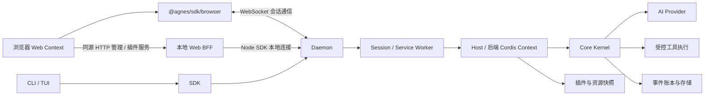

# 架构：从请求到可恢复执行

[English](architecture.md) | 简体中文

[文档导航](../README.zh-CN.md) · [源码地图](source-map.zh-CN.md)

AGH 把任务运行放在共享后台，让 CLI、Web 与 SDK 围绕同一份会话状态工作。业务工具和界面通过各自的扩展入口接入，开发者可以分别构建，再组合成应用。本页沿一次请求说明这套结构如何工作。

AGH 的客户端展示状态，daemon 管理会话与控制面，Host 组装运行环境，Core 推进模型与工具的执行循环。模型负责生成候选行为；工具授权、执行与持久状态不由模型文本决定。

## 业务 Agent 与运行时

业务 Agent Loop、工具、模型适配器与角色通过插件替换，由 Host 组合。官方默认 Agent Loop 位于 [loop-default](../../packages/loop-default/src/index.ts)，只使用公开 LoopContext 端口；Core 负责授权、持久事实与恢复。[文件记忆](../guide/memory.zh-CN.md)保存学习到的偏好，账本保留执行历史。

Jev 仍是探索中的结构化决策接入，没有已安装的 Jev 适配器。[MHS](../guide/mhs.zh-CN.md)已有模拟 MCP 巡检组合包，不证明物理设备兼容性；这些方向与下方已实现的请求链路分开说明。

## 运行时请求链路

## Web 的两条通信路径

会话主路径是浏览器中的 `@agnes/sdk/browser` → WebSocket → daemon。`app.ts` 从页面 `agnes-config` 的 `data-ws` 读取地址，以 `transport.kind: 'ws'`、协议 `agnes-v1` 和 `auth.kind: 'local'` 创建客户端；会话创建/加载、prompt、事件和审批交互走这条连接。它不经过 HTTP BFF 转发；`local` 不表示可以免除服务端的回环/Origin 与权限校验。

管理及受限插件服务则走同源 HTTP BFF。资源管理使用 `/admin/resources/api/...`，客户端插件 query/effect 使用 `/api/client-modules/service`、`/api/client-modules/effect`；本地 Web 进程再用 Node SDK 的本地连接调用 daemon。浏览器有直接会话连接，不等于浏览器插件获得了 Node 管理能力；`ClientContext` 的 service relay 仍受当前会话、行身份和 allow-list 约束。

对应代码：[浏览器会话客户端](../../packages/web/src/app.ts)、[浏览器 SDK 出口与管理方法限制](../../packages/sdk/src/index.browser.ts)、[资源管理 BFF](../../packages/resource-control-cli/src/admin-bff.ts)、[插件服务 BFF](../../packages/cli/launch/package-admin.ts)、[Web 服务](../../packages/web-server/src/server.ts)。

## 状态归属

| 层 | 主要职责 |
| --- | --- |
| CLI/Web | 用户输入、审批交互、会话与结果展示 |
| SDK | 协议、传输、会话句柄、游标与请求日志 |
| daemon / worker | 共享实例与会话目录、控制面与审批路由；worker 承载执行环境 |
| Host | Profile、凭据、平台适配、插件装配与 Kernel 创建 |
| Core | 执行状态机、事件事实与必要能力接缝 |
| AI/Base/Code | 提供方协议、标准能力与可编程工作流 |

一次 prompt 经 SDK 到 daemon，路由到 session worker。Host 为该会话提供模型、工具、审批、沙箱、存储等接缝；Core 生成下一步、记录状态，再消费模型或工具结果。客户端读取事件或派生投影。取消、失败、停驻、恢复都由后台状态决定。

## 接缝与扩展

Seam 是必要执行位置的实现，例如审批、账本、沙箱；缺失必须按合同拒绝，不能静默跳过。Extension 是可选贡献，例如工具、观察 hook、客户端槽位。它们虽可通过 Cordis 装配，但权限面并不相同。

受信后端 Cordis 行可贡献工具、hook 和受约束的服务等能力；浏览器模块是绑定该行的另一运行面，详见[插件边界](plugins.zh-CN.md)。前后端的 Context 不共享内存；普通 `ctx.provide()` 不是跨进程代理。浏览器通过已声明的 relay 调用行服务，不直接获取 Host 管理对象。

## Runtime target 与热更新

PackageManager 产生已核验快照和治理状态；runtime target 组合普通行、资源行与平台合成的客户端行。`web:` 行不在 Host 普通树执行。代码发布产生供新会话绑定的版本；保留的会话继续使用原代码与配套客户端模块。在同一版本内，Host 通过受限事务协调合格的动态资源行、依赖和实际状态。基础后端变更要求重启；失败补偿或污染处理可能要求重建。

这套机制支持符合条件的增量更新。其事务范围不覆盖外部业务效果；前端还有自己的名册对账与 fiber 清理，需要分别检查后端实际状态和页面加载结果。

## MCP 与 Skills

MCP 控制面保存定义、信任与启用状态。session worker 从资源快照为每个合格服务器挂载 Host `ext:` 行，启动与轮次边界重载使用同一条 apply 路径；专用资源管理 service worker 使用 manager。当前会话路径跳过 OAuth 绑定，具体调用链与限制见[MCP 运行方式](../guide/mcp.zh-CN.md#运行方式与版本)。

Skills 包含磁盘/包资源治理与运行时 Cordis 贡献。当前共享 worker 承接 Skill 扫描/删除命令，Host 的 Skills 行可在资源变化后增量刷新；会话工作区仍决定可见磁盘 Skill。它与 MCP 的逐服务器行是不同的生命周期，不应推定所有 Skill 来源都各有独立 Host 行。

## App Server 与客户端

每个 `AGH_HOME` 只有一个经过认证的 daemon endpoint。[App Server v1 合同](../reference/app-server.zh-CN.md) 发布生成的 JSON Schema 和方法级 TypeScript 类型。`agh app-server --stdio` 与 ACP 是连接同一 daemon 的 bridge。管理 HTTP 路径适配相同 RPC 方法；composition、search、context、history 和 plan 状态由 daemon 管理。错误保留数字代码，并携带本地化消息键、白名单 cause 和诊断 id。

AGH 的 App Server 为客户端提供共享的任务运行基础：daemon 管理会话与控制面，worker 承载执行，SDK 提供通信入口。开发自己的客户端时，从本仓的[API 合同](../reference/api.zh-CN.md)选择接入方式。

## 可复用场景的范围

FDE 是交付方式，MHS 是设备接入方向。FDE 交付可通过 AGH 已有扩展入口构建企业软件，后续也可包含设备接入。知识检索、数据库连接器、业务系统与专用界面需要针对具体环境开发与验证。

| 模块与源码归属 | 当前软件路径怎样支撑 FDE | 后续 MHS 接入可复用的底座 |
| --- | --- | --- |
| App Server：[SDK](../../packages/sdk/src)、[daemon](../../packages/daemon/src)、[worker](../../packages/worker-runtime/src) | 共享会话、任务提交、事件、审批路由与客户端接入 | 任务入口、人工确认和状态展示 |
| Agent Loop：[Host 装配](../../packages/host-runtime/src/assemble.ts)、[Core](../../packages/core/src)、[AI](../../packages/ai/src) | 模型与工具执行、任务状态、中断处理和恢复 | 高层设备任务编排；实际运动由设备控制器执行 |
| 记忆：[事件记录](../../packages/core-ledger/src/log)、[资源治理](../../packages/resource-control-runtime/src) | 保存任务历史和结果，通过 Skills 复用方法 | 按任务记录合同保存观察与适配器回执；设备实际状态仍需设备侧验证 |
| 执行约束：[受控工具执行](../../packages/core/src/step/tools.ts)、[sandbox](../../packages/base/src/sandbox-shell.ts)、[工作区策略](../../packages/host-common/src/workspace-policy.ts) | 工具审批与适用的软件执行约束 | 软件侧控制点；设备互锁、急停与本地接管仍由设备侧承担 |
| 插件：[Cordis](../../packages/cordis/src)、[插件运行时](../../packages/plugin-runtime/src)、[包管理](../../packages/package-manager/src)、[Web 客户端模块](../../packages/web-client/src) | 后端工具与服务、hooks、Skills、MCP 连接和业务面板 | 适配器与设备操作界面的扩展入口；仓库尚无已验证的通用 MHS 适配器 |

普通后端插件作为受信进程内代码执行；一次工具审批或可用的命令沙箱不代表任意插件代码已被隔离。审批、沙箱等必要接缝由受信部署配置选择；普通扩展注册工具或 hook 不会获得替换它们的权限。详见[安全与信任](../guide/security.zh-CN.md)。

MHS 适配器对应总览图中的设备分支，基于 MCP（Model Context Protocol）而非厂商专属 SDK 或 ROS 桥接；已有[模拟巡检组合包](../guide/mhs.zh-CN.md)，真实硬件适配仍需验证。仅完成一次 MCP 连接本身不构成 MHS 兼容证明，因为目前没有可供认证的公开 MHS 规范；取消任务也不代表物理设备已安全停止。企业部署、审计、隔离与设备动作均需在实际环境中分别验证。

源码依据：[Host](../../packages/host-runtime/src/assemble.ts)、[Worker](../../packages/worker-runtime/src/main.ts)、[Core](../../packages/core/src)、[Daemon](../../packages/daemon-supervisor/src/supervisor/supervisor.ts)、[运行目标发布](../../packages/host-providers/src/runtime-target-publisher.ts)、[Web Context](../../packages/web/src/client-modules/boot.ts)。
