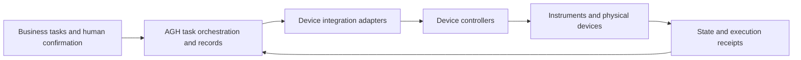

# MHS and device integration: bring tasks into the physical world

English | [简体中文](mhs.zh-CN.md)

[Project home](../../README.md) · [Documentation](../README.md) · [FDE and use cases](why-agh.md)

> **Coming soon: AGH's MHS integration documentation and examples.**

From inspection and maintenance to instrument coordination, field work connects device state, human judgment, and business workflows. AGH plans to explore physical device integration through MHS (Model Hardware Standard), bringing state reads, operation requests, and execution receipts into one task flow.

We plan to publish guides and reproducible examples around these scenarios, helping developers combine device capabilities, human confirmation, and business interfaces into applications.

## How AGH plans to integrate

The following is a proposed division of responsibilities. Concrete interfaces still need validation:

AGH organizes tasks, authorization interactions, and result records. An adapter connects device capabilities to task execution, while the device controller owns actual motion and site protections. The adapter may explore MHS, a vendor SDK, or another device interface. A connection through an SDK, ROS, or MCP alone does not demonstrate MHS compatibility.

For example, an inspection task might follow: read status → detect an anomaly → obtain human confirmation → perform a constrained action → verify the receipt. This describes a target workflow. Each device model, action, and failure path needs its own implementation and validation.

## What is coming

| Content | Planned scope | Status |
| --- | --- | --- |
| Integration guide | Device capability descriptions, adapter placement, identity, and permissions | Coming soon |
| Examples and reproduction steps | Start with read-only status or simulation; state prerequisites and expected results | Coming soon |
| Device verification notes | Supported models, software versions, test environments, and known limits | Coming soon |

Adapter designs, supported devices, and examples will be announced after validation. No opening date is set. Integration is currently exploratory: the repository has no verified general-purpose MHS adapter or end-to-end device example.

## Device control boundaries

The device and its control system remain responsible for real-time motion control, interlocks, emergency stops, and local takeover. Canceling an AGH task does not establish that a device has stopped safely. After a connection loss or missing receipt, inspect device state before repeating an action whose outcome is unknown. Desktop Computer Use verification does not establish physical device integration.

Start with [backend plugins](../develop/backend.md), [MCP](mcp.md), and [full-stack integration](../develop/fullstack.md) to understand the software extension paths. Share device requirements through the [feedback process](../develop/contributing.md). Code and documentation PRs remain limited to invited internal developers.

## Current status at a glance

**AGH's MHS integration documentation and examples are coming soon.** The direction covers task orchestration, human confirmation, and result verification. A verified general-purpose adapter, supported-device list, and end-to-end device example are not yet available, and no opening date has been announced. Device controllers retain responsibility for real-time control and physical safety.
