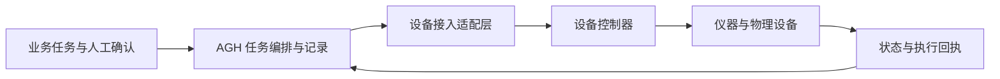

# MHS 与设备接入：让任务走进物理现场

[项目首页](../../README.md) · [文档导航](../README.md) · [FDE 与应用场景](why-agh.md)

> **即将开放：AGH 的 MHS 接入文档与示例。**

从巡检和运维到仪器协作，现场工作需要将设备状态、人的判断与业务流程连接起来。AGH 计划探索通过 MHS（Model Hardware Standard）接入物理设备，让状态读取、操作请求和执行回执进入同一套任务流程。

我们将围绕这些场景逐步开放指南和可复现示例，帮助开发者把设备能力、人工确认与业务界面组织成应用。

## AGH 计划如何接入

下面是拟议的职责关系，具体接口尚待验证：

AGH 负责组织任务、授权交互和结果记录；适配层将设备能力接入任务流程；设备控制器负责实际动作与现场保护。适配层可研究 MHS，也可使用厂商 SDK 或其他设备接口。通过 SDK、ROS 或 MCP 完成一次连接，本身不构成 MHS 兼容性验证。

例如，设备巡检场景可以按“读取状态 → 识别异常 → 人工确认 → 受控处置 → 核对回执”组织。这里描述的是目标流程，具体型号、动作和失败处理需要单独实现与验证。

## 即将开放的内容

| 内容 | 计划说明的范围 | 当前状态 |
| --- | --- | --- |
| 接入指南 | 设备能力描述、适配位置、身份与权限配置 | 即将开放 |
| 示例与复现步骤 | 从只读状态或模拟环境开始，说明前提与预期结果 | 即将开放 |
| 设备验证说明 | 支持型号、软件版本、验证环境与已知限制 | 即将开放 |

具体适配方案、支持设备与示例将在验证后公布，开放日期尚未确定。当前处于接入探索阶段，仓库尚无已验证的通用 MHS 适配器或设备端到端示例。

## 设备控制边界

实时运动控制、互锁、急停和现场接管由相应设备与控制系统承担。AGH 中取消任务不等于设备已安全停止；连接中断或回执缺失时，需要核对设备状态，避免重复执行结果未知的动作。桌面 Computer Use 的验证也不代表物理设备已经接入。

目前可以先从[后端插件](../develop/backend.md)、[MCP](mcp.md)和[前后端联动](../develop/fullstack.md)了解软件扩展方式。设备方向的需求可按[反馈规则](../develop/contributing.md)提供，代码与文档 PR 仍仅限受邀内部开发者。

## English summary

**Coming soon: AGH's MHS integration documentation and examples.** AGH is exploring device integration for task orchestration, human confirmation, and result verification. No verified general-purpose MHS adapter, supported-device list, or end-to-end device example is currently available in AGH. No opening date has been announced. Device controllers retain responsibility for real-time control and physical safety.
