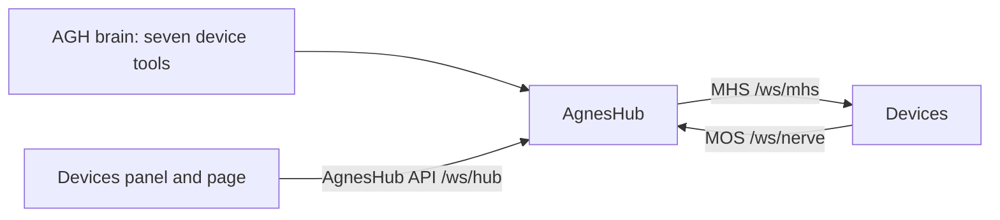

# MHS and device integration: bring tasks into the physical world

English | [简体中文](mhs.zh-CN.md)

<a id="mhs-与设备接入让任务走进物理现场"></a>

[Project home](../../README.md) · [Documentation](../README.md) · [FDE and use cases](why-agh.md)

Agnes MHS (Model Hardware Standard) is how physical devices, such as robots, vehicles, cameras and sensors, connect to AGH. A device dials AgnesHub, registers its state, tools and data sources, then takes calls and streams data. The model never talks to a device directly: it acts through AgnesHub, which checks every call against what the device declared. Agnes MHS is AGH's own protocol, independent of Anthropic's standard of the same name. It borrows the message format (JSON-RPC 2.0) and tool declarations of MCP (Model Context Protocol), and adds what physical devices need: stop, manual control, live state, and streamed sensor data.

In AGH's [brain, cerebellum, memory, and body metaphor](../develop/architecture.md#brain-cerebellum-memory-and-body), MHS represents the body: the interface to physical capabilities. The devices and their controllers supply those capabilities, while AGH contributes task orchestration, human confirmation, and records.

**Status:** MHS 1.0 and MOS 1.0. Everything below runs from the source repository; [`packages/mhs`](../../packages/mhs/README.md) is the reference for each part.

<a id="组成部分"></a>

## The parts


```mermaid
flowchart LR
  Brain[AGH brain: seven device tools] --> Hub[AgnesHub]
  Panel[Devices panel and page] -->|AgnesHub API /ws/hub| Hub
  Hub -->|MHS /ws/mhs| Device[Devices]
  Device -->|MOS /ws/nerve| Hub
```

| Part | What it is |
| --- | --- |
| [MHS](../../packages/mhs/spec/mhs-spec.md) | The command channel: registration, state, tools and calls, stop and pause, manual control, and the safety rules a device keeps by itself |
| [MOS](../../packages/mhs/spec/mos-spec.md) | The Model Observation Standard, the data channel: sources such as cameras, scans and readings, video streams, and the maps and places positions refer to |
| AgnesHub | The hub devices connect to. It runs inside AGH as an optional plugin, or on its own for development |
| [AgnesHub API](../../packages/mhs/server/hub-api.md) | AgnesHub's own interface for the brain, the Devices panel and other clients; it is not a standard |
| [Conformance suite](../../packages/mhs/spec/mhs-conformance.md) | A JSON Schema for every message, and `mhs-check`, a test hub that checks a device against every requirement that applies to it |
| Device libraries | `agnes_mhs` for Python and `@agnes/mhs/device` for TypeScript, with example devices |

<a id="不接硬件先试用"></a>

## Try it without hardware

After [installing the repository's dependencies](install.md), build the panel and start the development hub from the repository root:

```sh
pnpm --filter @agnes/mhs build:plugin
pnpm --filter @agnes/mhs dev-hub
```

Open `http://127.0.0.1:4191/`. The development hub is the real AgnesHub with four sample devices: `robot-01`, a mobile robot with a camera, a map of its office and manual drive; `lamp-01`, a lamp with writable state; `env-01`, a room sensor installed in the office; and `arm-01`, an arm with a switchable microphone. The page has three tabs: Devices, a card per device that opens a page per device; Flow, the calls and data between AgnesHub and the devices; and World, the office map with its zones, landmarks and devices. Add `?lang=zh-CN`, `?theme=light` or `?device=robot-01` to the address. Typing `health robot-01 hot` or `pose robot-01 lost` in the terminal pushes a device's health and position around.

For a larger world, [`examples/mars-world`](../../examples/mars-world/README.md) is a Mars base in the browser with eleven virtual MHS devices. [Mars base](mars-world.md) shows how to command them from AGH.

<a id="编写并检查设备"></a>

## Write and check a device

[Write a device](mhs-device.md) shows how to write a device with the Python or TypeScript library: a minimal device in both, the API of each, and common patterns. The Python examples are the smallest devices that pass the conformance suite: `examples/sensor.py`, a room sensor, and `examples/camera.py`, a test pattern streamed as H.264. Run Python commands from `packages/mhs/python`, where `uv run` sets up the environment. To connect the sensor to the development hub and see it on the page:

```sh
cd packages/mhs/python
uv run python examples/sensor.py ws://127.0.0.1:4191
```

`mhs-check` is a test hub on port 8800. Start it, then point the device at it:

```sh
cd packages/mhs/python
uv run python -m agnes_mhs.check
uv run python examples/sensor.py          # in a second terminal
```

It reads the registration, works out which profiles apply, runs their scenarios and reports every requirement as `pass`, `fail`, `warn` (a **SHOULD** missed), `skip` (not run) or `manual` (needs an operator). The exit status is non-zero when a requirement failed.

| Profile | Applies when the device declares |
| --- | --- |
| Core | Always |
| Motion | A tool with `motion: true` |
| Manual | Manual control |
| Pause | A pausable tool |
| Perception, Streaming | Data sources |
| Maps | Maps, a placement, or a `pose` or `grid` source |
| Derived perception | A derived source, such as detections |
| Video | A video source |
| Audio clip | A tool with a `clip` parameter |

`--profile core,streaming` limits the run, `--no-motion` keeps the device still, `--interactive` asks the operator at the checks only a person can judge (did it really stop?), and `--report report.json` writes the report. The [conformance suite](../../packages/mhs/spec/mhs-conformance.md) describes every scenario and the remaining flags. To check a sample device of the development hub, from the repository root:

```sh
DEV_DEVICES=robot-01 DEV_DEVICES_TO=ws://127.0.0.1:8800 pnpm --filter @agnes/mhs dev-hub
```

To record a session and check every message against the schema, run `pnpm --filter @agnes/mhs dev 127.0.0.1:4181 --record session.jsonl`, point a device at `ws://127.0.0.1:4181`, then from `packages/mhs/python` run `uv run python -m agnes_mhs.validate ../session.<device>.jsonl`.

<a id="在-agh-中使用设备"></a>

## Use devices from AGH

AgnesHub runs inside AGH as the `@agnes/mhs` plugin. It is optional: AGH runs without it. With a [source build of AGH](install.md), from the repository root:

1. In a terminal, run `pnpm --filter @agnes/mhs plugin:install`. It builds the plugin and installs it through the normal [package flow](packages.md); confirm the preview. The package starts disabled.
2. Start Web with AgnesHub's origin, so the workbench may connect to it: `AGNES_HUB_ORIGIN=http://127.0.0.1:4180 node packages/cli/dist/local/agnes.mjs serve`.
3. In Web, choose Settings → Plugins → `@agnes/mhs` → Enable.
4. Point devices at `ws://127.0.0.1:4180`, for example `DEV_DEVICES_TO=ws://127.0.0.1:4180 pnpm --filter @agnes/mhs dev-hub`.

| Variable | Read by | Meaning |
| --- | --- | --- |
| `AGNES_HUB_LISTEN` | The daemon, which runs the plugin | `host:port` AgnesHub listens on; default `127.0.0.1:4180`. A bare port listens on loopback |
| `AGNES_HUB_DATA` | The daemon | AgnesHub's data directory; default `AGH_HOME/hub`. It keeps `maps.json`, the maps devices declared |
| `AGNES_HUB_ORIGIN` | The Web server | AgnesHub's `http` or `https` origin, added to the workbench's content security policy |

The daemon reads its variables when it starts: set them before the first command that starts it, or stop the daemon and start it again. The workbench panel connects to the `hubUrl` in `packages/mhs/plugin/client/agnes.client.json`, `ws://127.0.0.1:4180/ws/hub`; for another port, change it there and install again.

While the plugin is enabled:

- **The Devices panel** docks to the right of the workbench, with an entry in the sidebar and a full-screen console. Its tabs are Devices, Flow, Activity (the brain's device calls in the open conversation) and World.
- **The conversation** shows a card for every device tool call the brain makes.
- **AgnesHub's own address**, `http://127.0.0.1:4180/`, opens the Devices panel as a page of its own, with every tab except Activity, for a second screen or a phone.

<a id="大脑能做什么"></a>

## What the brain can do

The brain uses devices through seven tools. A device's own tools are an argument of `call_device`, so the tool list stays the same as devices come and go.

| Tool | What it does |
| --- | --- |
| `list_devices` | Every device: id, name, kind, availability, health, what it is doing, its tools and sources |
| `read_device` | A device's state, health and position, and the newest data of the sources asked for |
| `call_device` | Calls a device tool and waits up to 50 s; a longer job wakes the conversation when it ends |
| `set_device` | Changes writable state |
| `stop_device` | Stops one device, or every device |
| `watch_device`, `unwatch_device` | Waits for a condition, such as a reading crossing a value, and wakes the conversation when it holds or times out |

`read_device` declares `returnsImages`, so the camera pictures it reads reach the model. At the start of every turn the brain also gets a snapshot of the maps and devices. The device tools ask for no approval: device safety does not depend on them (see [device control boundaries](#device-control-boundaries)). The [AgnesHub API](../../packages/mhs/server/hub-api.md#15-the-brain) describes the snapshot and the wake-ups.

<a id="地图位置与固定设备"></a>

## Maps, places and fixed devices

A device that knows its site, because it built a map or was configured with one, declares its maps with named **places**: a landmark is a point, such as a dock or a door, and a zone is an area, such as a room or a field ([MOS section 3.5](../../packages/mhs/spec/mos-spec.md#35-maps-and-places)). AgnesHub keeps every map it has seen, gives them to clients as `hub/world`, and says which zone each position is in. The brain sees the maps and their places in its snapshot, and sends a device to a place by calling the device's own tool with the place's coordinates. The World tab draws them.

A device installed at a fixed spot, such as a wall camera or a room sensor, declares `localization: fixed` and its `placement`: a map, a position and a direction. AgnesHub refuses a fixed device without a placement, and shows it at its placement on the map.

<a id="设备控制边界"></a>

## Device control boundaries

The device and its control system remain responsible for real-time motion control, interlocks, emergency stops, and local takeover. MHS requires a device to enforce its own limits and to stop moving by itself when its connection to AgnesHub is lost; AgnesHub and the brain add checks, but device safety never relies on them. Stopping an AGH task does not establish that a device has stopped safely; `stop_device` asks the device to stop, and its reply says what it stopped. After a connection loss or missing result, read the device's state before repeating an action whose outcome is unknown.

The AgnesHub API has no authentication or encryption. AgnesHub listens on loopback unless `AGNES_HUB_LISTEN` says otherwise; listen on a network address only on a trusted network, and never expose AgnesHub to the internet. Passing `mhs-check` shows that a device follows the protocol under the tested conditions; it does not certify the device as safe.
