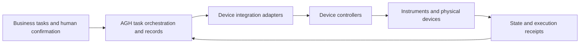

# MHS and device integration: bring tasks into the physical world

English | [简体中文](mhs.zh-CN.md)

[Project home](../../README.md) · [Documentation](../README.md) · [FDE and use cases](why-agh.md)

> **Preview: an MCP device integration seam and a simulated inspection bundle are available. No MHS compatibility is claimed.**

From inspection and maintenance to instrument coordination, field work connects device state, human judgment, and business workflows. AGH plans to explore physical device integration through MHS (Model Hardware Standard), built on MCP (Model Context Protocol) as the device connection layer, bringing state reads, operation requests, and execution receipts into one task flow.

In AGH's [brain, cerebellum, memory, and body metaphor](../develop/architecture.md#brain-cerebellum-memory-and-body), MHS represents the body: the interface to physical capabilities. The devices and their controllers supply those capabilities, while AGH contributes task orchestration, human confirmation, and records. This direction can be part of an FDE deployment using the same software foundation.

We plan to publish guides and reproducible examples around these scenarios, helping developers combine device capabilities, human confirmation, and business interfaces into applications.

## How AGH plans to integrate

The following is a proposed division of responsibilities. Concrete interfaces still need validation:

```mermaid
flowchart LR
  Task[Business tasks and human confirmation] --> AGH[AGH task orchestration and records]
  AGH --> Adapter[Device integration adapters]
  Adapter --> Controller[Device controllers]
  Controller --> Device[Instruments and physical devices]
  Device --> Receipt[State and execution receipts]
  Receipt --> AGH
```

AGH organizes tasks, authorization interactions, and result records. An adapter connects device capabilities to task execution, while the device controller owns actual motion and site protections. AGH's device integration direction builds the adapter on MCP (Model Context Protocol), a model-agnostic, versioned protocol, rather than a vendor-specific SDK or a ROS bridge. A bare MCP connection alone does not demonstrate MHS compatibility, since no public MHS specification is open for certification.

The [device-inspection bundle](../../examples/fde/device-inspection/README.md) demonstrates read status → detect an anomaly → obtain human confirmation → perform a constrained action → verify the receipt in a local simulator. Each device model, action, and failure path needs its own implementation and validation.

## What is coming

| Content | Planned scope | Status |
| --- | --- | --- |
| Integration guide | Device capability descriptions, adapter placement, identity, and permissions | Coming soon |
| Examples and reproduction steps | [Simulated inspection](../../examples/fde/device-inspection/README.md), dry-run by default | Preview |
| Device verification notes | Supported models, software versions, test environments, and known limits | Coming soon |

Adapter designs, supported devices, and examples will be announced after validation. No opening date is set. Integration is exploratory: the simulator provides a software workflow example; no general-purpose MHS adapter or physical device has been validated.

## Integration seam (preview)

A package can declare `agnes.capabilities.device: true` alongside its other capabilities. This adds the `device` review/policy atom to installation preview, capability hashes and allow/deny checks. It is an optional additive field: existing manifests retain their hash and behavior. It does not grant controller access, isolate plugin code or certify a device adapter.

The MCP bridge retains `readOnlyHint`, `destructiveHint` and `idempotentHint` and maps them to the existing tool policy metadata:

| MCP annotations | Tool metadata / default manual policy |
| --- | --- |
| Read-only, no destructive hint | Read-only, safe replay |
| Destructive hint, including contradictory read-only hint | Write, `requiresApproval: always` |
| Write with no idempotency assurance | `replay: never`, `requiresApproval: always` |
| Explicit non-destructive, idempotent write | `replay: idempotent`; other deployment policy still applies |

Missing write annotations remain conservative. Idempotency never pre-approves a destructive action. The default policy consumes this metadata in normal manual/smart approval modes; explicit full-access or approval-off configuration retains its existing semantics. The device bundle supplies a policy that asks before every write even with those settings. The bridge does not infer safety limits or enforce remote idempotency from a hint.

The installable [device-inspection bundle](../../examples/fde/device-inspection/README.md) packages a public-port loop, tools, confirmation policy, Skill and a local stdio MCP simulator. It defaults to `dry_run: true`, accepts bounded cooling targets and version preconditions, rejects conflicting idempotency keys, and reads receipts plus state after action. A dry-run receipt proves a preview, not a changed temperature. Receipts live only in the simulator process. Unknown or interrupted effects stop for inspection rather than being replayed automatically.

This is **MHS-inspired**, with no MHS compatibility claim. Real integrations still need validated units, limits, controller permissions, durable deduplication and receipt reconciliation. See the [FDE bundle index](../../examples/fde/README.md) for installation and adaptation.

## Device control boundaries

The device and its control system remain responsible for real-time motion control, interlocks, emergency stops, and local takeover. Canceling an AGH task does not establish that a device has stopped safely. After a connection loss or missing receipt, inspect device state before repeating an action whose outcome is unknown. Desktop Computer Use verification does not establish physical device integration.

Start with [backend plugins](../develop/backend.md), [MCP](mcp.md), and [full-stack integration](../develop/fullstack.md) to understand the software extension paths. Share device requirements through the [feedback process](../develop/contributing.md). Code and documentation PRs remain limited to invited internal developers.

## Current status at a glance

**A preview seam and simulated inspection example are available.** A verified general-purpose MHS adapter and supported-device list remain future work. The simulator does not establish MHS compatibility or physical-device acceptance. Device controllers retain responsibility for real-time control and physical safety.
