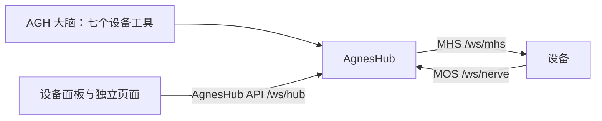

# MHS 与设备接入：让任务走进物理现场

[English](mhs.md) | 简体中文

[项目首页](../../README.zh-CN.md) · [文档导航](../README.zh-CN.md) · [FDE 与应用场景](why-agh.zh-CN.md)

Agnes MHS（Model Hardware Standard）是机器人、车辆、相机、传感器等物理设备接入 AGH 的方式。设备主动连接 AgnesHub，登记自己的状态、工具和数据源，然后接受调用并推送数据。模型从不直接与设备通信，而是通过 AgnesHub 操作设备；AgnesHub 会按设备的声明检查每一次调用。Agnes MHS 是 AGH 自己的协议，与 Anthropic 的同名标准无关。它沿用 MCP（Model Context Protocol）的消息格式（JSON-RPC 2.0）和工具声明，并补上物理设备需要的部分：停止、手动控制、实时状态和传感器数据流。

在 AGH 的[大脑、小脑、记忆与身体比喻](../develop/architecture.zh-CN.md#大脑小脑记忆与身体)中，MHS 代表身体，即连接物理能力的接口。设备及其控制器提供这些能力，AGH 提供任务编排、人工确认和记录。

**状态：** MHS 1.0 与 MOS 1.0。以下内容都在源码仓库中运行；各部分的参考说明见 [`packages/mhs`](../../packages/mhs/README.md)。

## 组成部分



| 部分 | 说明 |
| --- | --- |
| [MHS](../../packages/mhs/spec/mhs-spec.md) | 命令通道：登记、状态、工具与调用、停止与暂停、手动控制，以及设备自身必须遵守的安全规则 |
| [MOS](../../packages/mhs/spec/mos-spec.md) | Model Observation Standard，数据通道：相机、雷达、读数等数据源，视频流，以及位置所参照的地图与地点 |
| AgnesHub | 设备连接的中枢。作为可选插件运行在 AGH 中，开发时也可以单独运行 |
| [AgnesHub API](../../packages/mhs/server/hub-api.md) | AgnesHub 供大脑、设备面板和其他客户端使用的自有接口，不是标准 |
| [一致性测试套件](../../packages/mhs/spec/mhs-conformance.md) | 覆盖每种消息的 JSON Schema，以及测试中枢 `mhs-check`：按设备适用的每条要求检查设备 |
| 设备库 | Python 的 `agnes_mhs` 与 TypeScript 的 `@agnes/mhs/device`，附示例设备 |

## 不接硬件先试用

[安装仓库依赖](install.zh-CN.md)后，在仓库根目录构建面板并启动开发中枢：

```sh
pnpm --filter @agnes/mhs build:plugin
pnpm --filter @agnes/mhs dev-hub
```

打开 `http://127.0.0.1:4191/`。开发中枢就是真实的 AgnesHub，带四台示例设备：`robot-01` 是移动机器人，有相机、办公室地图和手动驾驶；`lamp-01` 是带可写状态的灯；`env-01` 是安装在办公室里的室内传感器；`arm-01` 是带可关闭麦克风的机械臂。页面有三个标签页：设备（每台设备一张卡片，点开是设备页）、数据流（AgnesHub 与设备之间的调用和数据）、地图（办公室地图及其区域、地标和设备）。可以在地址后加 `?lang=zh-CN`、`?theme=light` 或 `?device=robot-01`。在终端输入 `health robot-01 hot` 或 `pose robot-01 lost` 可以改变设备的健康状况和位置。

想看更大的场景，可以运行 [`examples/mars-world`](../../examples/mars-world/README.md)：浏览器里的火星基地，有十一台虚拟 MHS 设备。[火星基地](mars-world.zh-CN.md)介绍怎样在 AGH 里指挥它们。

## 编写并检查设备

[编写设备](mhs-device.zh-CN.md)介绍怎样用 Python 或 TypeScript 库编写设备：两种语言的最小设备、各自的 API 和常用写法。Python 示例是能通过一致性测试的最小设备：`examples/sensor.py` 是室内传感器，`examples/camera.py` 以 H.264 推送测试图案。Python 命令在 `packages/mhs/python` 下运行，`uv run` 会准备好环境。把传感器接到开发中枢并在页面上查看：

```sh
cd packages/mhs/python
uv run python examples/sensor.py ws://127.0.0.1:4191
```

`mhs-check` 是监听 8800 端口的测试中枢。先启动它，再让设备连上来：

```sh
cd packages/mhs/python
uv run python -m agnes_mhs.check
uv run python examples/sensor.py          # 在第二个终端中
```

它读取设备的登记信息，判断适用哪些测试档，运行对应场景，并为每条要求给出 `pass`、`fail`、`warn`（未满足 **SHOULD**）、`skip`（未运行）或 `manual`（需要操作员）。有要求失败时退出码非零。

| 测试档 | 设备声明了以下内容时适用 |
| --- | --- |
| Core | 总是适用 |
| Motion | 带 `motion: true` 的工具 |
| Manual | 手动控制 |
| Pause | 可暂停的工具 |
| Perception、Streaming | 数据源 |
| Maps | 地图、安装位置，或 `pose`、`grid` 数据源 |
| Derived perception | 派生数据源，例如检测结果 |
| Video | 视频数据源 |
| Audio clip | 带 `clip` 参数的工具 |

`--profile core,streaming` 只运行指定测试档，`--no-motion` 让设备保持不动，`--interactive` 在只有人能判断的检查处询问操作员（它真的停了吗？），`--report report.json` 写出报告。每个场景和其余参数见[一致性测试套件](../../packages/mhs/spec/mhs-conformance.md)。要检查开发中枢的某台示例设备，在仓库根目录运行：

```sh
DEV_DEVICES=robot-01 DEV_DEVICES_TO=ws://127.0.0.1:8800 pnpm --filter @agnes/mhs dev-hub
```

要录制一次会话并按 Schema 检查每条消息：运行 `pnpm --filter @agnes/mhs dev 127.0.0.1:4181 --record session.jsonl`，让设备连接 `ws://127.0.0.1:4181`，然后在 `packages/mhs/python` 下运行 `uv run python -m agnes_mhs.validate ../session.<device>.jsonl`。

## 在 AGH 中使用设备

AgnesHub 以 `@agnes/mhs` 插件的形式运行在 AGH 中。它是可选的：没有它 AGH 照常运行。使用[源码构建的 AGH](install.zh-CN.md)，在仓库根目录（使用[独立试用目录](install.zh-CN.md#独立试用目录)时，在每个运行这些命令的终端里导出同样的 `AGH_HOME` 和 `AGNES_PROFILE`）：

1. 在终端运行 `pnpm --filter @agnes/mhs plugin:install`。它构建插件并按常规[插件流程](packages.zh-CN.md)安装；确认预览即可。安装后插件处于禁用状态。
2. 带上 AgnesHub 的 origin 启动 Web，工作台才能连接它：`AGNES_HUB_ORIGIN=http://127.0.0.1:4180 node packages/cli/dist/local/agnes.mjs serve`。
3. 在 Web 中打开 设置 → 插件管理，在“已安装”里打开 `@agnes/mhs` 的开关，再选“确认启用”。
4. 让设备连接 `ws://127.0.0.1:4180`，例如 `DEV_DEVICES_TO=ws://127.0.0.1:4180 pnpm --filter @agnes/mhs dev-hub`。

| 变量 | 读取方 | 含义 |
| --- | --- | --- |
| `AGNES_HUB_LISTEN` | 运行插件的守护进程 | AgnesHub 监听的 `host:port`，默认 `127.0.0.1:4180`；只写端口时监听回环地址 |
| `AGNES_HUB_DATA` | 守护进程 | AgnesHub 的数据目录，默认 `AGH_HOME/hub`，其中的 `maps.json` 保存设备声明过的地图 |
| `AGNES_HUB_ORIGIN` | Web 服务 | AgnesHub 的 `http` 或 `https` origin，会加入工作台的内容安全策略 |

守护进程在启动时读取这些变量：请在第一条会启动它的命令之前设置，或者停止守护进程后重新启动。工作台面板连接 `packages/mhs/plugin/client/agnes.client.json` 中的 `hubUrl`，即 `ws://127.0.0.1:4180/ws/hub`；换端口时请修改这里并重新安装。

插件启用后：

- **设备面板**停靠在工作台右侧，侧边栏有入口，也可以全屏查看。标签页有设备、数据流、动态（大脑在当前对话中对设备的调用）和地图。
- **对话**中，大脑的每次设备工具调用都显示为一张卡片。
- **AgnesHub 自己的地址** `http://127.0.0.1:4180/` 会打开独立的设备面板页面，包含除动态以外的所有标签页，适合放在第二块屏幕或手机上。

## 大脑能做什么

大脑通过七个工具使用设备。设备自己的工具是 `call_device` 的参数，所以设备上线下线时工具列表保持不变。

| 工具 | 作用 |
| --- | --- |
| `list_devices` | 列出每台设备：id、名称、类型、是否可用、健康状况、正在做什么、它的工具和数据源 |
| `read_device` | 读取设备的状态、健康状况和位置，以及所请求数据源的最新数据 |
| `call_device` | 调用设备工具并最多等待 50 秒；更长的任务结束时会唤醒对话 |
| `set_device` | 修改可写状态 |
| `stop_device` | 停止一台设备或所有设备 |
| `watch_device`、`unwatch_device` | 等待某个条件（例如读数越过某个值），条件成立或超时时唤醒对话 |

`read_device` 声明了 `returnsImages`，所以它读到的相机画面会交给模型。每轮开始时，大脑还会收到一份地图与设备的快照。设备工具不请求审批：设备安全不依赖它们（见[设备控制边界](#设备控制边界)）。快照和唤醒的细节见 [AgnesHub API](../../packages/mhs/server/hub-api.md#15-the-brain)。

## 地图、地点与固定设备

知道所在场地的设备（自己建了地图，或者配置了地图）会声明它的地图和带名字的**地点**：地标是一个点，例如充电桩或门；区域是一片范围，例如房间或场地（[MOS 第 3.5 节](../../packages/mhs/spec/mos-spec.md#35-maps-and-places)）。AgnesHub 保存见过的每张地图，以 `hub/world` 提供给客户端，并标出每个位置所在的区域。大脑在快照中看到地图和地点，要把设备派到某个地点时，就用该地点的坐标调用设备自己的工具。地图标签页会把它们画出来。

安装在固定位置的设备（例如壁挂相机或室内传感器）声明 `localization: fixed` 和它的 `placement`：一张地图、一个位置和一个朝向。AgnesHub 会拒绝没有安装位置的固定设备，并在地图上把它显示在安装位置。

## 设备控制边界

实时运动控制、互锁、急停和现场接管由设备及其控制系统负责。MHS 要求设备自己执行限制，并在与 AgnesHub 的连接中断时自行停止运动；AgnesHub 和大脑会额外检查，但设备安全从不依赖它们。停止 AGH 任务不等于设备已安全停止；`stop_device` 请求设备停止，设备的回复说明停下了什么。连接中断或结果缺失时，先读取设备状态，再决定是否重复结果未知的动作。

AgnesHub API 没有认证和加密。除非 `AGNES_HUB_LISTEN` 另有设置，AgnesHub 只监听回环地址；只在可信网络中监听网络地址，绝不要把 AgnesHub 暴露到互联网。通过 `mhs-check` 说明设备在测试条件下遵守协议，并不证明设备是安全的。
