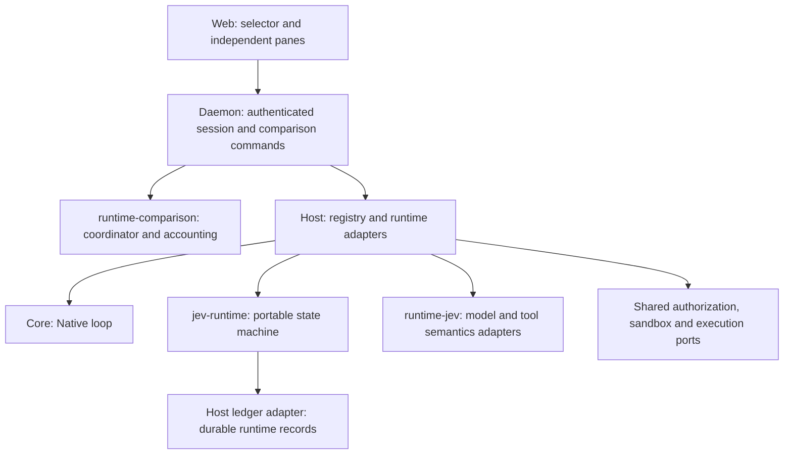

# Runtime loops

English | [简体中文](runtime-loops.zh-CN.md)

[Documentation](../README.md)

A new Web session can select Native or JevLoop. The backend fixes the runtime ID and version in
`session/start`; reopening preserves that owner. An unavailable or unknown runtime is refused.
Old sessions without the field retain Native ownership.

JevLoop is statically assembled in this release. Its portable core does not import Agnes Core,
Host, Cordis, Node.js or the Web client. The runtime registry is a future plugin boundary; it is
not a dynamic loop-plugin API today.



The Host environment bridges actual tool schemas, revision-bound candidates, approval decisions,
execution permits and one dispatch attempt. Approval completes before the dispatch barrier.
Native inference state is never used to drive a Jev session. Tool results and their corresponding
runtime settlement share a transaction. Assistant messages are published only after answer admission.

Configure the daemon environment before startup:

| Variable | Meaning |
|---|---|
| `AGNES_JEV_BACKEND` | `jev` (default) or `laya`. Missing backend in older saved settings also means Jev. |
| `AGNES_JEV_TRANSPORT` | `native` (default) or `cloudflare`; Laya supports `native` only. |
| `AGNES_JEV_ENDPOINT` | Credential-free HTTP URL of the System One decision endpoint. |
| `AGNES_JEV_MODEL` | Decision model identifier. |
| `AGNES_JEV_AUTHENTICATION` | `bearer` by default. Set `none` explicitly only for an anonymous decision service. |
| `AGNES_JEV_API_KEY` | Explicit bearer credential for the selected backend. For Jev only, takes precedence over `TYPESAFE_API_KEY`. Retained only in the transport closure. |
| `TYPESAFE_API_KEY` | Fallback alias for the Jev bearer credential. |
| `AGNES_JEV_HTTP2` | Empty by default (HTTP/2 where the endpoint speaks it). Set `off` to force HTTP/1.1 for a proxy that cannot carry HTTP/2. |
| `AGNES_JEV_DECISION_REQUEST_CREDITS` | Optional finite, positive request-cost upper estimate for the decision backend, in the deployment's credit unit. |
| `AGNES_JEV_LANGUAGE_REQUEST_CREDITS` | Optional finite, positive request-cost upper estimate for the language backend, in the same unit. |

Missing bearer credentials make JevLoop unavailable with an explanatory catalog message; Native
startup remains available. Anonymous access is never inferred from a local endpoint. An explicitly
supplied `HostOptions.jev` transport owns its authentication and does not require these environment keys.

<a id="local-laya"></a>

### Local Laya

Laya is an experimental decision backend inside JevLoop, not a separate runtime or a replacement
for the language model. Start a compatible `/v1/systemone` service separately. For the original
JevLoop project, run these commands **in that project's backend directory**, not in AGH:

```sh
uv sync --extra laya-mlx
uv run jevloop laya-serve --runtime mlx --port 8791
```

Apple Silicon uses MLX; NVIDIA deployments use the `laya-cuda` extra and `--runtime cuda`.
AGH does not install Python dependencies or download weights. First loading may download weights
inside that service's environment. Alternatively, connect an already running compatible service.
In AGH settings select Local Laya, or set these variables before starting the daemon:

```sh
export AGNES_JEV_BACKEND=laya
export AGNES_JEV_TRANSPORT=native
export AGNES_JEV_ENDPOINT=http://127.0.0.1:8791/v1/systemone
export AGNES_JEV_MODEL=multilingual
export AGNES_JEV_AUTHENTICATION=none
```

Select `none` only for an explicitly anonymous service; protected services require their own
`AGNES_JEV_API_KEY`. `TYPESAFE_API_KEY` is never a Laya fallback. Supported original checkpoints
include `english`, `multilingual` and `typed-decisions`; fixed `multilingual` avoids routing an AGH
state's English contract text instead of the user's goal. Saved profile configuration still requires
a daemon restart; runtime ownership stays `jevloop`, and durable decision calls record backend `laya`.

This MVP is for controlled short tasks. The inspected Laya MLX implementation has an 8192-token
maximum window, a shared question-head budget and roughly 48-token option-description truncation;
long state tails can be omitted by that service. AGH preserves its original state/questions and
does not yet provide token-aware Laya projection. Successful connectivity is not proof of full-context
coverage, correct decisions or production readiness. Missing usage and local cost evidence remain
unknown, not free; the Jev cloud pricing policy never applies to Laya. There is no automatic cloud
fallback. The language provider can still be remote and must be configured independently.

### Per-turn decision backend

When both targets are saved and booted, the JevLoop runtime descriptor publishes the available
decision backends and the default. The composer shows a per-round selector for new JevLoop drafts,
open JevLoop sessions, and the JevLoop side of a comparison; Native sessions never show it. The
choice travels with the input, is validated before the input is queued, and is durably bound to that
input: the runtime records a non-secret binding in the same transaction that opens the turn, so
interruption and recovery reuse the recorded backend instead of the current default. A retry of the
same durable command must repeat the same backend; a mismatch is an idempotency conflict. Steering
cannot change a running turn's backend, and a turn never falls back to the other backend when its
own becomes unavailable mid-run. Comparison rounds persist the JevLoop side's choice per round, and
their prepared configuration freezes the boot-time set of selectable targets. The decision graph,
request viewer and candidate details derive each request's Jev / Laya / LLM label from recorded
requests, so replayed history never changes when the default changes.

Environment-configured decision calls share Host-owned pooled connections: one warm keep-alive
connection per origin (HTTP/2 where the endpoint speaks it), created lazily on the first decision
call and closed together with the Host. A connection that stops answering is detected well before
the transport timeout and the pool is replaced, so a silently dead connection cannot stall later
decisions; the failed request itself is still settled as a failure and never retried at this layer.
An injected `HostOptions.jev` transport keeps whatever connection behaviour its fetcher provides.

The language backend uses the session's existing provider/model selection. The decision transport
does not substitute the language provider; policy can trigger a separate request for LLM takeover
of the current step’s decision. The decision gates match DSH: Purpose/Operation (`escalateBelow`),
Binding and mutation/RESPOND thresholds are `0.6`; same-operation support is `0.8`.
Support does not bypass a low Operation score or rescue RESPOND. `ambiguityGate: null`,
`responseReviewMode: 'diagnostic'` and `answerProgressFloor: null` leave those diagnostics non-blocking.

<a id="jevloop"></a>

#### Per-stage language models

Each language stage — parameter completion, arbitration and the final answer — can run on its own
model. A preset may pre-bind stages to slots with `model.jev_language_slots` (see
[Configuration](../reference/configuration.md#jevloop-per-stage-model-slots)), but no preset edit is
required: with the JevLoop runtime selected, the composer's **思考 · 环节** button opens the model
settings dialog, whose **JevLoop 分环节模型** section binds each stage to a model and thinking level
— before the task starts (applied when the session is created, ahead of the first prompt) or in a
running session (authorized `session.setJevStages`, audited, effective for that stage's next request,
durable across reopening). Choosing **跟随会话模型** restores the preset slot resolution. A dual-line comparison draft
offers the same section: its bindings apply to the JevLoop lane only, are frozen at creation like
the comparison model, and are attested in that lane's prepared configuration
(`runtimeConfig.languageStages`). They are deliberately outside the common preset fingerprint both
lanes must share, so binding JevLoop stages never trips the configuration-mismatch guard. Splitting stages is the experiment switch for the architecture blueprint's tiered-LLM
proposition — strong models for arbitration, cheap fast models for parameter completion and answers.
Two properties are worth remembering while experimenting: stages on different models keep separate
prompt-cache namespaces (each cold stage pays its own full-prefix reads), and stages still on a
shared preset slot move together when that slot is switched.

JevLoop mounts only `read`, `ls`, `grep`, `edit`, `write` and `shell` under the Host-owned
`agnes-jev-basic-tools-v1` policy. Other installed tools are disabled for this runtime and are not
registered in its session tool table. Jev and every language stage use that same mounted catalog;
Native retains its existing registrations. This does not change shell permissions or Host approval
rules. Reopening and owner reload preserve the policy, including reloads with unchanged schemas.
The policy ID is recorded in environment facts, and the mounted catalog is persisted with each
observation. Built-in Skill discovery instructions are omitted while the Skill loader is disabled;
workspace and user instructions remain intact. The policy is defined in the Host adapter rather
than a shared preset or package enable switch.

Comparison receipts retain each lane's actual mounted catalog in `effective.tools`.
`runtimeConfig.toolMount` records the JevLoop policy, common installed baseline digest, mounted
digest and names. `fingerprints.tools` compares the source installation before runtime projection;
Native's tool fingerprint is unchanged. Model, preset, permission and mounted-configuration checks
remain in place, and different installed baselines still refuse comparison. The actual tool ranges
differ intentionally as part of the runtime experiment.

Jev normally selects the current step's action. Low-confidence or invalid decisions, recoverable
failures, or an enabled response-review gate can trigger LLM takeover of the current step’s
decision. This request includes the complete mounted JevLoop tool catalog and does not lock the original
operation: the LLM can select another tool, propose 1–32 complete calls in order, or return a final
answer. The Host still validates and prepares each call under the existing authorization rules.
If the batch does not complete the turn, the next step returns to Jev. In contrast, `parameters`
locks the selected operation: it permits 1–32 independent complete calls to that same read-only
tool, but still requires exactly one call for a mutation or unknown effect class. Every proposed
member is schema-validated before any batch execution. Parameter-batch selections preserve Jev's
purpose and tool choice, link the original decision with `parameterDecision`, and bind each native
proposal with `callIndex`; they are not LLM arbitration. `answer` accepts no tool calls. Actual
arbitration requests retain purpose `arbitration` and decision source `llm_arbitration`.

Both parameter and arbitration batches run consecutive, explicitly concurrency-safe read-only
calls in windows of at most four. Host preparation confirms argument-resolved safety; absent or
unsafe declarations keep calls serial, and mutations are exclusive barriers. Intent creation,
per-call authorization, fresh binding checks and dispatch markers remain ordered. Tool work may
overlap, while runtime settlements are committed in proposal order. A refusal, failure, new input,
cancellation, conclusion or unknown effect stops the remaining batch; already-dispatched siblings
are drained and settled, never silently discarded or rolled back. A persistence failure invalidates
the writer but still drains started work; recovery never automatically executes an unadmitted tail.
Scheduling revision 5 is recorded in `run.opened.runtimeVersion`. Older records remain readable;
uncompleted turns of an older scheduling revision cannot resume as revision 5.

For providers that support durable preparation, new language calls use `agnes-language-v2`.
Before `model.requested` is committed, the provider binds the effective route, model capabilities,
compatibility options, contract prefix and credentials. The record includes a credential-free
`agnes-provider-request-v1` snapshot; invocation consumes the same in-memory binding once, with
automatic retries disabled. Credentials and headers stay outside the ledger. The Pi adapter supports
this preparation for its explicit-endpoint APIs; environment-resolved APIs and custom subclasses
without their own preparation contract refuse it. Native sessions continue to use ordinary inference.
Legacy providers and historical `agnes-language-v1` calls remain readable, but their abstract requests
do not acquire a provider snapshot retroactively. Reconstructing a historical request is not permission
to resend it: an unsettled request is recovered as `INTERRUPTED`.

Before adopting a successful answer, the Host validates the `agnes-inference-v1` native events:
they must end successfully and their visible text must agree with the portable output. Validation
runs before publication and on recovery. Later LLM history preserves the original thinking/text
block order. DeepSeek Completions also restores its plain `reasoning_content` field; opaque
provider signatures are not synthesized. Snapshot-less legacy records remain readable; contradictory snapshots are refused.

Parameter completion, LLM takeover and final-answer requests retain the same complete mounted JevLoop tool catalog.
Language requests use a fixed user-role prefix for ordinary tool execution constraints and directory
freshness semantics. LLM takeover receives normal agent context without a takeover instruction;
parameter locks, answer-only instructions and format repair belong only to the current request tail.
Historical `requestNote` values remain in their original durable snapshots but are not replayed into
new conversation messages. Internal request, settlement and decision links still validate authorship.
Directory-entry versions are opaque freshness tokens, not content hashes: content claims require
recorded content or tool results. Candidate invalidation and Host permissions are unchanged.
An `answer` tool call is rejected, never executed, and does not enter the format-repair loop.

A successfully completed and verified single native arbitration call may retain its accompanying
visible text as a non-final explanation, distinct from execution facts. Thinking is excluded here;
unaccepted answers, failed or uncertain executions, malformed streams and multi-call batch commentary
are not adopted. Batch completion does not backfill earlier text. Unadmitted-proposal feedback stays
beside its recorded settlement or execution rather than moving past later inputs on each replay.

With unchanged system text and tools, consecutive ordinary takeover requests preserve the full prior
message prefix as new facts append. Parameter, answer and repair tails are request-scoped and may be
replaced; an in-flight batch whose admitted calls change is not an append-only cache boundary.
Reprojection of existing sessions can change the prefix once. Stored requests are not rewritten.
These structural checks do not establish provider cache-hit rates; those require actual usage evidence.

Host-declared runtime-context snapshots enter the LLM conversation as user-role facts at their
recorded positions, not as a mutable top-level system prompt. Each changed snapshot supersedes
earlier snapshots for its own key; unchanged text adds no message. Clearing a key appends an
explicit notice that its earlier facts no longer apply, without deleting history. Date, mode and
working-directory changes therefore preserve the previous projected fact prefix when
the tool catalog and system instructions remain unchanged. The decision projection still uses only
the latest state. User text and tool-provided additions cannot acquire Host-snapshot semantics by
claiming the same source. Native projection and authorization are unchanged.

Persisted request snapshots and request notes are not rewritten by this change. Continuing a session
created with the older projection can change its next request prefix once; cache reuse across that
projection change is not guaranteed. Stable serialized prefixes enable provider caching, but tests
of request bytes do not establish actual cache-hit rates, which require provider usage evidence.

New system-prompt records retain full LLM text plus a section snapshot. Jev separately projects
known producer persona, environment, skill catalog and constraints. Only an exact identity-only persona
is omitted; behavioral obligations remain. When enabled by a future mounting policy, the exact bundled skill catalog becomes name/description
entries with `instructionsLoaded: false` and `retrieval: 'skill_read'`; usage rules remain separate rules,
and an omitted catalog window remains explicitly incomplete. This does not implement skill-body loading.
Unknown sections and modified templates are retained; missing scope is explicitly unspecified.
This adds no AGENTS.md file loader: `agents-md` remains a reserved Core section.

At Jev request preparation, `state.rules` groups containing only string `source`, `scope` and `text`
fields are rendered as labeled text blocks: `Source: <source>`, `Scope: <scope>`, then the unchanged
body, with a blank line between groups. Source, scope, body and order are preserved; the durable
request records the same view passed to the transport. The internal decision projection, rule
replacement, response-review checkpoints and LLM inputs retain their original structure. Laya,
existing text, empty arrays, unknown rule shapes and multiline source/scope labels are passed through
unchanged. Historical requests are not rewritten. This reduces rule-wrapper input overhead; it does
not establish decision equivalence across tasks.

In the same Jev-only wire view, a nonempty `state.resources.skills.items` array of exact string
`name`/`description` entries becomes a name-to-description object. All names, descriptions and their
order are preserved, along with catalog coverage, loading metadata and other resources. Duplicate
names, extra entry fields or names that would reorder object keys retain the original array; empty
arrays and existing mappings are unchanged. Internal resource facts, candidate construction, LLM
inputs and Laya retain their original representation. Catalog entries still do not mean that a skill
has been loaded, and no skills are filtered by the task.

Recognized Jev Operation questions use option names to reference the complete `state.operations`
definitions, replacing repeated `{operation: name}` descriptions with `null` and updating the local
reference instruction. All Purpose branches, option names and ordering remain present. Recognized
Binding questions omit the repeated `operation` line only when the question itself locks that tool
and every candidate has the same identity. Candidate descriptions, complete JSON arguments and the
`LLM_PARAMETERS` mode and explanation remain unchanged. Unknown or extended templates pass through
as whole questions. These are Jev-only request representations: internal compiler plans, conditional
support, parameter routing, gates, permissions and Laya are unchanged. The actual prepared view is
persisted before invocation; already recorded requests are never reformatted.

New runtime-context records also retain their sanitized structured facts. Jev checks the snapshot
against the recorded text before presenting named environment facts, omitting only known producer
transport/model identity. Unknown fields remain intact. Legacy or inconsistent snapshots fall back to
their full recorded text; the language history retains that text in ordered snapshots. Root directory discovery candidates use only
persisted workspace observations and verified bundled tools, not inferred paths from user prose.

Ordered system history and Host-selected tool calls are preserved as distinct request messages.
The current Pi adapter supports them through OpenAI Completions; the selected model must explicitly
set `compat.supportsMidConvoSystemMessages: true`. Set `supportsDeveloperRole: false` to preserve the
literal system role on reasoning models. Unsupported routes refuse these histories before sending;
they do not flatten system updates or present Host actions as user instructions.

Ordinary `standard` tasks have no mandatory request-credit cap (`budget.per_request_cap: null`) and
no new delegated-tree credit cap (`subagent.tree_budget_credits: unlimited`). Missing price evidence
therefore does not block a normal task. Usage recording, tool authorization, timeout, cancellation and
loop-hygiene protections are unchanged. `standard-no-credit-cap` remains a compatibility name for this
policy. Restart the service to load changed recipes; new tasks use the new policy, while already
persisted ancestor caps and explicit child caps remain binding.

Monetary budgets are opt-in. A custom preset can set a positive `budget.per_request_cap` or finite
`subagent.tree_budget_credits`; those caps still refuse admission when a trustworthy upper estimate is
missing. Environment estimates and `HostOptions.jev.requestCredits` are admission estimates, not actual
usage or amounts charged. Never treat examples, operator estimates or token-price projections as a
supplier bill.

Omitting `subagent.tree_budget_credits`, or setting it to `default`, preserves the existing 20-credit
default for a newly delegated tree. A numeric value selects a finite tree cap; `unlimited` is the
explicit opt-in to no new tree cap. Raw preset `null` is invalid. The internal legacy nullable view
does not mean unlimited, and changing a preset does not remove a persisted ancestor cap. The optional
`subagent_spawn` tool `budget` parameter remains a positive integer child cap; omitting it adds no
separate child cap and keeps all ancestor limits.

Current accounting is incomplete: Jev decision usage is retained in the runtime model settlement but
is not yet projected into the Host monetary ledger (`cost/ledger`). Validated language-provider usage
is projected there. Host monetary totals must therefore not be interpreted as the combined cost of
Jev decisions and language requests; missing decision charges remain unknown.

Comparison metrics count persisted provider calls by purpose and outcome. Native inference,
session titles, each compaction segment or retry, and auxiliary vision have separate call records;
Jev language and decision requests retain their runtime records. Hidden HTTP retries are outside
this count. Compaction writes one cost record per actual call and settles its own budget reservation
against that committed record. Metrics do not count these cost projections a second time. Reported
gateway amounts, reported estimates and historical token-price costs remain separate; missing usage
or historical prices stay unknown.

Each lane includes its captured descendant sessions. The shared journal freezes membership and each
member's own ledger cut; inherited fork history is excluded from that member's charges. Expand a
parent or child separately for its historical quote pages. Old journal positions without a tree
observation remain partial. A complete final release archive can complete only its final position.

When drafting a new Web session, choose Native, JevLoop, or **Dual runtime comparison · Native + JevLoop**
in the runtime selector. You can change the choice before the first send. In dual mode, that send creates
the comparison with the selected workspace, model, and prompt, then opens both lanes; no extra ordinary
session or separate creation step is needed. Both lanes use the default preset with separate approvals.
The top-bar comparison entry remains available to inspect and restore saved comparisons.

Sending a new dual-runtime task opens the main workspace directly: decision graph, JevLoop
conversation, then Native conversation. The workspace-level conversation/dual-trace switch changes
both lanes together and keeps the graph and shared replay position. Results and management are
available from the header. On narrow screens, the graph stays above a selectable conversation lane.
Visual ordering never changes the persisted left/right identities or cancellation targets.

Dual runtime comparison freezes one registered workspace and creates two independent
filesystem copies and sessions. Dirty and untracked ordinary files and local dependencies are included;
`.git` is excluded. Internal symlinks are relocated into each copy. External regular-file links
retain their canonical target, such as a Python interpreter; identity and content digests are persisted
and checked before admission and after execution. External directory links, dangling or cyclic links,
special files and exceeded limits refuse creation rather than silently omitting environment directories.
This is not an OS-level atomic snapshot against adversarial concurrent writes.

The two copies and their lane sessions are comparison-owned execution resources, not
additional user workspaces. Ordinary workspace and session lists omit them; open the pair
through saved comparisons instead. This navigation boundary does not remove workspace
authorization, change either lane's working directory, or delete its history. Comparison
ownership, rather than directory names such as `left` or `right`, determines visibility.

Durable backend ownership requires L1 sandbox enforcement for comparison lanes and descendants,
including a successful real backend probe; shell execution cannot fall back to an unconfined process.
Ordinary single-session presets are unchanged. Each lane may write its own copy and Host scratch that
does not overlap the source, snapshots or external dependencies; extra shared writable directories
refuse admission. Sandbox rules preserve the precise lane allowance while denying sibling and private
data paths. Tasks should use the current directory or relative paths; source absolute paths in input
are not rewritten. This isolates local filesystem writes. External interpreters remain shared read-only
dependencies; network services, ports and arbitrary third-party tools are outside the filesystem snapshot.
The current local L1 backend denies shell network access. Create a new comparison for historical groups
with weaker frozen isolation: their configuration and inputs are not rewritten or resent.

If existing admitted work retains the runtime configuration, creating a new comparison returns
`COMPARISON_PREPARATION_BUSY` instead of waiting indefinitely. Resolve or cancel the existing work
first. Jev UNKNOWN maintenance uses its live admission owner; it does not replay effects or mark the
blocked round successful. A cold persisted admission without its live owner requires explicit cancellation.

Shared input has one identity and two durable admission receipts. A failure or cancellation on one
side does not cancel the other. An uncertain receipt is not automatically resent. Ordinary refresh
reads coordinator state; explicit reconciliation reads persistent input/turn evidence without waking,
resuming or executing a session. Approvals and cancellations retain their session scope.

Before creation and each round, choose one shared approval mode: reject approval requests,
manual approval (default), or automatic approval with isolation preserved. The choice travels with
the input; both lanes must settle with no unknown input before the next round can change it.
Retries retain their original input ID and mode. Each round saves its actual configuration and
source receipts, so replay never borrows a later mode. Automatic approval uses the shared `off`
approval policy only while that round owns its configuration admission; it never enables YOLO,
widens filesystem access, or overrides hook/authorization denials. Settlement or release before
input acceptance restores the prior policy. Reject mode retains the ordinary Web client's refusal
of approval requests: it is not a read-only sandbox, and tools requiring no approval can still run.
Delegated child runs and their descendants inherit the live round's approval policy, including
continuations started during that round. This capability is bound to the original live owner and
writer, not copied permanently into the child preset or reconstructed from history. Once that
owner is released, cancelled or closed, an unfinished child run falls back to manual approval;
a later round cannot reauthorize that old run. Ending the child run restores its original policy.
Manual approvals show lane-specific allow/reject actions from the live request without waiting for
post-decision ledger publication. Historical replay, disconnection, cancellation and settled requests
cannot decide an obsolete live request.

**Retry original request** explicitly resends the retained text with the same input ID. A refusal of
that retry does not prove the original request was refused. Stopping an unconfirmed input addresses
that exact ID and records a durable execution fence. The view disables retry of a fenced ID and
shows each side's cleanup status; it preserves the draft until both cancellations are confirmed.

An explicit common-admission refusal preserves the draft. Resource contention permits an explicit
retry after existing work drains; changed or unverifiable prepared configuration requires a new
comparison. Refresh does not replace an experiment's frozen configuration. Diagnostics expose only
bounded reason identifiers, never underlying exceptions or configuration. An unknown reason does not
authorize replaying accepted input.

The saved-comparison list supports refresh, pagination and explicit reopening. Reading the list
does not open sessions. Switching comparisons preserves local drafts and detaches the old views;
unconfirmed submissions block switching. Historical timestamps absent from storage remain unknown.
Each lane has an independent native trace panel. Conversation, Jev graph, trace and metrics follow
the same shared journal position; historical tool details cannot include later results. Completed comparisons
read fixed prefixes through comparison APIs without loading runtime sessions; submitting again connects
both lanes first. Active comparisons retain streaming previews and approvals. Historical projections
have no writer generation.

Comparison preparation first settles pending worker resource publication before freezing its receipt.
A failed refresh refuses preparation; subsequent configuration changes still refuse admission.

The **Comparison results** table shares the selected journal position with both lane views,
with JevLoop before Native. Its DSH-aligned metrics are confirmed cumulative elapsed time;
LLM uncached input, cache-read (with hit rate), output and cost; Jev input, output and cost;
combined cost; LLM/Jev call counts; and LLM-only purpose composition. Each token row shows
its own bucket cost; family costs show witnessed off-peak multipliers or mixed periods.
Costs remain separate by currency. Combined estimates come from the backend at the same cut,
never from adding displayed rounded values. Current-price re-estimates remain labeled.
The table also shows status and the current-input answer. Preparation receipts directly below
include the preset output-token override; older receipts show unknown without backfilling.
Unlike a live stopwatch, elapsed time includes only durably confirmed intervals. A cache hit
rate requires complete input and cache-read evidence; partial evidence shows unknown. Copying a clipped answer copies only the displayed excerpt. Loading or a failed
read retains the previous complete view and labels its position; it never combines different cuts.
Live counters are lower bounds and missing evidence stays unknown. An empty request family is N/A
only with confirmed settlement and complete accounting. Cache hit rate describes observed requests,
not a lower bound on the final rate. Timing is measured with a monotonic clock during execution and
persisted with settlement; missing legacy/recovered timing is never reconstructed. A coordinator
terminal fact ahead of the selected lane cut cannot claim completion in that view.

After both sides and their delegated children finish, **Release runtime resources** permanently
ends further execution of that comparison. The backend checks the complete trees for idle state,
pins their exact owners and configuration, and confirms closure before archiving their events and
removing their execution storage and private snapshots. The source workspace is preserved. Active,
unknown or externally referenced trees refuse release. Shared child workspaces are supported;
Git worktree children require a verified maintenance cleanup adapter and otherwise refuse release.

Released comparisons retain conversation, trace, Jev decisions and tool details. At the latest shared
position, child history opens from the archive without reopening its runtime. **Delete comparison
history** removes this archive after resource release. Both operations require confirmation and use
the displayed revision; refresh and retry an uncertain outcome. Unknown accounting stays unknown
and is retained when required by its independent accounting evidence.

**Stop both sides** requests cancellation for the whole comparison. Its acknowledgement does not
prove either side has finished; inspect each side's persistent terminal state or reconcile an
uncertain reply. Cancellation is disabled during historical replay. Closing the comparison view
only detaches its views; it does not release resources or delete history.

Runtime records are authoritative; streaming previews are temporary. Runtime transactions use SQLite
FULL synchronization and fullfsync, including the dispatch barrier. Recovery settles undispatched
intent as not applied; dispatched mutations without a result remain unknown and are not repeated.
A failed runtime drain retains the writer and workspace leases.

A cancelled Jev turn with unresolved effects stays parked after recovery. Cancellation before
claiming a queued input leaves that input queued. A session generation change invalidates outstanding
view reads and previews independently for each comparison lane; it does not run or cancel the loop.

A verified builtin foreground shell command that returns a Host-confirmed normal process-exit
receipt is acknowledged even when its exit code is nonzero. Its tool outcome remains an error;
acknowledgement establishes execution completion, not a successful build or completed task. The
LLM can inspect the error and propose a correction. Timeout, cancellation, signal termination,
background submission, transport failures and unverified receipts do not gain this acknowledgement.

An uncertain dispatched action first enters a bounded LLM inspection phase. The arbitration
model receives the original task and execution history, with only read-only tools available;
inspection uses the normal authorization, validation, dispatch and drain pipeline. Inspection
and format repairs consume the original turn's step, model and spending budgets. The unfinished
write batch is discarded. The model cannot clear an effect by claiming success or returning a
final answer. Host-proven refusals before a builtin `write` or `edit` reaches writing are recorded
as `not_applied`, allowing the task to continue after the refusal.

For a verified builtin single-file content operation whose invocation has drained, the Host can
verify a fresh complete read and append `reconciled_state`. This means the current file state is
known and permits a new plan; the original call's effect remains unknown. The LLM then replans
before ordinary Jev routing resumes. This automatic resolution is not an operator payload value.
External effects, uncertain nested effects and old attempts without trustworthy execution evidence
remain unresolved when inspection cannot establish a safe continuation. Explicit cancellation is
never revived. A restored continuation retains the original portable turn and its budgets.

For an idle, open Jev session with an UNKNOWN action, the SDK exposes explicit operator
resolution through `session.controlRuntime({ expectedRuntime: { id: 'jevloop', version: '1' },
operation: 'jev.resolveUnknown', payload: { intentId, resolution, explanation, evidence } })`.
Choose `confirmed_applied`, `confirmed_not_applied` or `accepted_uncertainty`; provide a
non-empty explanation and at least one non-empty evidence string. Existing session-owner
authorization applies. The operation appends the authenticated operator's `action.resolved`
to the original turn and returns its committed sequence. It does not repeat tools, resume
the turn or drain queued inputs. Native, an identity mismatch, unknown operations, invalid
payloads, running sessions and closed/hibernated sessions refuse. If acknowledgement fails,
reopen explicitly and inspect the committed ledger before retrying; a committed resolution
is retained and no work runs automatically.

Jev model calls use durable tree reservations. Unknown quotes are admitted only when every ancestor
scope is unlimited; unknown actual cost stays unknown. Recovery releases a permit only when the
durable record proves dispatch never began, and never repeats the model call. An explicit reservation
writer takeover does not automatically transfer an older Jev admission.

Same-runtime delegated children acquire independent runtime leases. Spawn starts fresh; new delegated
forks in both Native and Jev inherit only the last completed turn prefix and exclude the current
unfinished turn. Existing child seeds and explicit Native history cuts retain their contracts. Parent shutdown
drains owned children and pending construction before releasing its writer. New spawned children persist a
continuable descriptor. `subagent_send_message` delivers new input to the same child ledger after
completion or a Host restart; an active child receives it at the next step. The receipt confirms
durable delivery, not completion; use `subagent_collect` to observe the answer. `subagent_interrupt`
stops the current turn while preserving the conversation and descendants. `subagent_cancel`
permanently cancels the subtree, including future continuation of an ended child.

A resident, continuable spawned child can also send a self-contained report to its exact live
direct parent. An idle parent starts a new turn automatically; an active parent receives the report
at its next step. Natural completion waits for running descendants and accepted messages to drain.
The child outbox and parent inbox/receipt are durable. Custom messages also record a sender
acknowledgement; completion notices use the parent's receipt after the child closes. A delivery receipt
does not prove the parent has finished responding. Cold, closing or UNKNOWN-parked parents remain
pending: this path does not reopen a parent or replay a cold outbox automatically.
Conversation and trace views identify child reports and completion notices from their durable receipt
and inbox identity. Their content remains untrusted; the source label does not grant tool permission.

One-shot forks and older children without a supported descriptor cannot continue. A follow-up
retains the stored model, lineage and ancestor budget scopes; it does not replay the initial task.
Worktree continuation requires its persisted ownership, current parent file authorization and
matching Git registration. Missing, moved or replaced worktrees are refused without rebuilding or
removing user directories. UNKNOWN effects still require reconciliation before new input.
Cancelling a running child does not prove it made no changes. If its parent tool call lacks a
conclusive effect receipt, the parent remains parked with UNKNOWN even after the child is cancelled;
use the explicit operator resolution above before continuing. A verified rejection before child
creation, such as an unknown model override, is recorded as not applied and does not park the parent.

Nested tool invocation uses the same Host execution, authorization, timeout and cancellation path;
its durable child evidence contributes to the parent's effect classification. A child with unknown
effects keeps the enclosing action unknown even if the outer tool returns successfully.

Current boundaries are explicit: Jev compaction, root-session Native-style fork
and deferred execution reconciliation are refused. Decision token counting requires a
separate counter; an over-cap quote request is refused until its approval adapter exists.
Jev selects native tools directly, matching the DSH Jev presentation. The builtin `run_code`
code-mode wrapper is excluded from its catalog and refused before dispatch; installing that
extension does not make its aggregate tool interface available to Jev.

Reviewed builtin and bundled-helper tools have revision-bound decision profiles: selection purpose,
phase, required inputs, result meaning and limits. These summaries complement the native schemas;
they do not replace parameter validation or grant execution permission. Unrecognized/replaced tool
definitions retain ordinary catalog fallback. Shell remains available, with dedicated file tools
preferred for equivalent operations. Management and helper tools remain installed for Native but
are not mounted under the current JevLoop policy. Their adapter contracts remain available if a
future Host policy explicitly enables them; package installation alone does not enable them here.

Complete candidates use persisted objective evidence. Initial file reads from directory/search
results bind only the path; text paging is retained for known text and version-checked continuations.
The retained Skill adapters, when enabled by a mounting policy, expose name candidates without
loading their instructions; skill continuations bind
the returned byte offset and version key. Known child receipts offer `subagent_collect(wait: true)`
candidates, reusing the native cancellable wait instead of spending decision steps repeatedly polling
`running`. Waiting follows live writer-lease renewals rather than freezing the initial expiry.
Existing tool timeouts, lease expiry and cancellation still apply; a wait can return a nonterminal result.
Terminal collection receipts suppress further candidates until new child work is admitted.
Failed reads invalidate stale continuation evidence, complete catalog removal suppresses obsolete
Skill candidates, and a delivered child continuation reopens collection. Native validation still owns
resource freshness and child relationships. Historical request snapshots keep their original profiles.

User image inputs remain unread artifacts until a tool reads them. The builtin `read` tool accepts
local PNG/JPEG files up to 4 MiB and 16 megapixels, without resizing; GIF/WebP are refused. Settled
tool image artifacts enter Jev language requests only after Host access, size and SHA-256 verification,
with a 64 MiB aggregate image bound. Missing or oversized evidence fails before provider dispatch.
Jev requires the exact selected route/model to uniquely declare image input in the provider catalog.
Text-only, missing or ambiguous declarations explicitly refuse the language request while preserving
the successful tool read. Actual endpoint vision support still requires provider verification. The durable request records retain actual base64
bytes, so repeated requests also repeat that bounded payload in the ledger. Explicit byte windows
preserve binary content; the filesystem adapter still loads the whole file before selecting a window.

The comparison UI reports
uncertain accounting as unknown; the portable accounting module keeps Jev and language attempts
separate. Static registration can later be replaced by plugin discovery without changing the portable
state machine or session ownership contract.

Single Jev sessions place the decision canvas beside the native conversation. Resize the split by dragging or using arrow keys; double-click to reset. Narrow screens switch between conversation and canvas. The composer, approvals and messages remain in the same session. Step selection and single-turn replay update the graph; all-turn replay also holds the conversation at the same persisted ledger cut. Node details and raw records open on demand. The comparison shortcut is hidden while viewing a single-line session; start a comparison from a new draft's runtime selector.

The graph toolbar's request-body shortcut and the Jev request node open the complete saved
`systemone-json-v1` body (`model`, `state`, `questions`). Select a recorded request to view, copy or
download its JSON without preview truncation. Only requests present at the displayed replay cut
are available. Missing or unsupported snapshots remain unavailable; the UI never rebuilds them from
current settings. A saved request does not by itself prove delivery to the provider. Credentials and
HTTP headers are not part of this viewer. Conversation cards remain bounded display summaries.

The graph uses a horizontal main path, a circular Jev node and candidate capsules with individual
fan-out and merge wires. Purpose, tool and parameter branches keep their hierarchy; unconsumed
branches are dimmed. Candidate growth extends the canvas without moving the main nodes. The
canvas opens in an overview fitted to both pane dimensions. Unconsumed branches retain their
headings and candidate counts with options collapsed. Expanding candidates opens a readable,
scrollable view; **Fit canvas** restores the overview. Updates preserve manual zoom. Click a candidate or stage to inspect evidence. Request and settlement positions remain
in tooltips and inspectors. Playback reserves a stable canvas envelope from already-read session
records, keeping main nodes and overview scale stable as requests settle or candidates collapse.
Reserved space does not reveal future candidates, probabilities or execution results.

Signal flow and node halos indicate unsettled records in the latest complete live ledger view;
they do not prove endpoint delivery or actual tool startup. Stopped, archived and historical
replay views do not show continuous activity. Revealing new evidence during playback may still
produce a brief pulse. Reduced-motion preferences disable animation.

Replay advances through actual event prefixes, either within the selected turn or across all turns, with play, pause, restart and 1/2/4/8 events per second. In all-turn mode the native conversation is read through `session.projectUI` at the same ledger sequence. Until that projection arrives, or if it fails, the historical conversation stays empty rather than showing later content; the banner identifies the cut or read failure. “Live” restores the latest conversation. Replay never executes tools. Candidate groups expand independently inside the canvas; the final adopted path after LLM takeover is distinguished from the original Jev selection.

Conversation process cards show decision models, selected paths, action settlement, answer generation and stop reasons. Expand a card for its model, request reference and record range. The trace view provides a separate runtime lane with clickable evidence. Historical restoration and live updates use the same backend projection; native messages continue to display tool results and final answers.

Comparison lanes use the same expandable runtime cards. Each round retains a separate finished, cancelled, failed or unknown terminal cause for each lane. Cancelling one lane while the other finishes produces a partial result rather than success for both. Legacy records without a terminal cause remain unknown.

The bundled `ask_user_question` tool uses the same Host question service in Native and Jev.
An attached client must explicitly advertise question support before a request can be published.
Web displays the pending question batch with options, custom answers and cancellation; comparison
lanes answer independently and require every question to be answered. General sessions may skip
individual questions. Answers are validated before consuming a request and acknowledged only after
the writer commits `question/settled`. A question answer does not grant tool approval. Cancelling a question ends that interaction; stopping
the whole turn remains a separate operation.

Human waiting pauses only the current tool's remaining execution budget and its active invocation
ancestors; independent tools and session cancellation remain active. Closing or aborting the owner
settles its pending request. Pending callbacks are not recovered after a process restart. Historical
request events remain evidence, while actionable cards come only from the current writer's pending
API. The SDK exposes `client.questions.pending`, `answer` and `cancel`; clients that implement an
answering UI opt in with `createClient({ questions: true, ... })`.

Jev estimates follow the DSH exact TypeSafe System One route for `jev-latest` and `jev-1.13.0`: USD 0.042 per million total input tokens, output zero. Unknown cache splits remain unknown. New calls freeze `call.pricing` outside the actual wire input. Missing legacy quotes may use explicit current configuration, labeled as current estimates with request coverage; this read-only calculation never rewrites the ledger or claims provider billing. Invalid saved quotes and unsupported endpoint/model identities remain unknown.

The single-line Jev workspace has a bottom accounting disclosure. It reads a snapped, bounded root-session ledger without executing a turn and uses the same Host accounting projection as comparison. It shows observed LLM/Jev request counts, input/output tokens, LLM cached input and hit rate, estimated family costs and a combined estimate. Missing usage remains unknown or an explicitly labeled known subtotal. The displayed root-session scope excludes child sessions; comparison metrics include the observed child-session tree.

The Jev direct count follows DSH: a decision selected without LLM takeover, a persisted direct route, its intent and dispatch must all exist. Language parameter generation, LLM takeover and pre-dispatch refusal do not count; failure after dispatch does. Single sessions count complete session history; comparison lane headers count only the shared committed playback prefix and show pending synchronization before that prefix is available. This is not a successful-action count.


### Multiple tool proposals from one language request

JevLoop LLM takeover accepts 1–32 complete tool calls in one LLM response. The entire
proposal is checked for available tools and valid arguments before execution begins.
Calls execute in model order, each with its own decision index, intent, approval,
dispatch barrier and settlement. They are not executed concurrently. Parameter
completion remains restricted to one call of the already selected operation.

A refusal, failed call, uncertain effect, cancellation, new tool-supplied input or
concluding result stops the remaining proposals. Interrupted batches never resume
their old tail automatically: durable results inform the next decision, and language
history explicitly identifies proposals that were not admitted. A committed concluding
result remains complete across restart. Historical single-call records remain readable.
The graph action selector exposes every observed action in the selected step; playback
never exposes later actions. Model usage is counted once per actual LLM request,
independently of the number of proposed or executed tools. This extends DSH's current
single-call `arbitration` contract; it does not change Jev direct-path counting.
