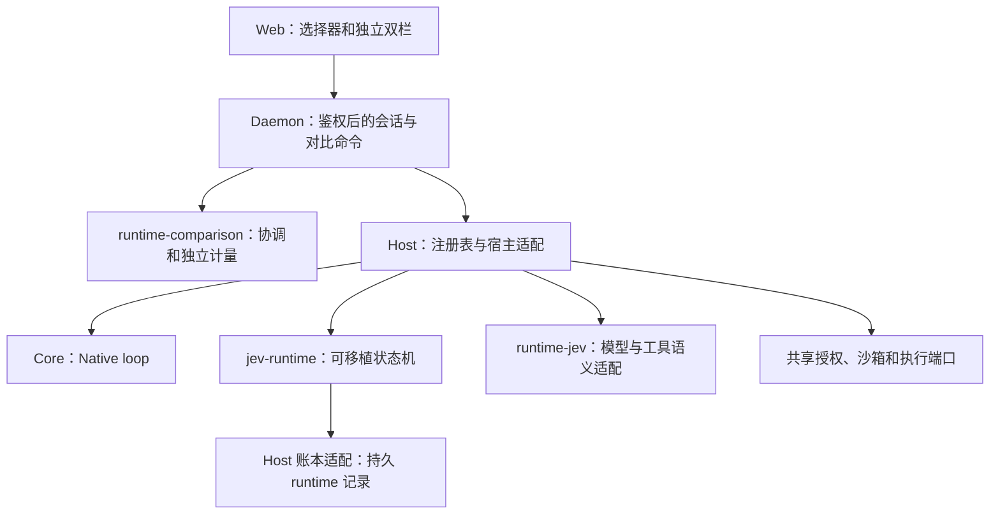

# Runtime 运行循环

[English](runtime-loops.md) | 简体中文

[文档首页](../README.zh-CN.md)

Web 新会话可选择 Native 或 JevLoop。后端将 runtime ID 和版本写入 `session/start`，
重开沿用原属主；未知或不可用 runtime 会拒绝创建。没有该字段的历史会话仍归 Native。

本期采用静态装配，目标仍是后续 loop 插件化。可移植核心不依赖 Agnes Core、Host、Cordis、
Node.js 或 Web。runtime registry 是后续插件接入边界，当前尚不提供动态 loop 插件 API。

Host 环境适配真实工具 schema、修订绑定候选、审批、执行许可和单次派发。审批完成后才能
写派发屏障。Jev 不借用 Native 推理状态；工具结果与 runtime 结算原子提交，回答只有正式
接纳后才进入 assistant/message。

启动 daemon 前配置环境：

| 变量 | 含义 |
|---|---|
| `AGNES_JEV_ENDPOINT` | 不含凭据的 System One 决策服务 HTTP 地址。 |
| `AGNES_JEV_MODEL` | 决策模型标识。 |
| `AGNES_JEV_AUTHENTICATION` | 默认 `bearer`；仅匿名决策服务可显式设为 `none`。 |
| `AGNES_JEV_API_KEY` | Bearer 凭据，优先于 `TYPESAFE_API_KEY`，仅留在传输闭包中。 |
| `TYPESAFE_API_KEY` | Jev Bearer 凭据的备用变量名。 |
| `AGNES_JEV_DECISION_REQUEST_CREDITS` | 决策请求的可选费用上界预估，须为有限正数，使用部署的 credit 单位。 |
| `AGNES_JEV_LANGUAGE_REQUEST_CREDITS` | 语言模型请求的可选费用上界预估，须为有限正数，使用相同单位。 |

缺少 Bearer 凭据时，JevLoop 会标为不可用并说明原因，Native 仍可正常启动。不会因为地址是
本地地址就自动允许匿名访问。显式传入的 `HostOptions.jev` transport 自行管理认证，不要求上述
环境密钥。

语言模型沿用会话的 provider/model。决策传输不会替换为语言模型；runtime 可按策略另行发起
语言模型仲裁请求。门控与 DSH 对齐：Purpose/Operation（`escalateBelow`）、Binding 和
mutation/RESPOND 均为 `0.6`，same-operation support 为 `0.8`。Support 不绕过低 Operation
分数，也不挽救 RESPOND。`ambiguityGate: null`、`responseReviewMode: 'diagnostic'`、
`answerProgressFloor: null` 保持这些诊断项不阻断执行。

支持持久化准备的 provider 使用 `agnes-language-v2` 记录新语言请求。在提交 `model.requested`
前冻结有效路由、模型能力、兼容参数、contract 前缀和凭据，并保存不含凭据的
`agnes-provider-request-v1` 快照。实际调用一次性消费同一内存绑定，关闭自动重试；凭据和 headers
不进入账本。Pi 适配器支持显式端点 API 的准备；依赖环境解析端点的 API，以及没有实现自身准备
契约的自定义子类，会拒绝此路径。Native 会话仍使用原有推理接口。
旧 provider 和历史 `agnes-language-v1` 请求仍可读取，但不会给旧抽象请求补造 provider 快照。
历史请求可重建不等于可以重发：没有结算的请求仍恢复为 `INTERRUPTED`。

成功答复采用前会校验 `agnes-inference-v1` 原生事件：必须以成功终态结束，且可见文本与
portable output 一致。校验在发布与恢复时执行；后续 LLM 历史保留原始 thinking/text 块顺序。
DeepSeek Completions 同时恢复明文 `reasoning_content` 字段；不会伪造其他 provider 的不透明签名。
没有 snapshot 的旧记录仍兼容，有 snapshot 但内容矛盾的记录拒绝恢复。

补参、仲裁与最终回答请求保留同一份完整原生工具目录，本次约束追加在对话末尾；已记录的
请求说明与目录观测保留原文。新请求说明明确：目录项 `version` 是不可解释的版本标识，
不是内容哈希；仅凭标识变化不能断言内容变化或恢复失败，标识不变也不能证明内容相同。
内容结论须依据已记录的读取或工具结果。这项说明不改变候选失效校验，也不改写历史请求。
answer 指令要求直接返回文本、不调用工具，但这只是模型指令，不是 provider 强制禁用工具。
answer 中的工具调用会被拒绝、不执行，也不进入补参／仲裁的格式修复循环。

Host 声明的 runtime-context 快照按记录位置作为 user 角色的事实进入 LLM 对话，不再放入可变的
顶层 system。变化的快照只取代同一 key 的旧快照所代表的当前状态；文本不变时不追加消息。
清空某个 key 时追加明确说明，标记该 key 的旧事实已失效，不删除历史。因此，工具目录与系统
指令不变时，日期、模式或工作目录变化不会改写上一次语言请求的消息前缀。决策投影仍只使用
最新状态；用户文字和工具提供的追加内容不能通过声称同名 source 获得 Host 快照语义。
Native 投影与授权机制不变。

此调整不改写已持久化的请求快照和请求说明。旧投影创建的会话继续运行时，下一次请求的前缀
可能发生一次变化，不保证跨投影版本复用缓存。序列化前缀稳定有利于 provider 缓存，但请求字节
测试不能证明真实命中率，后者仍须依据 provider usage。

新系统提示记录保留完整 LLM 文本和 section snapshot。Jev 单独投影已知 producer 的 persona、
环境、技能目录和约束；只省略精确匹配的纯身份 persona，保留其中行为义务。内置技能目录的
已知精确模板投影为 name/description 条目，声明 `instructionsLoaded: false` 和
`retrieval: 'skill_read'`；使用规则单独保留，存在省略项的目录明确标为不完整。这不实现技能正文加载。
未知 section 和修改过的模板完整保留，未提供的作用域明确标记为 unspecified。
这不增加 AGENTS.md 文件加载能力，`agents-md` 仍只是当前 Core 预留的 section。

新 runtime-context 记录同时保留清洗后的结构化事实。Jev 核验快照与原始文本一致后，将其投影为
具名环境事实，只省略已知 producer 的传输/模型身份字段，未知字段完整保留。旧记录或不一致的
快照回退为完整已记录文本，语言历史按快照顺序保留该文本。根目录发现候选只取自持久化工作区观测及已验证的
内置工具，不从用户原文推测路径。

`standard` preset 的单次模型请求上限为 4000 credits。有限额度遇到未知价格会拒绝，包括缺乏
计价历史时返回的估算零值。因此，新部署可能在获得可信费用估算前就拒绝首个请求。费用上界
预估须来自部署的计价规则；环境变量预估与 `HostOptions.jev.requestCredits` 仅用于准入，
不代表真实 usage 或已扣费用。不能将示例或测试估算当成真实费用。

如明确选择不设单请求 credits 上限，也不为新委派的任务树设置 credits 上限，可使用
`standard-no-credit-cap`。它继承 `standard`，把 `budget.per_request_cap` 改为 `null`，并将
`subagent.tree_budget_credits` 设为 `unlimited`。用量记录、审批和非金额限制保持不变；已持久化的
祖先任务树有限额度以及单独设置的子任务额度仍然生效。在用户 profile 中设置
`presets: { default: standard-no-credit-cap, allowed: [standard, standard-no-credit-cap] }`，
重启本地服务加载配置。已有会话需要显式切换 preset；更改默认值不会重写其持久选择。

省略 `subagent.tree_budget_credits` 或设为 `default`，保留新委派任务树默认 20 credits 的既有
行为；数值表示有限额度，只有显式 `unlimited` 才表示不设新的任务树额度。原始 preset 中的
`null` 非法；内部旧的 nullable view 不代表无限。切换 preset 也不会移除已持久化的祖先额度。
`subagent_spawn` 工具的可选 `budget` 参数仍须为正整数，表示单独的子任务额度；省略时不添加
独立子额度，但仍继承所有祖先限制。

历史系统指令与 Host 选择的工具调用保留独立消息身份和顺序。当前 Pi 适配器通过 OpenAI Completions
支持此表示，所选模型必须显式配置 `compat.supportsMidConvoSystemMessages: true`；思考模型如需
保留字面 system 角色，同时设置 `supportsDeveloperRole: false`。不支持的路由在发送前明确拒绝，
不会合并系统更新或把 Host 动作伪装成用户指令。

当前记账尚不完整：Jev 决策 usage 保存在 runtime 模型结算记录中，但还没有投影到 Host 的
货币账本（`cost/ledger`）；通过校验的语言模型 usage 会进入该账本。因此，不能将 Host
货币汇总当成 Jev 决策与语言模型的合计费用，缺失的决策费用仍须视为未知。

对比计量按持久的 provider 调用记录统计用途与结果：原生推理、会话标题、每个压缩分段或重试、
辅助视觉分别记录；Jev 的语言与决策请求使用自身 runtime 记录。这里不统计适配器内部透明 HTTP 重试。
压缩按实际调用分别写费用记录，使用已落盘记录结算各自预算许可；计量不会再次累计这些费用投影。
网关报告金额、已报告估算金额与 token 价格估算分别显示；缺失 usage 不计作零。Jev 对明确的 TypeSafe System One 地址与 `jev-latest` / `jev-1.13.0` 复用 DSH 的输入 0.042 USD／百万 token、输出 0 规则，按总输入计费，不编造缓存分桶。新请求在实际请求体之外保存 `call.pricing`；旧记录没有报价时可按当前明确配置只读重估，页面标明来源与请求数。已有报价无效、地址或型号不匹配时仍保留未知；重估不修改账本，也不是服务端账单。

每侧计量包含已观测的子会话。共享 journal 固定成员关系和每个成员的账本前缀；fork 继承的历史
不会再次计费。可分别展开父、子会话的历史报价明细。缺少会话树观测的旧 journal 位置保持部分可用；
完整的最终释放归档只能补全其最终位置，不能补入更早的回放。

单线 Jev 会话采用左侧决策画布、右侧原生对话布局。两栏可拖动调整，分隔条支持方向键和双击复位；窄屏通过“对话 / 决策图”切换。输入、审批与消息始终属于同一会话。步骤选择与单轮回放更新图；全轮回放还会把右侧对话固定在相同的持久化账本切点。节点详情和原始记录按需展开。查看单线会话时隐藏“双线对比”快捷入口；新建草稿时可从运行方式选择双线对比。
单线页面底部的“单线计量”从已持久化的根会话账本只读计算 LLM/Jev 请求次数、输入与输出 token、LLM 缓存读取和命中率、分项及合计估算成本，沿用双线对比的价格和缺失证据口径。它显示账本水位和证据问题；缺失用量不会当作零。当前单线计量不包含子会话，双线计量则包含已观测子会话树。

回放可按所选轮次或跨所有轮次的实际事件前缀推进，支持播放、暂停、从头播放及每秒 1/2/4/8 个事件。全轮模式通过 `session.projectUI` 读取相同账本序号的原生对话；读取期间或失败时，历史对话保持空白，不展示后续内容，提示栏标明切点或失败。“实时”恢复最新对话。回放不会执行工具。候选组可在画布内独立展开或收起，仲裁后的最终采用路径与原始 Jev 选择分别显示。

对话的执行过程展示决策模型、采用路径、动作结算、回答生成及停止原因；展开工作卡可查看模型、请求关联与记录范围。轨迹页提供独立的“循环”时间线，点击事件可查看同一份证据。历史恢复和实时更新使用相同的后端投影，工具结果与最终回答仍由原生消息展示。

双线的运行工作也使用相同的可展开卡片。每轮结果保留左右两侧各自的完成、取消、失败或未知原因；一侧取消、另一侧完成时显示部分结果，不表示双侧成功。旧记录缺少结束原因时保留未知。

Web 新建会话时，可在运行方式中选择 Native、JevLoop 或“双线对比 · Native + JevLoop”。
首次发送前可随时切换；选择双线后，首次发送直接使用当前工作区、模型及输入创建对比并打开双线视图，
无需再到独立入口创建，也不会额外创建普通会话。双线采用默认预设，审批分别处理；顶部“双线对比”入口用于查看和恢复已有对比。

双线首次发送后直接进入主工作区，从左至右为流程图、JevLoop 对话、Native 对话。
工作区级“对话／双线轨迹”同时切换两侧，保留流程图和共享回放位置；结果与管理操作从顶部入口打开。
窄屏将图放在上方，下方可切换会话。显示顺序不会改变持久化的左右身份或取消目标。

流程图工具栏的“请求体”以及“Jev 请求”节点可打开完整保存的 `systemone-json-v1` 请求体
（`model / state / questions`），按请求选择，完整查看、复制和下载 JSON，不受摘要截断限制。
只提供当前回放位置已经保存的请求；缺失或不支持的快照明确不可用，不用当前配置重建。
请求已保存不等于已送达服务端；认证信息和 HTTP 请求头不在查看范围内。对话工作卡仍是长度受限的展示摘要。

双线对比冻结一个已注册工作区，创建两份独立文件副本和会话。快照包含 dirty 与
untracked 普通文件及本地依赖，排除 `.git`。内部符号链接重定位到各自副本；外部普通文件链接
保留规范目标（例如 Python 解释器），持久记录身份与内容摘要，并在准入前和执行后复核。
外部目录链接、断链、循环链接、特殊文件和超限捕获会明确拒绝；不会默默省略环境目录。
这不是能够对抗恶意并发路径替换的操作系统原子快照。

两份副本及其双侧会话属于对比内部的执行资源，不是额外的用户工作区。普通工作区和会话列表
不展示这些条目；应通过“已保存对比”打开整组。导航隔离不会撤销工作区授权、改变两侧运行目录
或删除历史。可见性依据对比的持久归属，不按 `left`、`right` 等目录名称判断。

双线及其后代由后端持久归属强制使用 L1 沙箱，要求实际探测成功；不能回退到无约束 shell。
普通单线的预设保持原配置。每侧可写自己的副本，以及不与源目录、副本或外部依赖交叠的 Host 临时区；
额外的共同可写目录会拒绝准入。沙箱规则保留工作副本内部的精确授权，同时继续拒绝兄弟目录和私有数据。
任务应使用当前工作目录或相对路径；输入中的原目录绝对路径不会自动改写。
这是本地文件写隔离，外部解释器仍为共享只读依赖；网络服务、端口和任意第三方工具不属于文件快照。
当前本地 L1 后端禁用 shell 网络访问。旧对比若冻结了弱隔离配置，应新建对比，不会改写旧实验配置或重发输入。

若已有准入任务仍持有运行配置，新建对比会返回 `COMPARISON_PREPARATION_BUSY`，不会无限等待。
应先处理或取消已有任务。Jev UNKNOWN 维护通过原有的活跃准入所有者进行，不重放效果，也不把受阻轮次改为成功。
冷恢复后只有持久准入记录而没有活跃所有者时，需要明确取消。

共享输入有一个身份和两份持久接收回执。一侧失败或取消不影响另一侧。未知回执不会自动补发。
普通刷新只读协调状态；“核对持久状态”根据输入和 turn 账本恢复事实，不唤醒、重开或执行会话。
两侧审批与取消始终保留各自会话作用域。

创建对比及每轮提交前可统一选择“自动拒绝审批”“手动审批”（默认）或“自动审批（保持隔离）”。
选择随本轮输入一起提交；两侧均结束且没有未决输入后，才能为下一轮切换。同一输入 ID 的重试
保留原模式，不允许改模式重放。每轮保存各侧真实审批配置及源回执，历史回放不会使用后续模式。
自动审批仅在本轮配置准入持有期间使用共享审批策略 `off`，不启用 YOLO、不放宽目录隔离，
也不绕过 hook／授权拒绝；结束或未接收输入的准入失败后恢复原策略。
“自动拒绝审批”沿用普通会话的前端拒批语义，不是只读沙箱，原本不要求审批的工具仍可执行。
本轮驱动的子任务、孙代及续跑继承本轮有效审批策略；该能力绑定原始存活 owner 和 writer，
不会永久复制到子任务 preset，也不从历史记录恢复。原 owner 释放、取消或关闭后，仍在执行的
子任务运行退回手动审批，后续轮次不能给该旧运行重新授权；子任务运行结束后恢复原策略。
手动审批按左右侧分别显示实际请求的允许／拒绝操作，不等待同步审批结束后的落账；
历史回放、连接丢失、取消或请求结束后不再允许决定该实时请求。

“重试原请求”使用保留的文本和同一输入 ID 显式重试；这次重试被拒绝，并不证明原请求也被拒绝。
停止未确认输入会精确指定其 ID，持久记录禁止该输入继续执行。界面禁止重试已停止的 ID，
分别展示两侧的取消清理状态；两侧均确认取消前保留待确认输入和草稿。

如果共同准入明确拒绝本次输入，草稿会保留。资源暂忙时可在排空后显式重试；准备配置已变化或
回执无法核验时应新建对比，刷新不会替换旧实验的冻结配置。诊断只返回有限原因码，不包含底层
异常或配置内容；未知原因不代表安全重放已接收输入。

“已保存对比”支持刷新、分页和显式重开；读取列表不会打开会话。切换保留各组本地草稿，
只卸载原视图；未确认的提交会阻止切换。旧记录没有保存的时间显示为“未知”。
每侧提供独立的原生轨迹面板；对话、Jev 决策图、轨迹和计量遵循同一个共享 journal 位置，
历史工具详情不会混入后续结果。已结束的比较通过只读比较 API 读取固定前缀，不加载运行会话；
继续提交时才连接两侧。运行中的比较仍提供流式预览和审批。只读投影不含运行代次。

比较准备会先完成 worker 待发布的资源刷新，再冻结准备回执；刷新失败会拒绝准备，冻结后的真实配置变化仍拒绝准入。

“对比结果”表与两侧视图使用同一个 journal 位置，JevLoop 列在前、Native 列在后。
与 DSH 对齐的指标依次为：已确认累计耗时；LLM 未缓存输入、缓存读取及命中率、输出、费用；
Jev 输入、输出、费用；合计费用；LLM/Jev 调用数；仅含 LLM 的调用构成。每个 Token 行附带
该计费桶自己的费用，类别费用附带已见证的谷段倍率或峰谷混合标记。不同币种分别展示，合计
由后端在相同切点计算，不累加页面舍入后的数值；按当前价格重估仍明确标识。
表中另有状态与本轮回答；表下可展开两侧准备回执，查看预设输出 Token 上限，旧回执未记录时
保持未知。耗时只包含持久确认的区间，不补算实时秒表；缓存命中率要求输入和缓存读证据完整，
缺失时显示未知。
回答过长时只复制已显示的摘要。加载或读取失败时保留上一份完整视图并标明位置，不混用不同切点。
运行中计数是已知下限，缺证据保持未知；只有确认结束且计量完整时，零次调用的类别才显示“不适用”。
缓存命中率描述当前已知请求，不是最终比率的下限。耗时由执行时的单调时钟测量并随终态持久化；
旧记录或恢复过程缺少的耗时不补造。协调终态超出当前侧已捕获序号时，该视图不能显示为已完成。

两侧及其子任务结束后，“释放运行资源”会永久结束该比较的继续运行能力。后端检查完整子树空闲状态，
固定精确 owner 和配置，确认关闭后归档事件，再清理执行存储与比较私有快照，保留源工作区。
活动、状态未知或被外部历史分支引用的子树拒绝回收。支持 shared 子任务工作区；Git worktree
子任务需要可验证的维护清理适配器，缺失时明确拒绝。

释放后仍可查看对话、轨迹、Jev 决策和工具详情。在最新共享位置可直接从归档查看子任务历史，
不会重新打开运行时。“删除对比记录”在释放资源后删除这份历史。两种操作都需要确认，并绑定
当前显示的修订；结果不确定时先刷新再重试。未知账务保持未知，独立账务证据要求保留的记录不会删除。

“停止两侧”请求取消整组比较，接收确认不代表任一侧已经结束；应查看各侧持久终态，
回执不确定时核对持久状态。历史回放期间禁止取消。关闭比较视图只卸载视图，不释放资源或删除历史。

runtime 记录是事实来源，流式预览不代表持久回答。runtime 事务使用 SQLite FULL 与 fullfsync，
包括派发屏障。恢复将未派发意图结算为未执行；已经派发但没有结果的修改保持 unknown，禁止重放。
排空失败会保留 writer 与工作区租约。

已取消的 Jev 轮次仍有未知效果时，恢复后继续保持待裁定状态。领取队列输入前取消不会消耗该输入。
会话代次变化会使各比较面板的旧读取与预览独立失效，不会运行或取消循环。

对已打开且空闲、存在 UNKNOWN 动作的 Jev 会话，SDK 提供显式操作员裁定：
`session.controlRuntime({ expectedRuntime: { id: 'jevloop', version: '1' },
operation: 'jev.resolveUnknown', payload: { intentId, resolution, explanation, evidence } })`。
`resolution` 可选 `confirmed_applied`、`confirmed_not_applied` 或 `accepted_uncertainty`；
说明和每项证据去除首尾空白后必须非空，证据至少一项。沿用原会话属主权限，将已认证操作员的
`action.resolved` 写入原动作所属 turn，返回持久提交序号。裁定不会重新执行工具、恢复 turn 或
推进排队输入。Native、身份不匹配、未知操作、非法参数、正在运行和已关闭/休眠会话均明确拒绝。
提交回执失败时应显式重开并读取持久账本后再决定是否重试；已提交裁定会保留，重开不自动执行工作。

Jev 模型调用使用持久树预算预留。只有全部祖先范围均无上限时才接受未知报价，实际费用未知时仍保留
unknown。恢复仅在持久记录证明未开始派发时释放预留，不重复模型调用。显式接管 reservation writer
不会自动迁移旧 Jev admission。

同 runtime 委派子任务使用独立 runtime lease。spawn 从空历史开始；Native 和 Jev 新建委派 fork
都只继承最后一个已结束 turn 的前缀，排除当前未结束轮次。已有子任务的历史 seed 和 Native 显式历史
切点保持原契约。父会话关闭会等待所属子任务和创建过程退出后再释放 writer。
新建 spawn 子任务持久保存可续答描述。`subagent_send_message` 在完成或 Host 重启后向同一个子会话
账本投递新输入；运行中的子会话在下一步接收。回执只证明已持久接受，不代表任务完成；通过
`subagent_collect` 读取答案。`subagent_interrupt` 停止当前轮次并保留对话和后代；
`subagent_cancel` 永久取消子树，已结束的子会话也不能再续答。

驻留且可续答的 spawn 子任务也可向精确匹配的存活直接父会话发送完整报告。父会话空闲时自动开启
新一轮回答，运行中则在下一步接收。自然完成会等待运行中的后代和已接受消息处理完毕。
子 outbox 与父 inbox/回执均持久保存。自定义消息另存发送方确认；完成通知在子会话关闭后以父回执
为准。投递回执不证明父会话已经完成回答。
冷会话、正在关闭或因 UNKNOWN 停驻的父会话保留 pending，本路径不会自动重开父会话或重投冷 outbox。
对话与轨迹通过持久回执和 inbox 身份区分子任务报告、完成通知。消息内容仍不可信，来源标签不授予工具权限。

一次性 fork 和没有支持版本描述的旧子任务不能续答。续答沿用已保存模型、归属和祖先预算，
不重放初始任务。worktree 续答须同时通过持久归属、父会话当前文件授权和 Git 注册核验。
缺失、移动或替换的工作区会被拒绝，不会重建或删除用户目录。UNKNOWN 效果仍须先裁定才能投递新输入。
取消运行中的子任务不能证明它没有产生修改。如果父工具调用缺少明确的效果回执，即使子任务已取消，
父会话仍会以 UNKNOWN 停驻，需要使用上面的显式人工裁定后才能继续。经过验证的创建前拒绝，
例如未知模型覆盖，记为未执行，不会使父会话停驻。

嵌套工具调用复用 Host 的执行、授权、超时和取消路径；持久子调用证据参与父动作效果判定。
子调用效果未知时，即使外层工具成功返回，父动作也保留 unknown。

当前明确拒绝的能力包括 Jev 压缩、根会话 Native 风格 fork 和 deferred 执行对账。
决策 token count 需要单独计数器，超额 quote 在接入审批适配前会拒绝。
Jev 与 DSH 一样直接选择原生工具。内建 `run_code` 聚合调用工具不会进入 Jev 目录，显式调用也会在
派发前拒绝；安装 code-mode 扩展不代表 Jev 支持该聚合调用接口。

经过核验的内建和随包 helper 工具有修订绑定的决策说明，区分选择用途、阶段、输入、结果和限制。
说明补充原生 schema，不替代参数校验或授予执行权限；未知或被替换的定义保留普通目录回退。
Shell 继续可用，等价文件操作优先选择专用工具。管理工具保持原名称和 action 流程；
`mcp_manage` 的 prepare 必须提供 definition，commit/status/cancel 必须提供 proposalId。
已有安装的 helper 需要显式更新包，才能采用新契约。

完整候选只使用持久化的客观证据。目录或搜索结果生成的首次读取只绑定 path；已知文本和
版本校验的续页保留分页。技能目录提供名称候选，不提前加载指令；技能续页绑定实际返回的
字节 offset 和版本键。已知子任务回执提供 `subagent_collect(wait: true)` 候选，复用原生可取消
等待，不再反复查询 `running` 消耗决策步骤；等待跟随 writer lease 的续约，不冻结进入时的到期点。
既有工具超时、lease 到期和取消限制仍生效，等待仍可能返回
非终态结果；终态收集回执会抑制后续候选，直到子任务接收新工作。读取失败会使旧续页证据失效，
完整目录移除会抑制过期技能候选，子任务续聊投递后会重新开放 collect。资源新鲜度和父子关系
仍由原生工具校验，历史请求快照继续保留当时的工具说明。

用户图片输入在工具读取之前仍是未读 artifact。内建 `read` 接受不超过 4 MiB、
16 百万像素的本地 PNG/JPEG，不缩放；GIF/WebP 明确拒绝。已持久提交的工具图片经 Host
权限、大小与 SHA-256 校验后进入 Jev 语言请求，每次请求图片总量上限为 64 MiB。
产物缺失或超限会在 provider 调用前失败；Jev 要求当前精确 route/model 在 provider 目录中唯一声明图片输入；text-only、缺失或歧义目录
会明确拒绝图片语言请求，保持已成功读取的工具结果不变。端点是否真正支持识图仍需实际验证。持久请求保留真实
base64 字节，因此重复请求也会在账本中重复这份有界数据。显式字节窗口保留二进制内容，
但当前文件适配器仍在选取窗口前读取整个文件。

对比 UI 对不完整费用保留 unknown，可移植计量模块
将 Jev 与语言模型请求分开。后续插件发现机制可替换静态注册，无需重写核心状态机或会话属主契约。

内建 `ask_user_question` 在 Native 与 Jev 中共用 Host 问答服务。只有已经连接到会话、
明确声明支持问答的客户端存在时，才发布请求。Web 展示整批问题、选项、自定义答案与取消；
比较两侧独立回答，且要求回答每个问题，普通会话允许逐题跳过。非法答案不会消耗待答请求；
只有执行实例持久提交 `question/settled` 后才确认成功。回答问题不会授予其他工具操作权限。取消提问只终止该次交互，停止整轮执行仍是独立操作。

等待用户时仅暂停当前工具及其活动调用祖先的剩余执行时间预算，其他工具和会话取消仍然有效。
关闭或中止所属会话会结算待答请求。进程重启不恢复等待回调；历史提问事件保留为证据，
可操作的问答卡只来自当前执行实例的 pending API。SDK 提供 `client.questions.pending`、
`answer`、`cancel`；实现回答界面的客户端通过 `createClient({ questions: true, ... })` 声明能力。

Jev 直通数量沿用 DSH 定义：非 LLM 仲裁的决策选择、持久化 direct 路由、关联执行意图与派发记录齐备时计一次。补参、仲裁、派发前拒绝不计；派发后失败仍计。单线显示完整会话累计，双线在 Jev 栏标题显示当前共享回放位置的累计，未同步完成时显示待同步。该数量不等于成功执行数。

### 单次语言请求的多个工具提案

JevLoop 仲裁允许一个 LLM 响应包含 1–32 个完整工具调用。开始执行前先校验整批工具可用性与
参数，再按模型返回顺序逐个执行；每项有独立决策索引、意图、审批、派发屏障和结算，不并发执行。
参数补全仍限定为已选操作的一次调用。

拒绝、调用失败、效果未知、取消、工具带来的新输入或完成指令都会停止后续提案。中断恢复不自动
续跑旧批次尾项：依据已落盘结果重新决策，语言历史明确标识未准入的提案；已落盘的完成指令在重启后
仍有效。旧单调用记录保持可读。流程图动作选择器可查看同一步内每个已观察动作，历史回放不显示未来
动作。模型用量按真实 LLM 请求计一次，与提案数、执行数分别统计。这是对 DSH 当前单调用仲裁契约的
明确扩展，不改变 Jev 直通统计定义。
