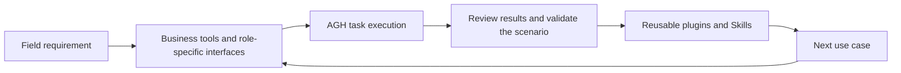

# Why AGH: make each deployment a starting point for the next

English | [简体中文](why-agh.zh-CN.md)

[Project home](../../README.md) · [Documentation](../README.md) · [Try the examples](demo.md)

**Put the differences into plugins. Let the harness handle execution. Reuse validated capabilities in the next deployment.**

A business agent needs models and system integrations, along with task records, authorization, and an interface people can use. AGH brings these shared capabilities into an extensible runtime so developers can focus on business tools, knowledge, and interfaces.

## One runtime for your application

AGH is built for Forward Deployed Engineering (FDE): working in users' environments to deliver software through integration, validation, and iteration. Each environment has its own data, workflows, and roles. AGH provides a way to organize those differences as extensions.

| Application component | AGH capability | Use in a deployment |
| --- | --- | --- |
| Business tools | Backend plugins and MCP integration | Let agents query data and call existing business services |
| Task methods | Skill discovery, management, and session selection | Bring documented methods into subsequent tasks |
| Role-specific interfaces | Web slots and controlled service calls | Display business state and connect user actions to service results |
| Ongoing work | Shared daemon, session history, and recovery entry points | Find and continue tasks through CLI, Web, and SDK |
| Execution control | Package trust, tool approvals, and execution constraints | Decide which code loads, which actions are allowed, and how to inspect results |

Each part has its own entry points and examples. Start with one query tool, add a Skill and a business panel, and grow the application around the needs of the deployment.

## Turn one integration into reusable capabilities

Distribute tool implementations as plugin packages, capture task methods as Skills, and reuse interfaces as frontend modules. Keep site addresses, credentials, and policies in deployment configuration. Confirm authorization and acceptance criteria for each integration.

## Example: handling a procurement exception

Consider a procurement team that wants to identify orders affected by inventory changes and decide what to do next. This is an illustrative application design: begin with read-only queries, then build a workbench for the role.

| Delivery step | Reusable parts | Integration work |
| --- | --- | --- |
| Query orders and inventory | Backend tool registration, input validation, and results | Business APIs, account permissions, and data integrity |
| Prepare recommendations | Task methods and checks in a Skill | Business rules, applicability, and representative tasks |
| Show status and evidence | Frontend panel and controlled service query | Orders, versions, update times, and the user experience |
| Confirm and execute changes | Approval interaction, execution records, and receipts | Write authorization, idempotency, failure handling, and result checks |

Integrators implement the business APIs. The repository's [backend tool](../develop/backend.md) and [connected panel](../develop/fullstack.md) provide software starting points: run them first, then replace their logic with your own.

## Built for trust

Making execution inspectable and controllable is an engineering priority for AGH. Package trust binds to specific content and declared capabilities. Approvals and execution policies constrain tool operations, while session records retain the task history for result checks and recovery.

Ordinary third-party plugins run as trusted in-process code. Review their source and provenance before installing them. See [security and trust](security.md) for each mechanism's responsibilities and platform boundaries.

## From business systems to physical devices

AGH plans to explore integration through MHS (Model Hardware Standard), bringing device state, human confirmation, and execution receipts into task workflows. The aim is to make integrations reusable across inspection, instrument coordination, and field operations.

**MHS integration documentation and examples are coming soon.** [Explore the device integration direction →](mhs.md)

## Start with your use case

- **Try it:** [Three examples](demo.md) → [First run](quickstart.md).
- **Build:** [Choose an extension path](../develop/plugins.md) → [Business tool](../develop/backend.md) / [Role-specific panel](../develop/frontend.md).
- **Share your scenario:** [Feedback and project updates](../develop/contributing.md). Your integration needs and experience help identify what AGH should improve next.
