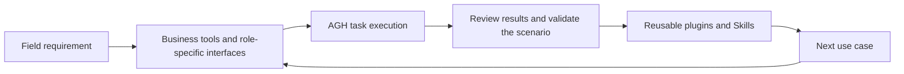

# Why AGH: make each deployment a starting point for the next

English | [简体中文](why-agh.zh-CN.md)

[Project home](../../README.md) · [Documentation](../README.md) · [Try the examples](demo.md)

**Put the differences into plugins. Let the harness handle execution. Reuse validated capabilities in the next deployment.**

A business agent needs models and system integrations, along with task records, authorization, and an interface people can use. AGH brings these shared capabilities into an extensible runtime so developers can focus on business tools, knowledge, and interfaces.

## Compare design choices

These are source-based architectural comparisons, not performance rankings. The linked dsh and pi revisions fix the scope of the reading; no competitor runtime or paid model benchmark was run for this comparison. Products continue to evolve.

| Approach | Useful starting point | AGH's choice and cost |
| --- | --- | --- |
| [dsh](https://github.com/deepseek-ai/deepseek-harness/blob/5badb15009ae1756c3afe0ae0cef1faafc290ccc/packages/boot/hmr/src/index.ts) | Cordis module/configuration reload is a developer iteration path; its [system-prompt composer](https://github.com/deepseek-ai/deepseek-harness/blob/5badb15009ae1756c3afe0ae0cef1faafc290ccc/packages/core/system-prompt/src/index.ts) organizes sections and persona overrides. | AGH makes durable per-session code snapshots an explicit contract, distinct from module reload. Old/new versions coexist, costing retained storage and lifecycle coordination. Live resources still refresh. This comparison does not claim dsh cannot support other versioning designs. |
| [pi coding agent](https://github.com/earendil-works/pi/blob/ce950d78f424dcaf9f5d6a03ce80ab141130eb1d/packages/coding-agent/src/core/session-manager.ts) | Its JSONL session manager exposes branches and conversation history, a useful base for a coding client. | AGH adds a shared authenticated App Server and installable business compositions, candidate review and UI evidence. This brings more control-plane and package-management machinery; choose the smaller client when those surfaces are unnecessary. |
| [LangGraph persistence](https://docs.langchain.com/oss/python/langgraph/persistence) | Threads, checkpoints and pending writes support stateful graph applications. | AGH supplies a business-agent product shell around plugin Loops and ledger-owned effects. Graph libraries leave more application policy and UI assembly to the integrator. Neither checkpointing nor AGH's ledger creates an atomic transaction with arbitrary external systems. |

Choose AGH when independently installed business agents, ongoing session versions, reviewed growth and user-facing evidence belong in one product. Choose a focused coding harness or graph library when you prefer its interaction model or are assembling those product responsibilities yourself. Validate your own models, tools, latency and isolation rather than inferring them from this table.

AGH's implemented contracts are [pinned code/live resources](../develop/architecture-plugins.md#pinned-code-live-resources), [candidate publication](../extend/agent-built-plugins.md), [App Server](../reference/app-server.md) and [execution evidence](fact-chain.md). The [three demos](demos.md) demonstrate them with synthetic data. Ordinary plugins remain trusted in-process code, and external effects can remain unknown after a crash.

## One runtime for your application

AGH is built for Forward Deployed Engineering (FDE): working in users' environments to deliver software through integration, validation, and iteration. Each environment has its own data, workflows, and roles. AGH provides a way to organize those differences as extensions.

| Application component | AGH capability | Use in a deployment |
| --- | --- | --- |
| Business tools | Backend plugins and MCP integration | Let agents query data and call existing business services |
| Task methods | Skill discovery, management, and session selection | Bring documented methods into subsequent tasks |
| Role-specific interfaces | Web slots and controlled service calls | Display business state and connect user actions to service results |
| Ongoing work | Shared daemon, session history, and recovery entry points | Find and continue tasks through CLI, Web, and SDK |
| Execution control | Package trust, tool approvals, and execution constraints | Decide which code loads, which actions are allowed, and how to inspect results |

Try the [installable FDE bundles](../../examples/fde/README.md), covering support, contracts, reports, operations, CRM, simulated devices, knowledge QA, meetings, code review, finance, recruiting and policy evidence. Each ships a loop, tools, policy and Skills together, with keyless fixtures and a real-model configuration path.

Each part has its own entry points and examples. Start with one query tool, add a Skill and a business panel, and grow the application around the needs of the deployment.

## Turn one integration into reusable capabilities

```mermaid
flowchart LR
  Need[Field requirement] --> Integration[Business tools and role-specific interfaces]
  Integration --> Run[AGH task execution]
  Run --> Evidence[Review results and validate the scenario]
  Evidence --> Reuse[Reusable plugins and Skills]
  Reuse --> Next[Next use case]
  Next --> Integration
```

Distribute tool implementations as plugin packages, capture task methods as Skills, and reuse interfaces as frontend modules. Keep site addresses, credentials, and policies in deployment configuration. Confirm authorization and acceptance criteria for each integration.

## Example: handling a procurement exception

Consider a procurement team that wants to identify orders affected by inventory changes and decide what to do next. This is an illustrative application design: begin with read-only queries, then build a workbench for the role.

| Delivery step | Reusable parts | Integration work |
| --- | --- | --- |
| Query orders and inventory | Backend tool registration, input validation, and results | Business APIs, account permissions, and data integrity |
| Prepare recommendations | Task methods and checks in a Skill | Business rules, applicability, and representative tasks |
| Show status and evidence | Frontend panel and controlled service query | Orders, versions, update times, and the user experience |
| Confirm and execute changes | Approval interaction, execution records, and receipts | Write authorization, idempotency, failure handling, and result checks |

Integrators implement the business APIs. The repository's [backend tool](../develop/backend.md) and [connected panel](../develop/fullstack.md) provide software starting points: run them first, then replace their logic with your own.

## Built for trust

Making execution inspectable and controllable is an engineering priority for AGH. Package trust binds to specific content and declared capabilities. Approvals and execution policies constrain tool operations, while session records retain the task history for result checks and recovery.

Ordinary third-party plugins run as trusted in-process code. Review their source and provenance before installing them. See [security and trust](security.md) for each mechanism's responsibilities and platform boundaries.

## From business systems to physical devices

AGH plans to explore integration through MHS (Model Hardware Standard), bringing device state, human confirmation, and execution receipts into task workflows. The aim is to make integrations reusable across inspection, instrument coordination, and field operations.

A [simulated device bundle](../../examples/fde/device-inspection/README.md) now demonstrates status → anomaly → human confirmation → constrained action → receipt verification. It is MHS-inspired and does not claim MHS compatibility. The integration seam is a preview; validated hardware adapters remain future work. [Explore the device integration direction →](mhs.md)

## Start with your use case

- **Try it:** [Three examples](demo.md) → [First run](quickstart.md).
- **Build:** [Choose an extension path](../develop/plugins.md) → [Business tool](../develop/backend.md) / [Role-specific panel](../develop/frontend.md).
- **Share your scenario:** [Feedback and project updates](../develop/contributing.md). Your integration needs and experience help identify what AGH should improve next.
