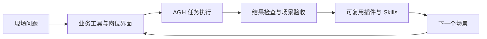

# 为什么选择 AGH：让每次交付成为下一次的起点

[English](why-agh.md) | 简体中文

[项目首页](../../README.zh-CN.md) · [文档导航](../README.zh-CN.md) · [体验示例](demo.zh-CN.md)

**把现场差异写进插件，把任务执行交给 Harness，把经过验证的能力带到下一个项目。**

做一个业务 Agent，需要连接模型与系统，也需要把任务记录、授权交互和使用界面组织起来。AGH 将这些共同能力放进一套可扩展的运行基础，让开发者围绕业务问题构建工具、知识和界面。

## 比较设计取舍

下表比较源码中的架构选择，不做性能排名。dsh 与 pi 的链接固定了阅读版本；本次对比没有运行竞品或付费模型基准，项目仍会演进。

| 路径 | 适合的起点 | AGH 的选择与成本 |
| --- | --- | --- |
| [dsh](https://github.com/deepseek-ai/deepseek-harness/blob/5badb15009ae1756c3afe0ae0cef1faafc290ccc/packages/boot/hmr/src/index.ts) | Cordis 模块/配置重载支持开发迭代，[系统提示组合器](https://github.com/deepseek-ai/deepseek-harness/blob/5badb15009ae1756c3afe0ae0cef1faafc290ccc/packages/core/system-prompt/src/index.ts)组织分节与角色覆盖。 | AGH 把持久的会话代码快照设为明确合同，与模块重载分开。新旧版本并存，需要保留存储与生命周期协调，动态资源仍刷新；这不宣称 dsh 无法实现其他版本设计。 |
| [pi 编码 Agent](https://github.com/earendil-works/pi/blob/ce950d78f424dcaf9f5d6a03ce80ab141130eb1d/packages/coding-agent/src/core/session-manager.ts) | JSONL 会话管理器提供分支与对话历史，可作为编码客户端基础。 | AGH 加入共享认证 App Server、可安装业务组合、候选审阅与界面证据，也增加控制面和包管理复杂度；不需要这些界面时，可以选择更小的客户端。 |
| [LangGraph 持久化](https://docs.langchain.com/oss/python/langgraph/persistence) | Thread、checkpoint 与 pending writes 支持有状态的图应用。 | AGH 在插件 Agent Loop 与账本效果之上提供业务 Agent 产品界面；图库把更多应用策略与 UI 组合留给集成者。Checkpoint 或 AGH 账本都不与任意外部系统组成原子事务。 |

需要独立安装的业务 Agent、持续任务的版本保留、人工审阅后的成长和用户可检查的证据时，可以选择 AGH。偏好某个编码交互模型，或准备自行组合这些产品职责时，可选择专注的编码 Harness 或图库。模型、工具、延迟与隔离需自行验证，不能从表格推断。

AGH 的现行合同见[固定代码与动态资源](../develop/architecture-plugins.zh-CN.md#pinned-code-live-resources)、[候选发布](../extend/agent-built-plugins.zh-CN.md)、[App Server](../reference/app-server.zh-CN.md)及[执行证据](fact-chain.zh-CN.md)。[三个演示](demos.zh-CN.md)使用合成数据验证流程。普通插件仍是进程内受信代码，崩溃后的外部效果可能仍不确定。

## 一套基础，组合你的应用

AGH 面向 Forward Deployed Engineering（FDE）：工程师深入业务现场，通过系统集成、验证和迭代完成交付。每个现场都有自己的数据、流程和岗位，AGH 提供将这些差异组织为扩展的方式。

| 构建的一部分 | AGH 的能力 | 交付时的用途 |
| --- | --- | --- |
| 业务工具 | 后端插件、MCP 工具接入 | 让 Agent 查询数据、调用已有业务服务 |
| 任务方法 | Skills 的发现、管理与会话选择 | 把经过整理的方法带入后续任务 |
| 岗位界面 | Web 前端槽位、受限服务调用 | 展示业务状态，连接用户交互与服务结果 |
| 持续工作 | 共享后台、会话历史与恢复入口 | 在 CLI、Web 和 SDK 中找到并继续任务 |
| 执行控制 | 包信任、工具审批、执行约束 | 明确加载什么代码、允许什么操作、如何检查结果 |

可先运行[可安装的 FDE bundles](../../examples/fde/README.zh-CN.md)，覆盖客服、合同、报告、运维、CRM、模拟设备、知识问答、会议、代码评审、财务、招聘与政策依据。每个包一起交付 loop、工具、策略和 Skills，提供无密钥夹具与真实模型配置入口。

每一部分都有独立的入口与示例。你可以先接入一个查询工具，再补充 Skill 和业务面板，逐步形成适合现场的应用。

## 从一次集成，积累可复用能力

工具实现可以随插件包分发，任务方法可以整理为 Skill，界面可以作为前端模块复用。现场地址、凭据与政策留在部署配置中，每次接入分别确认授权与验收要求。

## 从采购异常处理，看一个场景如何组合

下面是一个构建示意：采购人员希望了解哪些订单受到库存变化影响，并据此安排下一步。可以从只读查询起步，逐步形成岗位工作台。

| 交付步骤 | 可以复用的部分 | 现场集成重点 |
| --- | --- | --- |
| 查询订单与库存 | 后端工具的注册、输入校验与结果返回 | 业务接口、账号权限和数据完整性 |
| 整理处置建议 | Skill 中的任务方法和核验步骤 | 企业规则、适用条件与任务样例 |
| 展示状态和依据 | 前端面板与受限服务查询 | 订单、版本、更新时间和岗位体验 |
| 确认并执行变更 | 审批交互、执行记录与回执处理 | 写入授权、幂等性、失败处置和结果核对 |

业务接口由接入者实现。仓库提供的[后端工具](../develop/backend.zh-CN.md)和[联动面板](../develop/fullstack.zh-CN.md)是这条路径的软件起点，可以先运行示例，再替换为自己的业务逻辑。

## 以可信为根基

让人能够检查与控制执行，是 AGH 的工程重点。包信任绑定具体内容与能力声明，工具操作通过审批与执行策略约束，会话记录保留任务过程，便于核对结果和处理中断。

普通第三方插件运行在受信进程中；选择插件时需要审核其代码与来源。各机制的职责和平台适用范围见[安全与信任](security.zh-CN.md)。

## 从数字业务走向设备现场

AGH 计划探索 MHS（Model Hardware Standard）接入，将设备状态、人工确认和执行回执组织进任务流程，面向巡检、仪器协作和现场运维积累可复用的集成方式。

[模拟设备 bundle](../../examples/fde/device-inspection/README.zh-CN.md) 已展示状态读取 → 异常判断 → 人工确认 → 受约束动作 → 回执验证。它受 MHS 启发，不宣称 MHS 兼容；接缝处于预览阶段，经过验证的硬件适配器仍待后续交付。 [了解设备接入方向 →](mhs.zh-CN.md)

## 带着你的问题开始

- **先体验**：[三个示例](demo.zh-CN.md) → [首次运行](quickstart.zh-CN.md)。
- **开始构建**：[选择扩展方式](../develop/plugins.zh-CN.md) → [业务工具](../develop/backend.zh-CN.md) / [岗位面板](../develop/frontend.zh-CN.md)。
- **分享场景**：[反馈与关注](../develop/contributing.zh-CN.md)。你的集成需求与使用体验，可以帮助 AGH 找到下一步值得完善的方向。
